---

# Introduction

---

:::: {style="display: flex;"}

::: {}
In this tutorial, we will be discussing the use of ELAN, which, according to the website, is "an annotation tool for audio and video recordings". This program, brought to you by the great folks at [The Language Archive](https://archive.mpi.nl/tla/), is quite versatile. In addition to being free, there's an active and response community of users who are more than willing to answer your questions.

:::

::: {}

:::

::::

| Programs | Word (or other) | Adobe Audition | ELAN |
| ------ |------ | ------ | ------ |
| Cost | Often free but could include licensing fee | **Very** Expensive | Free |
| Versatility | minimal | Very Versitile | Very Versitile |

# Getting Started

The first thing you'll need to do is download ELAN, [which you can do here](https://archive.mpi.nl/tla/elan/download). 

# Other stuff

## Observaciones preliminares
- La gran mayoría de los hablantes de español, más de 300 millones, se encuentra en América Latina.
- Cada rasgo dialectal observado en español de Hispanoamérica ocupa su propia área, que raramente coincide con el área de cualquier otro rasgo y mucho menos con las fronteras políticas
- Con la excepción de las innovaciones léxicas, hay muy pocos rasgos que se observen en el español de Hispanoamérica que no pertenezcan también a alguna variedad o variedades del español peninsular, y que, probablemente, no tengan sus orígenes en España.
- Según Penny, en todos los niveles sociales, el grado de variación geográfica dentro del español de América es considerablemente menor que la variación que se observa en el español peninsular (según el número de isoglosas que hay entre dos puntos separados por la misma distancia).

## La colonización

- El español llegó a las Américas en el siglo XV.
- Durante un periodo de 100 años, los españoles habían llegado, por el norte, a lo que hoy es el territorio del suroeste de los Estado Unidos y, por el sur, hasta Chile y el norte de Argentina.
- Siglo XV: asentamientos en el caribe; Siglo XVI: exploración de Florida y México; 1519: fundación del Virreinato de Nueva España sobre la capital azteca de Tenochtitlán.
- Desde México, los españoles fueron a Centroamérica y al suroeste de los EEUU. - Fundaron la ciuidad de Lima, después de la conquista de los Inca, en 1535.
- Desde Lima, viajaron a las regiones que son Chile, Bolivia, Paraguay, Argentina, y Uruguay; Virreinato del Río de la Plata en 1776.
- Factores dialectales: las diversas características sociopolíticas; la distancia que tenías estas regiones a las capitales del virreinato; los ragos dialectales de los primeros pobladores; las características que tenían grupos originarios

## Divisiones dialectales

Según algunos autores, se identifican seis zonas dialectales dentro de Hispanoamerica:

1. el **español caribeño** (que incluye las islas del Caribe y las zonas costeras de los países que lo rodean)
2. el **español mexicano/centroamericano** (que podríamos también dividir en al menos dos dialectos diferentes, el mexicano y el centroamericano)
3. el **español andino** (que incluye las zonas altas de Venezuela, Colombia, Ecuador, Perú, Bolivia, y el norte de Argentina)
4. el **español paraguayo**
5. el **español argentino/uruguayo**
6. el **español chileno**

Hay otras posibles divisiones (p.ej. la existencia de un español centroamericano, combinar el español paraguayo con el español argentino/uruguayo)

Esta división considera **tres isoglosas** que se emplean en el estudio de los dialectos americanos, combinados con el momento de colonización y la presencia de lenguas indígenas específicas. El español en el territorio americano es lo que se conoce como una lengua colonial, una lengua en **su diáspora**, fuera de su territorio originario. Las isoglosas son:

1. la /s/ en posición final de sílaba
2. la /ɾ/ en posición final de sílaba
3. la diferenciación entre /ʝ/ y /ʎ/

Una curiosidad histórica que diferencia el mundo hispanohablante del anglohablante es que, en el nivel de la pronunciación, en el español es el sistema consonántico el que explica la gran mayoría de los casos de variación, mientras que en el inglés la variación se centra en la pronunciación de las vocales.

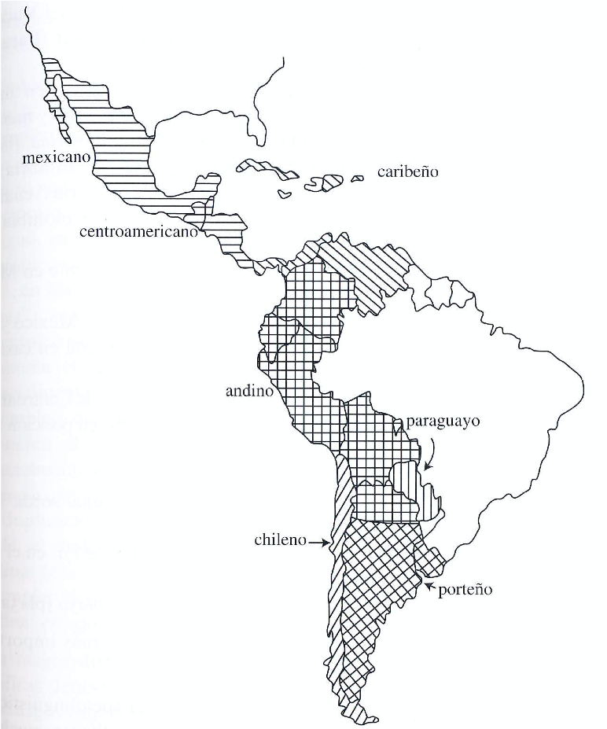

| Rasgos | Caribeño | Mexicano | Andino | Paraguayo | Argentino | Chileno |
| ------ |------ | ------ | ------ | ------ | ------ | ------ |
| **/s/ final** | [h] o 0 | se conserva | se conserva | se conserva | [h] o 0 | [h] o 0 |
| **/ɾ/ implosiva** | [ɾ],[l] o 0 | [ɾ] asibilada | [ɾ] asibilada | [ɾ] | [ɾ] | [ɾ] |
| **/ʝ/ y /ʎ/** | yeísmo | yeísmo | /ʝ/ y /ʎ/ | /ʝ/ y /ʎ/ | yeísmo (zeísmo)| yeísmo |
| **leng. orig.** | arahuaco (extinta) | náhuatl maya | quechua aimara | guaraní | guaraní mapundungu | mapundungu aimara |

___
___

## Rasgos lingüísticos

### Rasgos (socio)fonológicos
- La vibrante múltiple se velariza [ʁ] en Puerto Rico, especialmente: *carro* [ka.ʁo], *perro* [pe.ʁo]
- La vibrante simple se lateraliza en el Caribe, especialmente en Puerto Rico y la República Dominicana, en posición implosiva: *verdad* [bel.ða], *amor* [a.mol]
- Las vocales se nasalizan en contacto con nasal en el Caribe (como en Andalucía)
- La nasal se velariza [ŋ] en el Caribe, el sur de México (zona de Yucatán), Centroamérica y la zona andina, pero no así en el cono sur (Paraguay, Argentina/Uruguay y Chile): *compró pa*[ŋ], *baila muy bie*[ŋ]
- La aspiración de la /h/ proveniente de la /f/ latina se conserva en algunas palabras en Puerto Rico, la DR y Panamá: *harto* [haɾ.to], *hambre* [ham.bɾe], *humo* [hu.mo], *harina* [ha.ɾi.na]
- Las oclusivas sonoras tienden a mantenerse oclusivas tras cualquier consonante o semivocal en partes de Centroamérica, Colombia y la zona andina: [aɾ.bol], [dew.da]
- Las vocales se tienden a perder en sílaba átona, especialmente en México y la zona andina: *todos* [toðs] *pues* [ps]
- Los hiatos muestran una fuerte tendencia a diptongarse en México y en la zona andina especialmente, si bien - es un fenómeno general en casi toda Latinoamérica: *real* > *rial*, *poema* > *puema*, *peón* > *pión*
- La vibrante múltiple se asibila en la zona andina (y en partes de Centroamérica—Costa Rica y Guatemala). En México se asibila la vibrante en posición final.
- La /d/ en final absoluta puede pronunciarse como una sorta [t] en Paraguay: *usted* > *ustet*; *ataúd* > *ataút*
- La /x/ se pronuncia como [ç] ante las vocales anteriores /e/, /i/ en el habla de Chile: *gente* [çen.te], *mujer* [mu.çeɾ]
- El yeísmo se expresa mediante [ʒ] (o [ʃ]) en Argentina: *playa* [pla.ʒa]

### Rasgos (socio)morfológicos

- La marca de plural con /-se/ en algunas variedades sociolingüísticas de la RD: *cafés > cafése, gallinas > gallínase, muchachas > mucháchase, latas > látase*
- El uso extendido del diminutivo, especialmente en México y la zona andina: *callandito, corriendito, dositos, ahisito, acasito, estito*
- El empleo del pronombre *le* en ciertas expresiones mexicanas con función discursiva: *híjole, ándale pues, órale*
- El **voseo** se percibe como característica Argentina, aunque tienen una extensión geográfica mucho mayor (Centroamérica, partes de Venezuela y de Colombia, Bolivia, Chile, etc.)
- El empleo de *che* en Paraguay en Argentina: *¿qué tomás, che?*
- El empleo del leísmo animado en la zona andina, en Paraguay y en partes del Caribe:  *¿Llamaste a Juan?/ Me olvidé llamarle*
- El empleo del artículo con pronombres propios, en Chile (como en la región catalana o en el portugués): *Vimos a la Tere en el cine / la Susana me visitó ayer*.
- El empleo ocasional de la terminación /-sen/ con verbos reflexivos en imperativos plurales en el Caribe: *siéntensen, vístansen*. Este fenómeno también se da dialectalmente en España.
- La pluralización de *haber y hacer* en construcciones impersonales: *habían muchas personas, hacían tres años que llegó*
- El uso de sujetos expletivos en el español del caribe (la DR): *Ello llueve , Ello hay maíz*

### Rasgos sintácticos

- La tendencia a no invertir el pronombre sujeto en preguntas en el Caribe: *¿Qué tú dices? ¿Cómo tú estás?*
- El empleo del verbo en infinitivo con pronombre sujeto prepuesto después de para en la Venezuela y Panamá especialmente, pero también en el Caribe: *para yo poder venir* (*“para que yo pueda venir/para poder venir yo”*)
- El empleo del posesivo con el artículo indefinido, similar al español antiguo, en Centroamérica: *una mi amiga, un su caballo*
- El empleo de la preposición hasta con función de inicio, en lugar de límite final, en México y Centroamérica: *abre hasta las nueve* (*“no abre hasta las nueve”*), *empieza hasta la tarde* (*“empieza en la tarde”*)
- El empleo del presente del subjuntivo en oraciones subordinadas que requieren el imperfecto del subjuntivo en otras variedades, se emplea especialmente en México y en la zona andina: *quise que venga* (< *viniera*)
- El empleo del presente del indicativo en oraciones subordinadas que requieren el presente de subjuntivo en otras variedades, se emplea especialmente en México y en la zona andina: *no creo qu que viene* (< *venga*)
- La duplicación del objetivo directo cuando es animado y determinado en Chile, el dialecto porteño (Buenos Aires y sus alrededores) y la zona andina: *la via a tu hermana*
- El empleo de la preposición en delante de adverbios de lugar en la zona andina: *en aquí, en su delante*

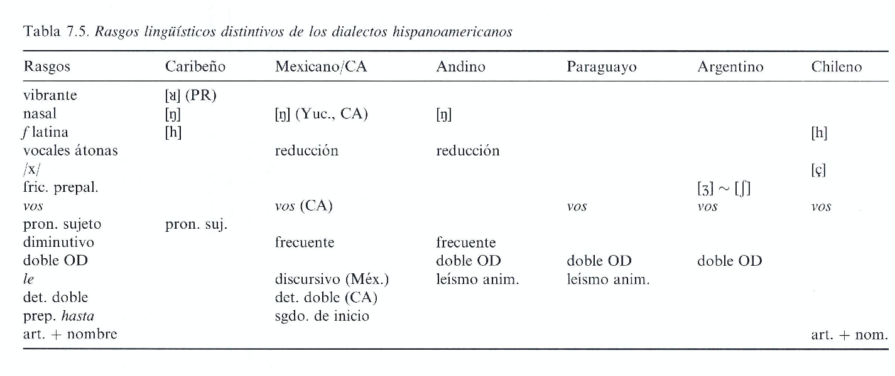

----

### Rasgos léxicos

- **Arcaísmos**: *amarrar, gaveta, mata, botar, alcanzar, calentura, candela, bravo, liviano*
- **Préstamos**:
    + **arahuaco o taíno**: *ají, barbacoa, cacique, hamaca, canoa, maíz, tabaco, huracán, loro, caimán*
    + **náhuatl**: *cuate, chamaco, elote, tomate, chocolate, chicle, aguacate, cacahuete, tiza*
    + **quechua**: *papa, palta, puna, chacra, choclo, soroche, cóndor, cancha, ñato, alpaca*
    + **mapundungu**: *poncho, guata*
    + **guaraní**: *jaguar, tapioca, petunia, tucán, mangangá*
- **Agronegrismos**: *banana(o), bemba, cachimbo, mucama, dengue, guandú, molinga, bochinche*
- **Regionalismos**:
    + **mexicanismos**: *chambear (trabajar), alberca (piscina), amolar (dañar), caco (ladrón)*
    + **peruanismos**: *calato (desnudo), pata (amigo), chato (bajo), huachafo (cursi), ñeque (tacaño)*
    + **venezolanismos**: *arrecho (molesto), chévere (bueno), chamo (muchacho), cuaima (ser listo)*
    + **argentinismos**: *barrilete (cometa), campera (chaqueta), pelado (calvo), atorrate (un vago)*

---

## La percepción dialectal

En un trabajo sobre la percepción de los dialectos, [Quesada Pacheco (2014)](https://scielo.conicyt.cl/scielo.php?script=sci_arttext&pid=S0718-93032014000200012) examina "las opiniones que tienen los hispanoamericanos de sus propias formas de hablar la lengua española" (1). Mediante el uso de "mapas perceptuales, mentales o virtuales", Quesada Pacheco muestra los resultados de una serie de entrevistas con hablantes de diferentes países.

### La metodología

"Los datos se recogieron entre 2008 y 2010, en cada una de las capitales de Hispanoamérica donde el español es lengua oficial, como parte de una investigación más global en el campo de las actitudes lingüísticas.  Desde la perspectiva diatópica, el cuestionario se dividió básicamente en dos ámbitos: preguntas que recogen opiniones concernientes al habla del país donde se aplicó la encuesta, y preguntas con opiniones sobre los demás países hispanohablantes. Así, dentro de este cuestionario, que constaba de 30 preguntas, se hicieron dos de carácter geográfico-perceptual en la sección llamada "Percepciones cognitivo-lingüísticas", y se preguntó a las personas consultadas lo siguiente:

- Pregunta 29: Diga/mencione tres países donde hablan el español/castellano igual o parecido a como usted lo habla.

- Pregunta 30: Diga/mencione tres países donde hablan el español/castellano diferente a como usted lo habla.

Los países incluídos en el estudio son México, Cuba, República Dominicana, Puerto Rico, Guatemala, El Salvador, Honduras, Nicaragua, Costa Rica, Panamá, Colombia, Venezuela, Ecuador, Perú, Bolivia, Paraguay, Chile, Argentina y Uruguay.

### Los resultados

____

___

___

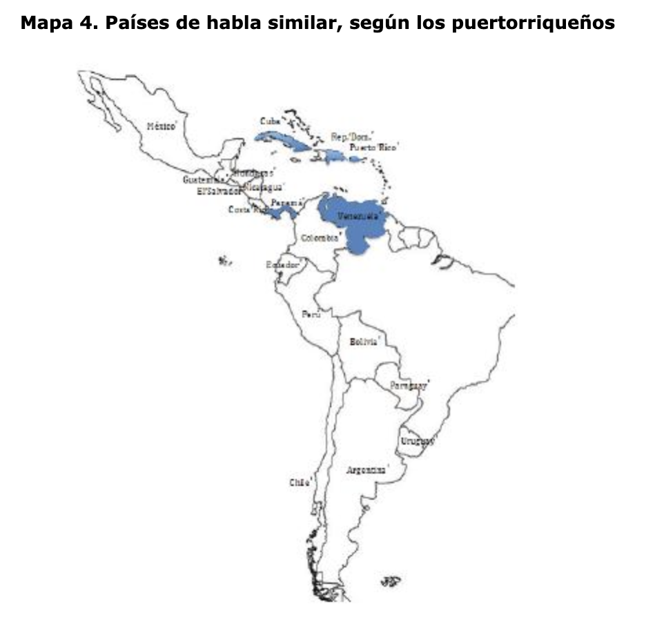

___

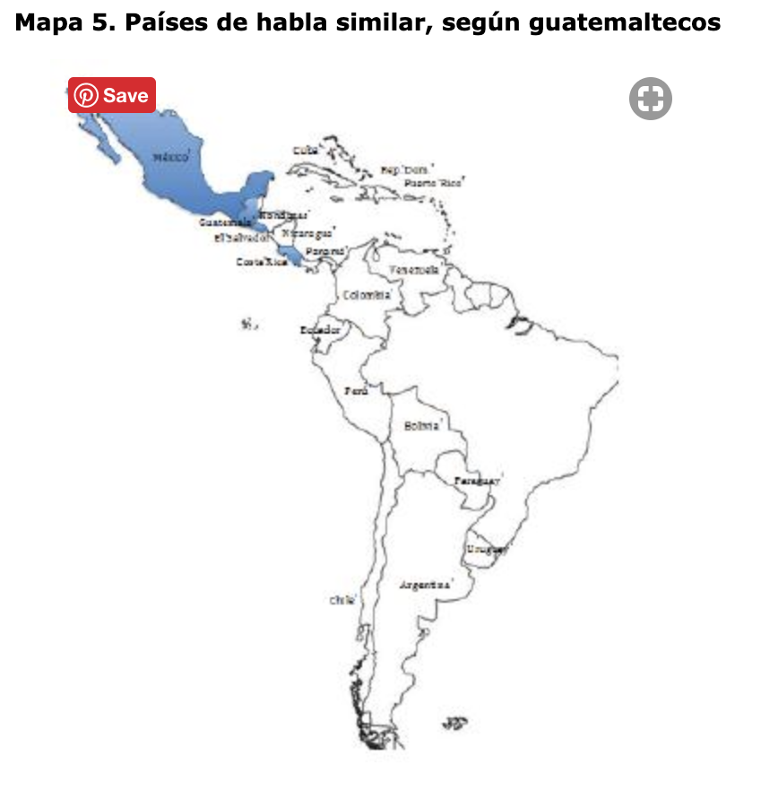

___

___

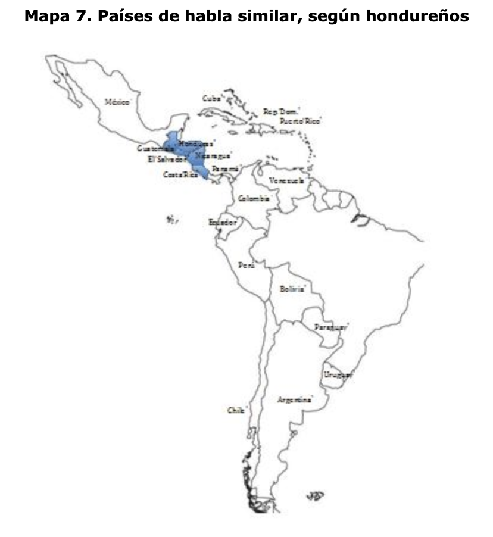

___

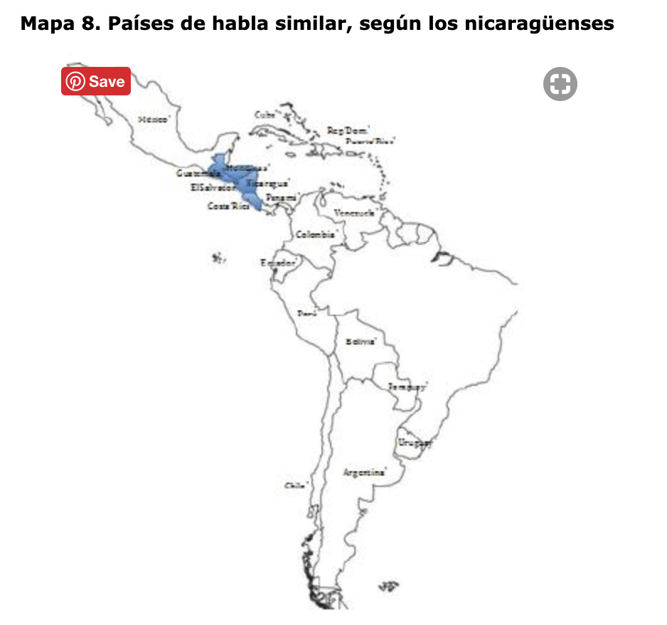

___

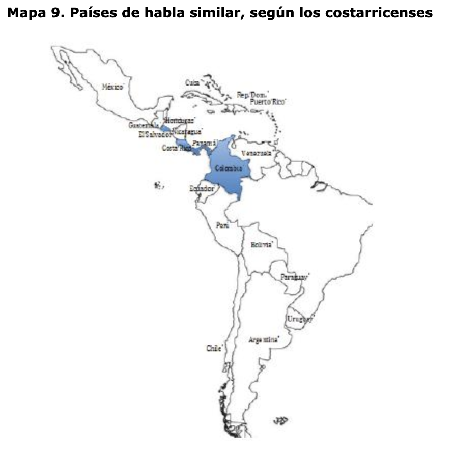

___

___

___

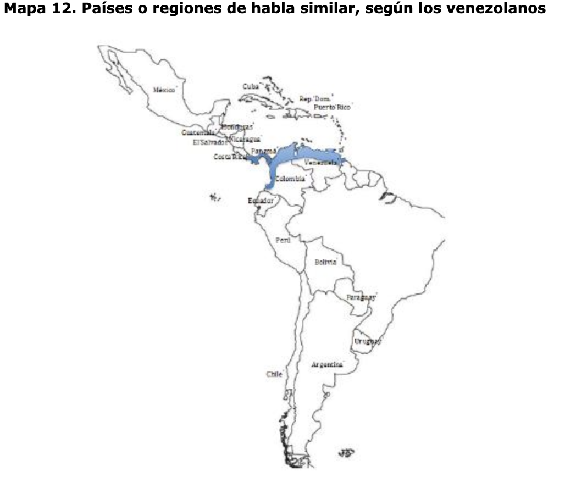

___

___

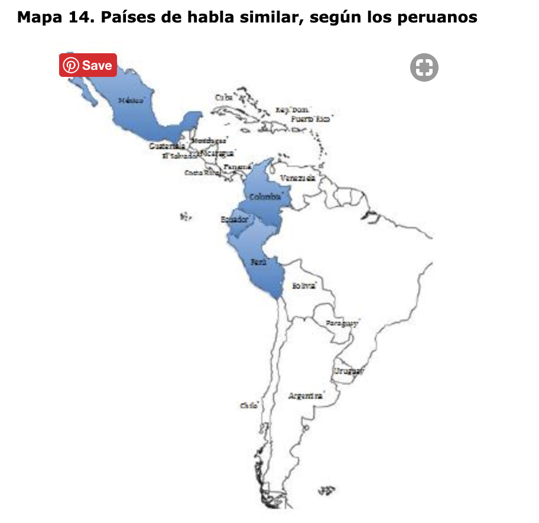

___

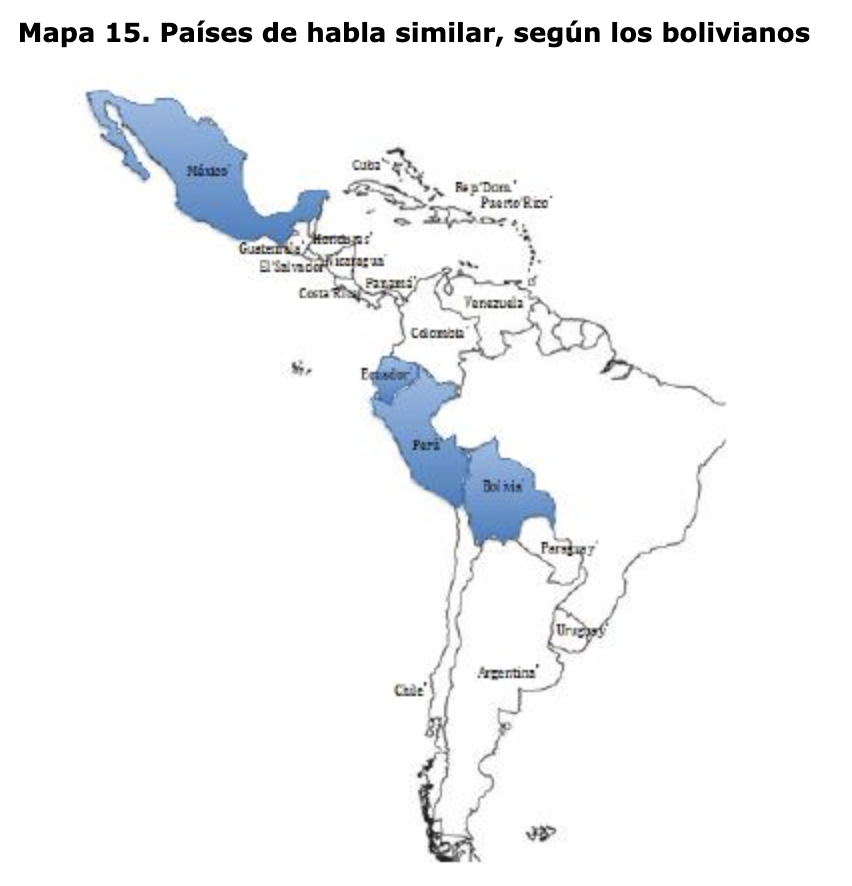

___

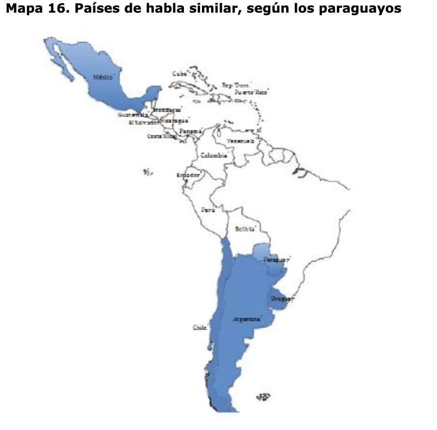

___

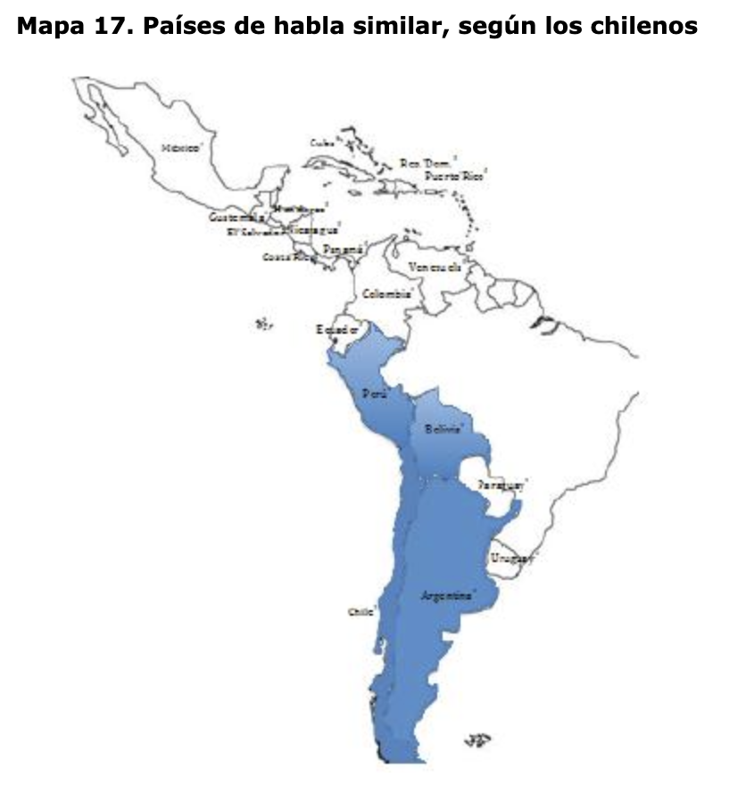

___

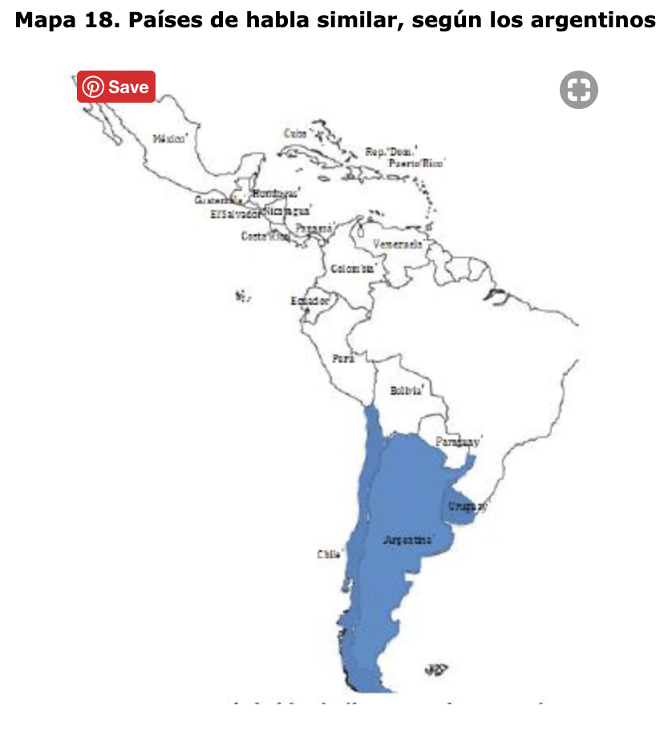

___

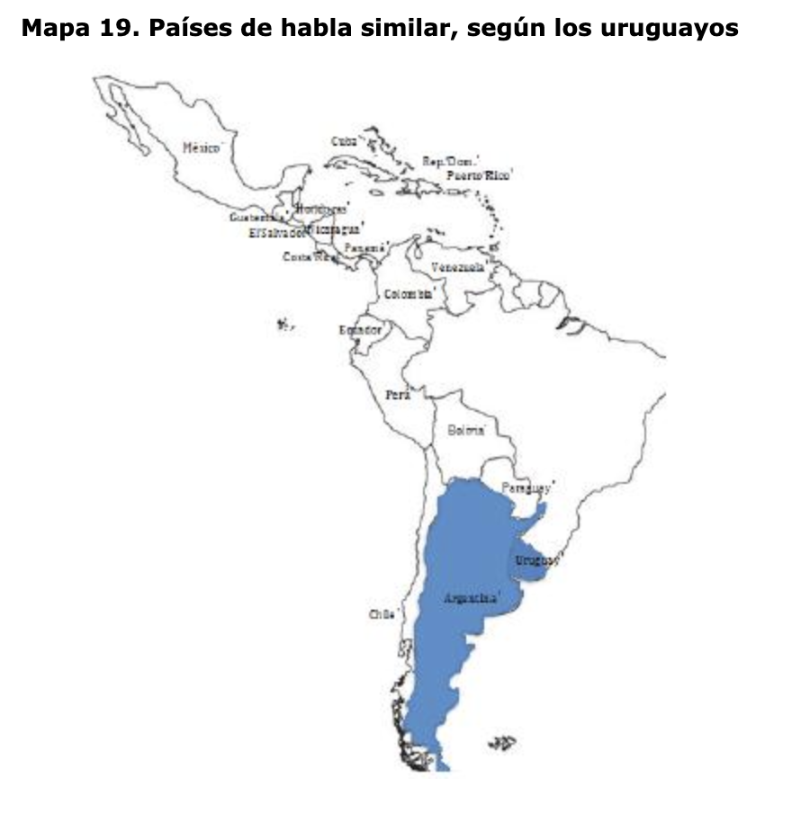

__

___

## Tarea

Para la tarea, vais a explorar la variación en el español de América Latina. Para empezar, hay que elegir uno de los siguientes sitios:

- [Voices of the Hispanic World](http://dialectos.osu.edu/)
- [Catálogo de voces hispánicas](https://cvc.cervantes.es/lengua/voces_hispanicas/)

Estos dos recursos presentan información sobre las variedades del español. Vuestro objetivo será encontrar dos rasgos que se hayan mencionado todavía. Prefiero que los dos rasgos sean de dos tipos distintos (es decir, fonológico o morfológico), pero no es un requisito fijo para la tarea. Estas observaciones se entregarán por eLC (Tools > Discussions > Tareas).
