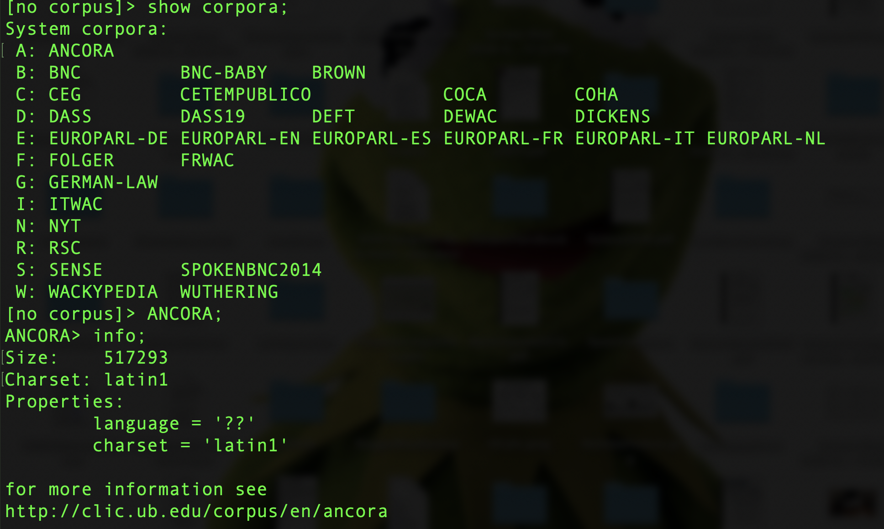

# Introducción

**Descripción del curso:**

En este curso, utilizaremos los corpus para explorar cuestiones lingüísticas del español. Además, desarrollaremos un conocimiento más amplio del campo de la Lingüística de Corpus (LC), tanto como una perspectiva metodológica como una sub-disciplina dentro de las ciencias de la lengua. Los estudiantes aprenderán una variedad de técnicas para el estudio de los corpus, entre ellos el uso del UGA Corpus Server y el CQP Query Language. Las áreas de estudio incluirán (i) diferentes aspectos del análisis lingüístico (p.e. la semántica léxica, las colocaciones, la adquisición, y la variación gramatical) y (ii) algunas perspectivas del campo de las humanidades digitales sobre los textos electrónicos como la codificación, la manipulación de archivos, y (tal vez) la estilística. Los estudiantes tendrán que realizar proyectos de investigación originales en los cuales se integran las diferentes perspectivas y metodologías presentadas en clase. Los temas comparativos (p.e. el español y el portugués) también son bienvenidos.

***

# 1a Semana {#introduccion}

## ¿Qué es un corpus? {-}

En esta clase se introducirá el uso de los corpus para el análisis del español (y otras lenguas). Nuestra primera cuestión se contestará así

> El análisis de corpus es el uso de métodos, normalmente computacionales, de colecciones de lengua humana con el fin de sacar conclusiones sobre el lenguaje o alguna característica de los usuarios del lenguaje (p.e. el/la autor(a), grupos demográficos, etc.).   

Para este primer día de clase, hableremos de uso del **UGA corpus server**. El programa que utilizaremos hoy para explorar esta colección de corpus se llama [el Corpus Query Processor (CQP)](http://cwb.sourceforge.net/documentation.php). El CQP te ofrece ciertas herramientas que facilitan el proceso de trabajar con datos electrónicos. Se introducirán otras técnicas durante el curso, pero es sumamente importante que tengamos una base sólida del CQP para poder seguir con los temas del curso. Por favor, consulta los mandatos del CQP descritos en el Manual. Entiendo que el uso del CQP puede ser intimidante, pero espero poder guiaros paso a paso.

***

## El uso del servidor {-}

Para poder utilizar CQP, tenemos que empezar con un programa que nos permite acceso al server:

1.  Hay que conectar directamente al UGA campus network o al [Virtual Private Network](https://uga.view.usg.edu/d2l/le/content/2064782/viewContent/31621926/View).
2.  Hay que tener una cuenta para el servir. Ya os he creado cuentas para todos. Estas cuentas requieren tu **UGA myID** y tu contraseña.

El server existe como parte del sistema operador de linus. Se puede convertir temporalmente la computadora donde trabajas en [un terminal](https://uga.view.usg.edu/d2l/le/content/2064782/viewContent/31621926/ViewEte) para el server mediante el uso del mandato `ssh`. Las instrucciones presentadas en el documento que se llama "Utilizing the UGA Corpus Server" describen este proceso.^[Gracias a Donald Dunagan por la prepación de este documento.] Para esta fase del curso, trabajaremos con dos programas que facilitan el proceso de acceder al servidor: **Terminal** (macOS) o [Putty](https://uga.view.usg.edu/d2l/le/content/2064782/viewContent/31621926/View) (Windows).

El primero paso al abrir el programa relevante (es decir, Terminal o Putty) será hacer el login con tu UGA myID. Una vez que se haya conectado al server, hay que iniciar CQP desde el mensaje ('prompt') de linux, con el uso de las etiquetas `e` y `c`:^[Verifica que la versión del CQP que utilizas es la versión apropiada con el mandato `cqp -version`. Debe ser la versión 3.4.22.]

* `kucera $ cqp -eC`

La etiqueta `-e` te ofrece opciones limitadas para revisar líneas del código, como el acceso a mandotos previous con el `up-arrow key'. La etiqueta `-C' produce los colores que observas. Al comenzar, el mensaje de linux (`$`) se reemplaza con el mensaje del CQP, lo cual es `[no corpus]` en el estado inicial. Puedes pedir que te muestre la lista de los corpus disponibles así. Notad que todos los mandatos del CQP se debe finalizar con el punto y coma.

* `[no corpus]> show corpora;`

No todos los corpus que existen como parte de [la colección del Departamento de Lingüística de UGA](http://research.franklin.uga.edu/linglab/corpora) son accesibles mediante CQP. Para averiguar más sobre un corpus partícular, utiliza el mandato `info`. Puedes salir de CQP con el mandato `exit`; otro uso de `exit` o `logout` te quitará del servidor. 

 [Arriba](#introduccion) 

***

# 2a Semana

## Nuestra primera consulta {-}

Las consultas más simples son palabras simples. Si se busca una palabra entre comillas (""), lo que se produce es una **concordancia** del tipo KWIC ('Key Words in Context') [CQP, sección 2.3](http://cwb.sourceforge.net/files/CQP_Tutorial/node9.html).

* `WUTHERING> "hardly" ;`

Para navegar los resultados, hay que utilizar el *spacebar* (lo cual avanza los resultados página por página), el *returEn key* (línea por línea), o `q` para terminar la búsqueda. En la visualización de KWIC, la palabra que concuerda con tu consulta se identifica con corchetes ángulares. Los números a la izquierda representan posiciones en el corpus. Estos números se pueden suprimir con el siguiente mandato:

* `WUTHERING> show -cpos ;`

Hay otras opciones que se pueden modificar. Por ejemplo, el mandato `+cpos` restaura los números para las próximas consultas. También, puedes pedir que CQP te produzca una cabecera para cada concordancia (CQP, sección 2.4). Para terminar con esta opción, hay que hacer el siguiente:

* `WUTHERING> show PrintOptions hdr;`
* `WUTHERING> show PrintOptions nohdr;`

## Contar los ejemplos

El CQP te puede contar los ejemplos de una palabra, pero es importante considerar lo significan estos números. Consideremos nuestra consulta de "hardly" con el corpus de WUTHERING. Se puede pedir que el CQP te cuente el número de ejemplos de la última consulta con el mandato `count` (CQP, sección 2.9).

* `WUTHERING> "hardly";`
* `WUTHERING> count by word;`
`43       hardly     [#0-#42]`

El número que se encuentra a la izquierda es el número total de atestaciones de "hardly" en la novela *Wuthering Heights*--es decir, 43. Si comparamos este número con otra colección del siglo 19 (Charles Dickens, CQP sección 1.3), conseguimos los siguientes resultados:

* `WUTHERING> DICKENS;`
* `DICKENS> "hardly";`
* `DICKENS> count by word;`
`451       hardly     [#0-#450]`

Con estos resultados, ¿debemos concluir que el uso de "hardly" es mayor en Dickens que el trabajo de Brontë? La respuesta es que NO. Si consultamos la información de estos dos corpus (con el mandato `info`), veremos que el tamaño (indicado en la sección de `size`) del corpus de DICKENS es mucho mayor (3.4 millones de casos de varios libros) que el de *Wuthering Heights*, con su 1.400 casos. Entonces, lo que tenemos que hacer es *relativizar* las frecuencias. Veremos esto más adelante.

## Los casos ('tokens')

Los corpora son divididos en casos ('tokens') discretos. Un casos es simplemente un elemento que ocupa una posición específica. Típicamente, un caso es una palabra (sobre todo con los corpus canónicos), pero hay casos no tan claros. Por ejemplo, con el corpus de *Wuthering Heights*, la 's' con el apóstrofe también es un caso.

* `WUTHERING> "'s'";`

Las consultas con CQP son especificaciones de propiedades que deben de tener casos particulares. Por ejemplo, cuando escribimos la palabra "hardly" entre comillas, pedimos que CQP nos encuentre un caso que se escribe 'h-a-r-d-l-y'. Dicho de otra forma, pedimos que nos de un caso donde el atributo `word` tiene con su valor la serie 'h-a-r-d-l-y'. Encontonces, consulta que realizamos anteriomente es igual al siguiente:

* `WUTHERING> [ word="hardly" ] ;`

Toda expresión que se escriba entre corchetes ("[...]") describe un caso simple. Este método de realizar una consulta señala al CQP que lo que importa para esta consulta es la ortografía de la palabra. Sin embargo, los casos pueden tener otro atributos y podemos realizar una consulta con más de un conjunto de corchetes. La siguiente consulta encuentra casos de "hardly know" y "hardly knew" ya que las dos formas de la segunda forma comparten el mismo **lema**.

* `WUTHERING> [ word="hardly" ] [ lemma="know" ] ;`

**Los lemas** están disponibles como atributo adicional en algunos de los corpus que se encuentran en el servidor. Nos facilita el proceso de buscar casos sin preocuparnos de formas variantes morfológicas. 

Si no imponenos ninguna restricción y dejamos que los corchetes estén vacíos, el CQP nos encuentra todos los casos que concuerden con estas posiciones.  Así que, ¿cuáles son las palabras que co-ocurren con "hardly"?

* `WUTHERING> [ ] [ lemma="know" ] ;`
* `WUTHERING> count by word ;`

Para especificar la consulta, podemos añadir el elemento `cut` que requiere que no se imprima las concordancias con menos de un número específico de casos.

* `WUTHERING> count by word cut 2 ;`

Con los resultados del mandato `count`, se nota que el número a la izquierda representa el número total de casos de secuencias de dos palabras que aparecen con "hardly" en *Wuthering Heights*. Se nota que el grupo más frecuente es la secuencia "I hardly", seguida de grupos con los verbos modales *can* y *could*. Ahora, inténtalo con el corpus de Dickens.

¿y qué pasa con un corpus mucho más grande como el NYT (1.35 mil millones de palabras)?

En el estilo del periodisimo representando por el corpus del NYT, se observa que las combinaciones con los verbos copulativos y los verbos modales son las secuencias más frecuentes, mientras que la secuencia de "I hardly" no es tan prominente. Lo que nos muestran estos resultados es que los corpus nos ofrecen una forma de observar **el uso lingüístico**. Es obvio pero importante destacar que el análsis lingüístico mediante corpus depende de los corpus, que son **muestras de una lengua**. Estas muestras son ejemplos de registros, estilos y contextos específicos. Si replicamos la misma consulta con el Spoken British National Corpus del año 2014, vemos de nuevo que la secuenca "I hardly" es algo frecuente. El texto de los periódicos, la producción literaria y el habla son todos registros distintos.

**Pregunta**: Con el uso del corpus ANCORA, contesta las siguientes preguntas:

1.  ¿Cuántos casos hay de la palabra *todo* en el corpus?
2.  ¿Cuáles son las formas de la palabra *todo* en el corpus?
3.  ¿Cuántos casos hay de cada uno de estas formas?
4.  ¿Cuáles son las palabras que ocurren antes de la palabra *todos*? Y después?

## Las distribuciones

En el análsis de corpus, a veces queremos ignorar variaciones que ocurren como función de, por ejemplo, la ortografía. Si utilizamos el corpus BNC-BABY (una muestra limitada del BNC), podemos ignorar la diferencias entre letras mayúsculas y minúsculas con la etiqueta `%c`.

* `BNC-BABY> [ word="bank"];`
* `BNC-BABY> [ word="bank" %c];`

También, podemos buscar por lemas; es decir, variantes morfológicas de una palabra:

* `DICKENS> [ lemma="go" ] ;`

Los elementos `word` y `lemma` son atributos posicionales; es decir, son definidos para cada caso para toda posición en el corpus. Los otros atributos posicionales se pueden averiguar con el corpus actual/activo mediante el mandato `show cd`.

### Consultas con nombre

Las consultas se pueden nombrar:

* `ANCORA> Ahora = "ahora";`

Nótete que no se produce un resultado. Sin embargo, podemos utilizar el output de esto proceso para ver, por ejemplo, la concordancia. Por ejemplo, con el mandato `cat`, podemos pedir que nos muestre la concordancia. También, podemos encontrar el número de casos con el mandato `size` (CQP, sección 3.1).

* `ANCORA> cat Ahora;`
* `ANCORA > size Ahora;`

De hecho, todas las consultas reciben, por defeto, el nombre `Last`. Si realizas una consulta sin especificar un nombre, puedes asignar un nombre con el "=".

* `ANCORA> "desde" ;`
* `ANCORA> d = Last ;`
* `ANCORA> "entonces" ;`
* `ANCORA> show named;`

El mandato `show named` produce una lista de todas las consultas que se han hecho durante la sesión actual, entre ellas los que tienen el nombre implícito de `Last`. Estas consultas se guardan en la memoria (m) y desaparecen cuando terminas las sesión, o si pides que las discartes.

### El mandato `group`

El mandato `group` es similar a otros mandatos de CQP como `cat`, `sort`, `count`, y `size` en que requiere el nombre de una consulta como un argumento. En el siguiente ejemplo, la consulta tiene el nombre K. Luego, aplicamos el mandato `group` a la consulta K y pedimos que nos muestre la distribución de frecuencias de las palabras que concuerden con la consulta:

El mismo grupo de mandatos también se pueden aplicar a las consultas de casos múltiples. Pregunta: ¿Cuánto son los casos de combinaciones de dos palabras como "knock out"?

Ahora podemos aplicar el mandato `group` a esta consulta también. Solo tiene que especificar cuál es el grupo que queremos. En esta situación, queremos la primera palabra a la derecha del elemento que buscamos, de acuerdo con su atributo de `word`.

Según estos resultados, los casos de "knock out" son menos frequentes que los casos de "knock on". Con el uso de la palabra clave `by`, podemos crear una tabla de dos dimensiones para considerar detalladamente esta distribución. En este caso, `hw` significa 'headword', lo cual representa el atributo del BNC que identifica la raíz morfológica (similar a `lemma`).

Estos números en la columna a la derecha del output de `group` representan una distribución de frecuencia. Son una medida cuantitativa que describe la frecuencia de de una forma partícular.

## Los metadatos ('metadata')

El término 'metadata' se refiere a esta información que describe los diferentes aspectos (sociales, dialectales, entre muchos otros) del corpus. Por ejemplo, abajo se presentan algunos de los atributos disponibles con el BNC:

Podemos utilizar estos atributos para realizar una consulta más precisa:

*  `BNC-BABY>[word="fantastic"]::match.text_mode="spoken" & match.u_sex="female";`

Con esta consulta, estamos buscando la palabra 'fantastic', pero hemos especificado que queremos de los casos (i) de la porción oral del corpus (`match-text_mode="spoken"`) y (ii) producidos por las personas indicadas como mujeres (`match.u_sex="female"`). Estos atributos se describen como *s-attributes* (donde la *s* = 'estructura'). El corpus de EUROPARL-ES, por ejemplo, contiene los siguientes s-attributes:

Se puede encontrar más información sobre estos atributos en [la documentación sobre el corpus](http://www.statmt.org/europarl/). Como un ejemplo, el atributo `speaker_language` indica la lengua original del hablante que produjo el caso.

Para ver un ejemplo tal vez más concreto, consideremos el corpus BNC-BABY, un sub-corpus del BNC. Con la siguiente consulta, utilizamos el mandato `match` para pedir los casos de la palabra 'lovely' según el sexo del/de la autor(a):

* `BNC-BABY> L = "lovely";`
* `BNC-BABY> group L match text_author_sex ;`

Podemos también utilizar el elemento `::` para indicar un 'global constraint' (manual de CQP, sección 4.1). En la siguiente consulta, definimos un elemento ('M') que contiene los casos de la palabra "mate". Además, especificamos (con el `::`) que no queremos casos que tengan el valor "unknown".

***
# 3a Semana

## Los verbos modales^[Estos apuntes se han basado en los apuntos de curso del profesor John Hale.]

En inglés, existe una clase de verbos auxiliares que expresan la "modalidad":

> In linguistics and philosophy, modality is the phenomenon whereby language is used to discuss non-actual situations. For instance, a modal expression may convey that something is likely, desirable, or permissible. Quintessential modal expressions include modal auxiliaries such as English "should" [Descripción](https://en.wikipedia.org/wiki/Modality_(linguistics))

Según Biber (2012), los verbos modales son más comunes en la lengua hablada que en el lengua escrita. Su argumento se basa en el corpus **Longman Spoken and Written English** (40 millones de palabras). Examinemos la hipótesis de Biber con el BNC (100+ millones de palabras).

*   `BNC> SPOK = "should" :: match.text_mode="spoken";`
*   `BNC> WRIT =  "should" :: match.text_mode="written";`
*   `BNC> size SPOK;`
*   `11676`
*   `BNC> size WRIT;`
*   `94884`

Debemos reconozer que estos resultados parecen producir una asimetría, pero que no concuerda la hipótesis de Biber. Hasta ahora, hemos ignorado que las secciones orales y escritas del BNC no son de tamaños equivalentes. Los valores del verbo *should* se tienen que relativizar para que comparemos dos corpus de tamaños distintos. Para hacer esto, podemos pedir que el CQP nos produzca una total de palabras en las secciones correspondientes con una consulta sin ninguna restricción; es decir, unos corchetes vacíos.

*   `BNC> ALLSPOK = [ ] :: match.text_mode="spoken";`
*   `BNC> size ALLSPOK;`
*   `11983120`
*   `BNC> ALLWRIT = [ ] :: match.text_mode="written";`
*   `BNC> size ALLWRIT;`
*   `100119205`

Ahora tenemos la información cuantitativa que se necesita para poder determinar la realización relativizada (por millón de palabras-`wpm`).

*   *should*~BNCspoken~ = $\frac{11676 x 1000000}{11983120}$ = 974.3wpm
*   *should*~BNCwritten~ = $\frac{94884 x 1000000}{11983120}$ = 947.4wpm

Según estos resultados, se nota la preponderancia de la palabra *should* en la sección escrita (974 wpm) comparada con la sección oral (947 wpm). Estas frecuencias se llaman frecuencias relativas ('relative frequencies') en el sentido descrito por Brezina (2018, p. 43)

## La historia y la geografía

Esta dicción ignora una variedad de otros factores, como el registro, que sirven como vehículos sociales del uso lingüístico. Examinemos la distinción entre 'can' y 'may'a través de uno de estos factores. Biber (2012, p. 203) nos dice que el verbo 'may' se está perdiendo por cuestión del cambio lingüístico. ¿Se manifiesta este fenómeno en algún registro específico? 

Para empezar, observemos los géneros específicos anotatos en el BNC. Podemos observar los valores de este atributo con otra consulta sin restricción, combinado con el uso del mandadto `group`.

 

Este ejemplo del mandato `group` nos permite observar todos los valores del atributo `text_derived_type` en el corpus. Estas categorías se describen en el documento de Susanne Flach con una tabla de los metados del BNC. Con el uso de la restricción global `::`, se puede concentrar en un género específico:

 

Esta diferencia de distribuciones concuerda con lo que dice Biber cuando propone que 'may' es menos frecuente que 'can'. ¿Cómo compara estos datos con el inglés de los EE.UU.? Utilizemos el [Brown Corpus](http://korpus.uib.no/icame/manuals/BROWN/), lo cual representa el primer corpus de tamaño grande para el inglés americano. Toma su nombre de Brown University donde fue creado en el año 1961 por Henry Kučera y W. Nelson Francis. La próxima tabla muestra de diferentes textos incluídos en este corpous.

* Tabla 1: Muestra de la distribución en el corpus de Brown

| Genre | Subgenre/Topic Area | | Samples|
|:------|:--------------------|--|----:|
| Non-fiction | Religion | Books | 7 |
| | | Periodicals | 6 |
| | | Tracts | 4 |
| | Skills and Hobbies | Books | 2 |
| | | Periodicals | 34 |
| | Popular Lore | Books | 23 |
| | | Periodicals | 25 |
| | Belles Lettres, Biography, Memoirs, etc. | Books | 38 |
| | | Periodicals | 37 |
| | Miscellaneous | Government Documents | 24 |
| | | Foundation Reports | 2 |
| | | Industry Reports | 2 |
| | | College Catalog | 1 |
| | | Industry House organ | 1 |
| | Learned | Natural Sciences | 12 |
| | | Medicine | 5 |
| | | Mathematics | 4 |
| | | Social and Behavioral Sciences | 14 |
| | | Political Science, Law, Education | 15 |
| | | Humanities | 18 |
| | | Technology and Engineering | 12 |
| Fiction | General | Novels | 20 |
| | | Short Stories | 9 |
|  | Mystery and Detective | Novels | 20 |
| | | Short Stories | 4 |
|  | Science Fiction | Novels | 3 |
| | | Short Stories | 3 |
|  | Adventure and Western | Novels | 15 |
| | | Short Stories | 14 |
|  | Romance and Love Story | Novels | 14 |
| | | Short Stories | 15 |
|  | Humor | Novels | 3 |
| | | Essays, etc. | 6 |
| Press | Reportage | Political | 14 |
| | | Sports | 7 |
| | | Society | 3 |
| | | Spot news | 9 |
| | | Financial | 4 |
| | | Cultural | 7 |
| | Editorial | Institutional | 10 |
| | | Personal | 10 |
| | | Letters to the Editor | 7 |
| | Reviews (theatre, books, music, dance) |  | 17 |

Use show cd to discover a metadata attribute that identifies a text's "Subgenre/Topic Area" in Brown. Did you notice text_category? Again, an unconstrained query reveals what the possible values are:

Podemos utilizar `cd` para descubrir los atributos que identifican los "Subgenre/Topic Area" de los textos de Brown. También podemos utilizar una consulta sin restricción:

* `BROWN> ALL = [ ] ;`
* `group ALL match text_category:`

Ahora, ¿se observa la misma asimetría entre 'may' y 'can' en el inglés americano?

 

Parece que sí; el verbo 'may' es menos frecuente, tanto en la muestra inglesa como en la muestra americana, que el verbo 'can' en los textos periodísticos.

*   **Tarea:** Examina los verbos 'may' y 'can' en el género `fiction`. ¿Se observa la misma asimestría? ¿Cómo se comparan los datos del inglés británico y el inglés americano? Ahora, exmamina la categoría de textos con el valor `learned` o `academic`. ¿Está disminuyendo el verbo 'may' en estos géneros?

## Contruir una hipótesis

En la sección anterior, se presentó la idea de que el verbo 'may' está desapareciendo en inglés, tal vez debido al uso elevado del verbo 'can' para expresar los mismos signficados. En esta sección, examinemos nuestra propia hipótesis sobre los modales de obligación (deónticos), 'should' y 'ought'.

* **Hipótesis:** El verbo 'should' ha reemplazado la forma 'ought', lo cual expresa aproximadamente el mismo significado.

Una hipótesis es una adivinanza educada. Sin embargo, si es verdad, debemos observar menos casos de 'ought' que 'should. 

Parece que, sí, esta hipótesis es válida. Las tasas de atestación de 'should' y 'ought' se diferencian por un ordén de magnitud entre los dos corpus.

* Tabla 2: Frecuencias normalizadas en dos corpora del inglés

| expresión | Brown | BNC |
|:---------|:-----|:----|
| should | $\frac{865 x 1M}{brownsize}$ = 744wpm | $\frac{106597 x 1M}{bncsize}$ = 950wpm |
| ought | $\frac{66 x 1M}{brownsize}$ = 56wpm | $\frac{5757 x 1M}{bncsize}$ = 51wpm |

Ahora, comparemos la forma modal de obligación 'must' con su homólogo 'have to'. ¿Qué pensamos sobre la siguiente hipótesis?

* **Hipótesis:** La estructura 'have to' es menos formal que 'must'.

Si esta hipótesis es correcta, esperamos tener más casos de 'have to' que 'must' en un género informal como `spoken_conversations`.

*   `BNC> HT = "have" "to" :: match.text_derived_type="spoken_conversation";`
*   `BNC> M = "must" :: match.text_derived_type="spoken_conversation" ;`
*   `BNC> size HT;`
*   `5141`
*   `BNC> size M;`
*   `2780`

Vemos que nuestra hipótesis es correcta. ¿Qué observamos en un género como la escritura académica?

*   `BNC> M = "must" :: match.text_derived_type="academic";`
*   `BNC> HT = "have" "to" :: match.text_derived_type="academic";`
*   `BNC> size M ;`
*   `13514`
*   `BNC> size HT ;`
*   `3615`
*   `BROWN> M = "must" :: match.text_category="learned";`     
*   `BROWN> HT = "have" "to" :: match.text_category="learned";`
*   `BROWN> size M ;`
*   `202`
*   `BROWN> size HT ;`
*   `24`

En un género formal, se obsera que hay más casos de 'must' comparado con 'have to', un resultado que es consistente con nuestra hipótesis. [Dejamos el proceso de la normalización como una tarea de casa.]

***

## Las listas de palabras

El trabajo de Biber (2012) identifica tres tipos de significados que puden expresear los verbos modales del inglés:

1.    permisión o posibilidad
2.    obligación o necesidad lógica
3.    voluntad o predicción

Cada uno de estos significados se pueden asociar con una lista de palabras. El CQP ofrece un mecanismo ([manual, sección 6.2](http://cwb.sourceforge.net/files/CQP_Tutorial.pdf)) que permite definir una lista y asociar palabras específicas con estas listas. Este proceso hace posible evitar la necesidad de escribir manualmente secuencias largas separadas por barras verticales.

*   `BROWN> define $perm = "can could may might"`
*   `BROWN> define $oblig = "must should ought"`
*   `BROWN> define $volit = "will would shall"`

Estas variables, cuyos nombres comienzan con un `$`, se pueden utilizar en toda situación en la cual se podría haber utilizado una seria individual en una consulta.

*   `BROWN> O = $oblig ;`
*   `BROWN> group O match text_category ;`
*   `BNC> O = $oblig ;`
*   `BNC> group O match text_derived_type ;`

¿Qué observamos en cuanto a la formalidad con estos resultados? Ahora podemos forma la unión de todas las formas modales:

*   `BNC> define $modal = $perm`
*   `BNC> define $modal += $oblig`
*   `BNC> define $modal += $volit`
*   `BNC> show $modal`
*   `$modal = can could may might must should ought will would shall`

La posibilidad de referirse a todas las formas modales a la vez facilita la búsqueda de las formas modales dobles. Estas formas se aceptan en [algunas variedades del inglés](https://ygdp.yale.edu/phenomena/multiple-modals).

Algunos de estos casos parecen ser errores, los cuales son inevitables en un corpus. Otros casos no son modales de verdad; por ejemplo, la palabra 'will' se entiende también como el sustantivo *voluntad*.

*   `1433741433: at his will be done . And <God 's will will> be done voice-over And i`
*   `429416972: at this second gesture of <good will will> be met with a similar ge`
*   `429589131: this humanitarian aid and <good will will> help bring down some of`
*   `297895587: ple call you . Enough ill <will can> turn anything into an at`
*   `325323612:  official . But political <will can> be found " to do more to`
*   `486055689:  message to them that our <will can> not be broken by terror`

Sin embargo, si observamos de forma más específica los casos de la forma 'might could', se encuentran algunos casos legítimos. En cuanto a la comparación entre el inglés británico y el inglés americano: no existe ningún caso en el BNC y  solo se encuentran dos casos en el SPOKENBNC2014, los cuales no parecen ser casos legítmos. Estas observaciones son consistentes con el uso de 'might could' con un fenómeno especificamente americano. (p. 44 de Hoffman et al.)

***
# Recursos {.tabset .tabset-fade .tabset-pills}

## Tools {-}
- [Collection of corpus resources available to UGA faculty and students](http://research.franklin.uga.edu/linglab/corpora)
- [The IMS Open Corpus Workbench](http://cwb.sourceforge.net/): The IMS Open Corpus Workbench (CWB) is a collection of open-source tools for managing and querying large text corpora (ranging from 10 million to 2 billion words) with linguistic annotations. Its central component is the flexible and efficient query processor CQP.
- [LANCSBox](http://corpora.lancs.ac.uk/lancsbox/): software package for the analysis of language data and corpora
- [Lancaster Stats Tools online](http://corpora.lancs.ac.uk/stats/index.php): The website provides practical support for the analysis of corpus data using a range of statistical techniques.
- [Linguistic Data Consortium](https://www.ldc.upenn.edu/): A great resource for language corpora; and UGA has an institutional subscription!!
- [Tools for Corpus Linguistics](https://corpus-analysis.com/): A long list of corpus-related resources that's always being updated

## Generales {-}

- [Corpus del Español](http://www.corpusdelespanol.org/): Spanish corpus compiled by BYU
- [El Corpus de Referencia del Español Actual (CREA)](https://www.rae.es/recursos/banco-de-datos/crea)
- [El Atlas Sintáctico del Español (ASinEs)](https://www.rae.es/recursos/enlaces-externos/atlas-sintactico-del-espanol)

## Históricos {-}

- [El Corpus Diacrónico del Español (CORDE)](https://www.rae.es/recursos/banco-de-datos/corde)
- [Corpus del Nuevo Diccionario Histórico del Español](http://web.frl.es/CNDHE/view/inicioExterno.view;jsessionid=2E34C1C1AF321C2A31535DD5369E994F)
- [Corpus Diacrónico y Diatópico del Español de América](http://www.cordiam.org/): El Corpus Diacrónico y Diatópico del Español de América reúne tres conjuntos documentales; Cordiam-Documentos, Cordiam-Literatura y Cordiam-Prensa.
- [Corpus Hispánico y Americano en la Red: Textos Antiguos](http://www.corpuscharta.es/): CHARTA se concibe como un proyecto global para la edición y análisis lingüístico de textos archivísticos en español de los siglos XII al XIX.
- [El corpus CODEA (Corpus de Documentos Españoles Anteriores a 1800)](http://corpuscodea.es/)
- [Project P.S. Post Scriptum](http://ps.clul.ul.pt/)
- [Biblia Medieval](http://www.bibliamedieval.es/index.php)

<!--
## General Corpus Tools
- [Collection of corpus resources available to UGA faculty and students](http://research.franklin.uga.edu/linglab/corpora)
- [The IMS Open Corpus Workbench](http://cwb.sourceforge.net/): The IMS Open Corpus Workbench (CWB) is a collection of open-source tools for managing and querying large text corpora (ranging from 10 million to 2 billion words) with linguistic annotations. Its central component is the flexible and efficient query processor CQP.
- [LANCSBox](http://corpora.lancs.ac.uk/lancsbox/): software package for the analysis of language data and corpora
- [Lancaster Stats Tools online](http://corpora.lancs.ac.uk/stats/index.php): The website provides practical support for the analysis of corpus data using a range of statistical techniques.
- [Linguistic Data Consortium](https://www.ldc.upenn.edu/): A great resource for language corpora; and UGA has an institutional subscription!!
- [Tools for Corpus Linguistics](https://corpus-analysis.com/): A long list of corpus-related resources that's always being updated

----

Spanish Corpora
General Corpora
- [Corpus del Español](http://www.corpusdelespanol.org/): Spanish corpus compiled by BYU
- [El Corpus de Referencia del Español Actual (CREA)](https://www.rae.es/recursos/banco-de-datos/crea)
- [El Atlas Sintáctico del Español (ASinEs)](https://www.rae.es/recursos/enlaces-externos/atlas-sintactico-del-espanol)

Historical

- [El Corpus Diacrónico del Español (CORDE)](https://www.rae.es/recursos/banco-de-datos/corde)
- [Corpus del Nuevo Diccionario Histórico del Español](http://web.frl.es/CNDHE/view/inicioExterno.view;jsessionid=2E34C1C1AF321C2A31535DD5369E994F)
- [Corpus Diacrónico y Diatópico del Español de América](http://www.cordiam.org/): El Corpus Diacrónico y Diatópico del Español de América reúne tres conjuntos documentales; Cordiam-Documentos, Cordiam-Literatura y Cordiam-Prensa.
- [Corpus Hispánico y Americano en la Red: Textos Antiguos](http://www.corpuscharta.es/): CHARTA se concibe como un proyecto global para la edición y análisis lingüístico de textos archivísticos en español de los siglos XII al XIX.
- [El corpus CODEA (Corpus de Documentos Españoles Anteriores a 1800)](http://corpuscodea.es/)
- [Project P.S. Post Scriptum](http://ps.clul.ul.pt/)
- [Biblia Medieval](http://www.bibliamedieval.es/index.php)

-----

Sociolinguistic

- [Corpus del Español en el Sur de Arizona (CESA)](https://cesa.arizona.edu/)
- [El Corpus del Español del Siglo XXI (CORPES XXI)](https://www.rae.es/recursos/banco-de-datos/corpes-xxi)
- [PRESEEA](http://preseea.linguas.net/): A collection of sociolinguistic data from around the Spanish-speaking world.
- [CANOLFAN: The Miami corpus consists of conversations by Spanish-English bilinguals](http://bangortalk.org.uk/speakers.php?c=miami)
- [Corpus MIAMI](http://bangortalk.org.uk/speakers.php?c=miami&fbclid=IwAR1gYuXaXUhYw-u7_B0zS2kMwdMYyd-pQW_JGTkjrGxdoL11AgpcRsZFYI8)
- [Corpus of Mexican Spanish in Salinas](https://itcdland.csumb.edu/~eabrown/)
- [COSER: Corpus oral y Sonora del Español Rural](http://corpusrural.es/)
- [Spanish in Texas](http://spanishintexas.org/)

Acquisition

- [CEDEL2: Corpus Escrito del Español L2 (versión 2)](http://cedel2.learnercorpora.com/)
- [Spanish Learner Language Oral Corpora (splloc)](http://www.splloc.soton.ac.uk/)
- [El Corpus de aprendices del español (CAES)](https://hispanismo.cervantes.es/congresos-y-cursos/corpus-aprendices-espanol-caes-concepcion-explotacion-caes)

Digital Spanish

- [Bilingual Youth Texts](https://byts.commons.gc.cuny.edu/)
- [COW](https://www.webcorpora.org/): High Quality Web Corpora

Other Languages

- [Corpus do Português](http://www.corpusdoportugues.org/): Portuguese corpus compiled by BYU

- <a href="https://uclouvain.be/en/research-institutes/ilc/cecl/corpora.html">Center for English Corpus Linguistics (Louvain)</a>: A collection of several useful corpus resources
- <a href="http://lingtools.uoregon.edu/coraal/explorer/">CoRAAL</a>: Corpus of Regional African American Language, developed and hosted by the University Oregon
- <a href="https://cqpweb.lancs.ac.uk/">Lancaster Corpus Resources</a>
- <a href="https://cesa.arizona.edu/links-other-sociolinguistic-corpora">University of Arizona Corpus Resources</a>
- [SPeech Across Dialects of English (SPADE)](https://spade.glasgow.ac.uk/): This is a very cool project that seeks to develop tools for doing large-scale analysis of speech data.

-->
