# Introducción

**Descripción del curso:**

En este curso, utilizaremos los corpus para explorar cuestiones lingüísticas del español. Además, desarrollaremos un conocimiento más amplio del campo de la Lingüística de Corpus (LC), tanto como una perspectiva metodológica como una sub-disciplina dentro de las ciencias de la lengua. Los estudiantes aprenderán una variedad de técnicas para el estudio de los corpus, entre ellos el uso del UGA Corpus Server y el CQP Query Language. Las áreas de estudio incluirán (i) diferentes aspectos del análisis lingüístico (p.e. la semántica léxica, las colocaciones, la adquisición, y la variación gramatical) y (ii) algunas perspectivas del campo de las humanidades digitales sobre los textos electrónicos como la codificación, la manipulación de archivos, y (tal vez) la estilística. Los estudiantes tendrán que realizar proyectos de investigación originales en los cuales se integran las diferentes perspectivas y metodologías presentadas en clase. Los temas comparativos (p.e. el español y el portugués) también son bienvenidos.

***

# 1a Semana {#introduccion}

## ¿Qué es un corpus? {-}

En esta clase se introducirá el uso de los corpus para el análisis del español (y otras lenguas). Nuestra primera cuestión se contestará así

> El análisis de corpus es el uso de métodos, normalmente computacionales, de colecciones de lengua humana con el fin de sacar conclusiones sobre el lenguaje o alguna característica de los usuarios del lenguaje (p.e. el/la autor(a), grupos demográficos, etc.).   

Para este primer día de clase, hableremos de uso del **UGA corpus server**. El programa que utilizaremos hoy para explorar esta colección de corpus se llama [el Corpus Query Processor (CQP)](http://cwb.sourceforge.net/documentation.php). El CQP te ofrece ciertas herramientas que facilitan el proceso de trabajar con datos electrónicos. Se introducirán otras técnicas durante el curso, pero es sumamente importante que tengamos una base sólida del CQP para poder seguir con los temas del curso. Por favor, consulta los mandatos del CQP descritos en el Manual. Entiendo que el uso del CQP puede ser intimidante, pero espero poder guiaros paso a paso.

***

## El uso del servidor {-}

Para poder utilizar CQP, tenemos que empezar con un programa que nos permite acceso al server:

1.  Hay que conectar directamente al UGA campus network o al [Virtual Private Network](https://uga.view.usg.edu/d2l/le/content/2064782/viewContent/31621926/View).
2.  Hay que tener una cuenta para el servir. Ya os he creado cuentas para todos. Estas cuentas requieren tu **UGA myID** y tu contraseña.

El server existe como parte del sistema operador de linus. Se puede convertir temporalmente la computadora donde trabajas en [un terminal](https://uga.view.usg.edu/d2l/le/content/2064782/viewContent/31621926/ViewEte) para el server mediante el uso del mandato `ssh`. Las instrucciones presentadas en el documento que se llama "Utilizing the UGA Corpus Server" describen este proceso.^[Gracias a Donald Dunagan por la preparación de este documento.] Para esta fase del curso, trabajaremos con dos programas que facilitan el proceso de acceder al servidor: **Terminal** (macOS) o [Putty](https://uga.view.usg.edu/d2l/le/content/2064782/viewContent/31621926/View) (Windows).

El primero paso al abrir el programa relevante (es decir, Terminal o Putty) será hacer el login con tu UGA myID. Una vez que se haya conectado al server, hay que iniciar CQP desde el mensaje ('prompt') de linux, con el uso de las etiquetas `e` y `c`:^[Verifica que la versión del CQP que utilizas es la versión apropiada con el mandato `cqp -version`. Debe ser la versión 3.4.22.]

* `kucera $ cqp -eC`

La etiqueta `-e` te ofrece opciones limitadas para revisar líneas del código, como el acceso a mandotos previous con el `up-arrow key'. La etiqueta `-C' produce los colores que observas. Al comenzar, el mensaje de linux (`$`) se reemplaza con el mensaje del CQP, lo cual es `[no corpus]` en el estado inicial. Puedes pedir que te muestre la lista de los corpus disponibles así. Notad que todos los mandatos del CQP se debe finalizar con el punto y coma.

* `[no corpus]> show corpora;`

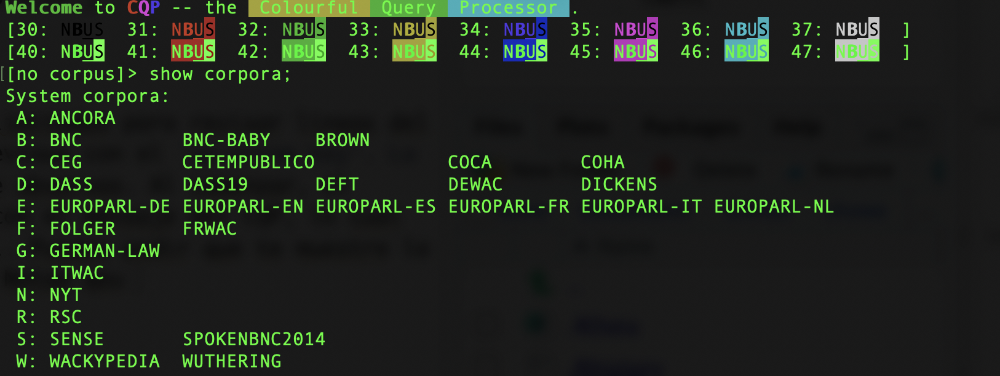

No todos los corpus que existen como parte de [la colección del Departamento de Lingüística de UGA](http://research.franklin.uga.edu/linglab/corpora) son accesibles mediante CQP. Para averiguar más sobre un corpus partícular, utiliza el mandato `info`. Puedes salir de CQP con el mandato `exit`; otro uso de `exit` o `logout` te quitará del servidor. 


<center> [Arriba](#introduccion) </center>

***

# 2a Semana

## Nuestra primera consulta {-}

Las consultas más simples son palabras simples. Si se busca una palabra entre comillas (""), lo que se produce es una **concordancia** del tipo KWIC ('Key Words in Context') [CQP, sección 2.3](http://cwb.sourceforge.net/files/CQP_Tutorial/node9.html).

* `WUTHERING> "hardly" ;`

Para navegar los resultados, hay que utilizar el *spacebar* (lo cual avanza los resultados página por página), el *returEn key* (línea por línea), o `q` para terminar la búsqueda. En la visualización de KWIC, la palabra que concuerda con tu consulta se identifica con corchetes ángulares. Los números a la izquierda representan posiciones en el corpus. Estos números se pueden suprimir con el siguiente mandato:

* `WUTHERING> show -cpos ;`

Hay otras opciones que se pueden modificar. Por ejemplo, el mandato `+cpos` restaura los números para las próximas consultas. También, puedes pedir que CQP te produzca una cabecera para cada concordancia (CQP, sección 2.4). Para terminar con esta opción, hay que hacer el siguiente:

* `WUTHERING> show PrintOptions hdr;`
* `WUTHERING> show PrintOptions nohdr;`

## Contar los ejemplos

El CQP te puede contar los ejemplos de una palabra, pero es importante considerar lo significan estos números. Consideremos nuestra consulta de "hardly" con el corpus de WUTHERING. Se puede pedir que el CQP te cuente el número de ejemplos de la última consulta con el mandato `count` (CQP, sección 2.9).

* `WUTHERING> "hardly";`
* `WUTHERING> count by word;`
`43       hardly     [#0-#42]`

El número que se encuentra a la izquierda es el número total de atestaciones de "hardly" en la novela *Wuthering Heights*--es decir, 43. Si comparamos este número con otra colección del siglo 19 (Charles Dickens, CQP sección 1.3), conseguimos los siguientes resultados:

* `WUTHERING> DICKENS;`
* `DICKENS> "hardly";`
* `DICKENS> count by word;`
`451       hardly     [#0-#450]`

Con estos resultados, ¿debemos concluir que el uso de "hardly" es mayor en Dickens que el trabajo de Brontë? La respuesta es que NO. Si consultamos la información de estos dos corpus (con el mandato `info`), veremos que el tamaño (indicado en la sección de `size`) del corpus de DICKENS es mucho mayor (3.4 millones de casos de varios libros) que el de *Wuthering Heights*, con su 1.400 casos. Entonces, lo que tenemos que hacer es *relativizar* las frecuencias. Veremos esto más adelante.

## Los casos ('tokens')

Los corpora son divididos en casos ('tokens') discretos. Un casos es simplemente un elemento que ocupa una posición específica. Típicamente, un caso es una palabra (sobre todo con los corpus canónicos), pero hay casos no tan claros. Por ejemplo, con el corpus de *Wuthering Heights*, la 's' con el apóstrofe también es un caso.

* `WUTHERING> "'s'";`

Las consultas con CQP son especificaciones de propiedades que deben de tener casos particulares. Por ejemplo, cuando escribimos la palabra "hardly" entre comillas, pedimos que CQP nos encuentre un caso que se escribe 'h-a-r-d-l-y'. Dicho de otra forma, pedimos que nos de un caso donde el atributo `word` tiene con su valor la serie 'h-a-r-d-l-y'. Encontonces, consulta que realizamos anteriomente es igual al siguiente:

* `WUTHERING> [ word="hardly" ] ;`

Toda expresión que se escriba entre corchetes ("[...]") describe un caso simple. Este método de realizar una consulta señala al CQP que lo que importa para esta consulta es la ortografía de la palabra. Sin embargo, los casos pueden tener otro atributos y podemos realizar una consulta con más de un conjunto de corchetes. La siguiente consulta encuentra casos de "hardly know" y "hardly knew" ya que las dos formas de la segunda forma comparten el mismo **lema**.

* `WUTHERING> [ word="hardly" ] [ lemma="know" ] ;`

**Los lemas** están disponibles como atributo adicional en algunos de los corpus que se encuentran en el servidor. Nos facilita el proceso de buscar casos sin preocuparnos de formas variantes morfológicas. 

Si no imponenos ninguna restricción y dejamos que los corchetes estén vacíos, el CQP nos encuentra todos los casos que concuerden con estas posiciones.  Así que, ¿cuáles son las palabras que co-ocurren con "hardly"?

* `WUTHERING> [ ] [ lemma="know" ] ;`
* `WUTHERING> count by word ;`

Para especificar la consulta, podemos añadir el elemento `cut` que requiere que no se imprima las concordancias con menos de un número específico de casos.

* `WUTHERING> count by word cut 2 ;`

Con los resultados del mandato `count`, se nota que el número a la izquierda representa el número total de casos de secuencias de dos palabras que aparecen con "hardly" en *Wuthering Heights*. Se nota que el grupo más frecuente es la secuencia "I hardly", seguida de grupos con los verbos modales *can* y *could*. Ahora, inténtalo con el corpus de Dickens.

¿y qué pasa con un corpus mucho más grande como el NYT (1.35 mil millones de palabras)?

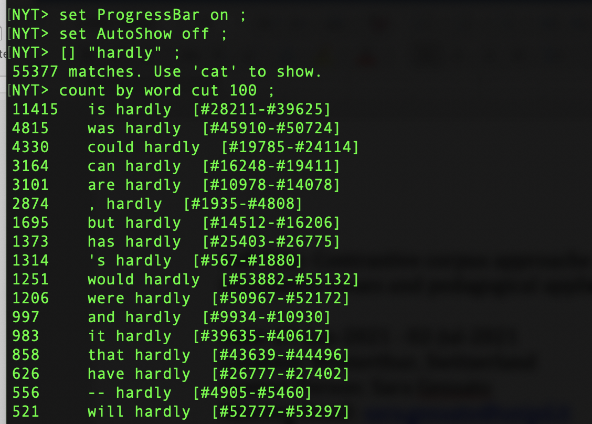

En el estilo del periodisimo representando por el corpus del NYT, se observa que las combinaciones con los verbos copulativos y los verbos modales son las secuencias más frecuentes, mientras que la secuencia de "I hardly" no es tan prominente. Lo que nos muestran estos resultados es que los corpus nos ofrecen una forma de observar **el uso lingüístico**. Es obvio pero importante destacar que el análsis lingüístico mediante corpus depende de los corpus, que son **muestras de una lengua**. Estas muestras son ejemplos de registros, estilos y contextos específicos. Si replicamos la misma consulta con el Spoken British National Corpus del año 2014, vemos de nuevo que la secuenca "I hardly" es algo frecuente. El texto de los periódicos, la producción literaria y el habla son todos registros distintos.


**Pregunta**: Con el uso del corpus ANCORA, contesta las siguientes preguntas:

1.  ¿Cuántos casos hay de la palabra *todo* en el corpus?
2.  ¿Cuáles son las formas de la palabra *todo* en el corpus?
3.  ¿Cuántos casos hay de cada uno de estas formas?
4.  ¿Cuáles son las palabras que ocurren antes de la palabra *todos*? Y después?

## Las distribuciones

En el análsis de corpus, a veces queremos ignorar variaciones que ocurren como función de, por ejemplo, la ortografía. Si utilizamos el corpus BNC-BABY (una muestra limitada del BNC), podemos ignorar la diferencias entre letras mayúsculas y minúsculas con la etiqueta `%c`.

* `BNC-BABY> [ word="bank"];`
* `BNC-BABY> [ word="bank" %c];`

También, podemos buscar por lemas; es decir, variantes morfológicas de una palabra:

* `DICKENS> [ lemma="go" ] ;`

Los elementos `word` y `lemma` son atributos posicionales; es decir, son definidos para cada caso para toda posición en el corpus. Los otros atributos posicionales se pueden averiguar con el corpus actual/activo mediante el mandato `show cd`.

### Consultas con nombre

Las consultas se pueden nombrar:

* `ANCORA> Ahora = "ahora";`

Nótete que no se produce un resultado. Sin embargo, podemos utilizar el output de esto proceso para ver, por ejemplo, la concordancia. Por ejemplo, con el mandato `cat`, podemos pedir que nos muestre la concordancia. También, podemos encontrar el número de casos con el mandato `size` (CQP, sección 3.1).

* `ANCORA> cat Ahora;`
* `ANCORA > size Ahora;`

De hecho, todas las consultas reciben, por defeto, el nombre `Last`. Si realizas una consulta sin especificar un nombre, puedes asignar un nombre con el "=".

* `ANCORA> "desde" ;`
* `ANCORA> d = Last ;`
* `ANCORA> "entonces" ;`
* `ANCORA> show named;`

El mandato `show named` produce una lista de todas las consultas que se han hecho durante la sesión actual, entre ellas los que tienen el nombre implícito de `Last`. Estas consultas se guardan en la memoria (m) y desaparecen cuando terminas las sesión, o si pides que las discartes.

### El mandato `group`

El mandato `group` es similar a otros mandatos de CQP como `cat`, `sort`, `count`, y `size` en que requiere el nombre de una consulta como un argumento. En el siguiente ejemplo, la consulta tiene el nombre K. Luego, aplicamos el mandato `group` a la consulta K y pedimos que nos muestre la distribución de frecuencias de las palabras que concuerden con la consulta:


El mismo grupo de mandatos también se pueden aplicar a las consultas de casos múltiples. Pregunta: ¿Cuánto son los casos de combinaciones de dos palabras como "knock out"?


Ahora podemos aplicar el mandato `group` a esta consulta también. Solo tiene que especificar cuál es el grupo que queremos. En esta situación, queremos la primera palabra a la derecha del elemento que buscamos, de acuerdo con su atributo de `word`.

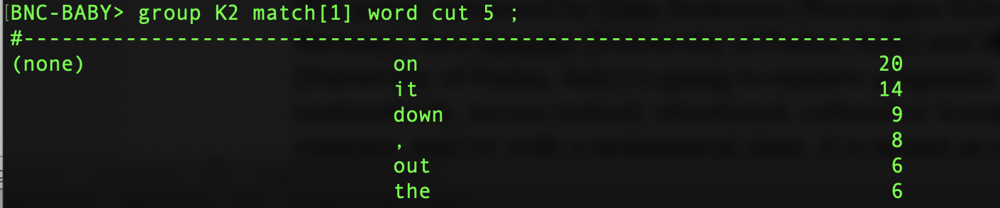

Según estos resultados, los casos de "knock out" son menos frequentes que los casos de "knock on". Con el uso de la palabra clave `by`, podemos crear una tabla de dos dimensiones para considerar detalladamente esta distribución. En este caso, `hw` significa 'headword', lo cual representa el atributo del BNC que identifica la raíz morfológica (similar a `lemma`).


Estos números en la columna a la derecha del output de `group` representan una distribución de frecuencia. Son una medida cuantitativa que describe la frecuencia de de una forma partícular.

## Los metadatos ('metadata')

El término 'metadata' se refiere a esta información que describe los diferentes aspectos (sociales, dialectales, entre muchos otros) del corpus. Por ejemplo, abajo se presentan algunos de los atributos disponibles con el BNC:


Podemos utilizar estos atributos para realizar una consulta más precisa:

*  `BNC-BABY>[word="fantastic"]::match.text_mode="spoken" & match.u_sex="female";`

Con esta consulta, estamos buscando la palabra 'fantastic', pero hemos especificado que queremos de los casos (i) de la porción oral del corpus (`match-text_mode="spoken"`) y (ii) producidos por las personas indicadas como mujeres (`match.u_sex="female"`). Estos atributos se describen como *s-attributes* (donde la *s* = 'estructura'). El corpus de EUROPARL-ES, por ejemplo, contiene los siguientes s-attributes:

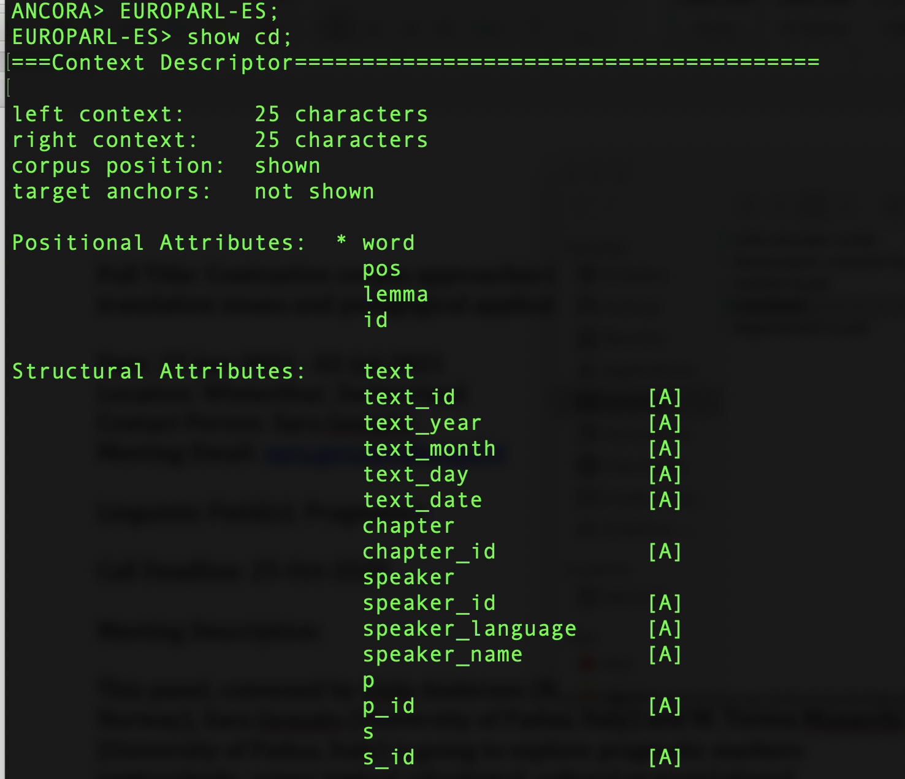
Se puede encontrar más información sobre estos atributos en [la documentación sobre el corpus](http://www.statmt.org/europarl/). Como un ejemplo, el atributo `speaker_language` indica la lengua original del hablante que produjo el caso.

Para ver un ejemplo tal vez más concreto, consideremos el corpus BNC-BABY, un sub-corpus del BNC. Con la siguiente consulta, utilizamos el mandato `match` para pedir los casos de la palabra 'lovely' según el sexo del/de la autor(a):

* `BNC-BABY> L = "lovely";`
* `BNC-BABY> group L match text_author_sex ;`


Podemos también utilizar el elemento `::` para indicar un 'global constraint' (manual de CQP, sección 4.1). En la siguiente consulta, definimos un elemento ('M') que contiene los casos de la palabra "mate". Además, especificamos (con el `::`) que no queremos casos que tengan el valor "unknown".


***
# 3a Semana

## Los verbos modales^[Estos apuntes se han basado en los apuntos de curso del profesor John Hale.]

En inglés, existe una clase de verbos auxiliares que expresan la "modalidad":

> In linguistics and philosophy, modality is the phenomenon whereby language is used to discuss non-actual situations. For instance, a modal expression may convey that something is likely, desirable, or permissible. Quintessential modal expressions include modal auxiliaries such as English "should" [Descripción](https://en.wikipedia.org/wiki/Modality_(linguistics))

Según Biber (2012), los verbos modales son más comunes en la lengua hablada que en el lengua escrita. Su argumento se basa en el corpus **Longman Spoken and Written English** (40 millones de palabras). Examinemos la hipótesis de Biber con el BNC (100+ millones de palabras).

*   `BNC> SPOK = "should" :: match.text_mode="spoken";`
*   `BNC> WRIT =  "should" :: match.text_mode="written";`
*   `BNC> size SPOK;`
*   `11676`
*   `BNC> size WRIT;`
*   `94884`

Debemos reconocer que estos resultados parecen producir una asimetría, pero que no concuerda la hipótesis de Biber. Hasta ahora, hemos ignorado que las secciones orales y escritas del BNC no son de tamaños equivalentes. Los valores del verbo *should* se tienen que relativizar para que comparemos dos corpus de tamaños distintos. Para hacer esto, podemos pedir que el CQP nos produzca una total de palabras en las secciones correspondientes con una consulta sin ninguna restricción; es decir, unos corchetes vacíos.

*   `BNC> ALLSPOK = [ ] :: match.text_mode="spoken";`
*   `BNC> size ALLSPOK;`
*   `11983120`
*   `BNC> ALLWRIT = [ ] :: match.text_mode="written";`
*   `BNC> size ALLWRIT;`
*   `100119205`

Ahora tenemos la información cuantitativa que se necesita para poder determinar la realización relativizada (por millón de palabras-`wpm`).

*   *should*~BNCspoken~ = $\frac{11676 x 1000000}{11983120}$ = 974.3wpm
*   *should*~BNCwritten~ = $\frac{94884 x 1000000}{11983120}$ = 947.4wpm

Según estos resultados, se nota la preponderancia de la palabra *should* en la sección escrita (974 wpm) comparada con la sección oral (947 wpm). Estas frecuencias se llaman frecuencias relativas ('relative frequencies') en el sentido descrito por Brezina (2018, p. 43)

### La historia y la geografía

Esta sección ignora una variedad de otros factores, como el registro, que sirven como vehículos sociales del uso lingüístico. Examinemos la distinción entre 'can' y 'may'a través de uno de estos factores. Biber (2012, p. 203) nos dice que el verbo 'may' se está perdiendo por cuestión del cambio lingüístico. ¿Se manifiesta este fenómeno en algún registro específico? 

Para empezar, observemos los géneros específicos anotatos en el BNC. Podemos observar los valores de este atributo con otra consulta sin restricción, combinado con el uso del mandadto `group`.

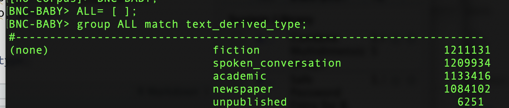 


Este ejemplo del mandato `group` nos permite observar todos los valores del atributo `text_derived_type` en el corpus. Estas categorías se describen en el documento de Susanne Flach con una tabla de los metados del BNC. Con el uso de la restricción global `::`, se puede concentrar en un género específico:

 

Esta diferencia de distribuciones concuerda con lo que dice Biber cuando propone que 'may' es menos frecuente que 'can'. ¿Cómo compara estos datos con el inglés de los EE.UU.? Utilizemos el [Brown Corpus](http://korpus.uib.no/icame/manuals/BROWN/), lo cual representa el primer corpus de tamaño grande para el inglés americano. Toma su nombre de Brown University donde fue creado en el año 1961 por Henry Kučera y W. Nelson Francis. La próxima tabla muestra de diferentes textos incluídos en este corpous.

* Tabla 1: Muestra de la distribución en el corpus de Brown

| Genre | Subgenre/Topic Area | | Samples|
|:------|:--------------------|--|----:|
| Non-fiction | Religion | Books | 7 |
| | | Periodicals | 6 |
| | | Tracts | 4 |
| | Skills and Hobbies | Books | 2 |
| | | Periodicals | 34 |
| | Popular Lore | Books | 23 |
| | | Periodicals | 25 |
| | Belles Lettres, Biography, Memoirs, etc. | Books | 38 |
| | | Periodicals | 37 |
| | Miscellaneous | Government Documents | 24 |
| | | Foundation Reports | 2 |
| | | Industry Reports | 2 |
| | | College Catalog | 1 |
| | | Industry House organ | 1 |
| | Learned | Natural Sciences | 12 |
| | | Medicine | 5 |
| | | Mathematics | 4 |
| | | Social and Behavioral Sciences | 14 |
| | | Political Science, Law, Education | 15 |
| | | Humanities | 18 |
| | | Technology and Engineering | 12 |
| Fiction | General | Novels | 20 |
| | | Short Stories | 9 |
|  | Mystery and Detective | Novels | 20 |
| | | Short Stories | 4 |
|  | Science Fiction | Novels | 3 |
| | | Short Stories | 3 |
|  | Adventure and Western | Novels | 15 |
| | | Short Stories | 14 |
|  | Romance and Love Story | Novels | 14 |
| | | Short Stories | 15 |
|  | Humor | Novels | 3 |
| | | Essays, etc. | 6 |
| Press | Reportage | Political | 14 |
| | | Sports | 7 |
| | | Society | 3 |
| | | Spot news | 9 |
| | | Financial | 4 |
| | | Cultural | 7 |
| | Editorial | Institutional | 10 |
| | | Personal | 10 |
| | | Letters to the Editor | 7 |
| | Reviews (theatre, books, music, dance) |  | 17 |

Use show cd to discover a metadata attribute that identifies a text's "Subgenre/Topic Area" in Brown. Did you notice text_category? Again, an unconstrained query reveals what the possible values are:

Podemos utilizar `cd` para descubrir los atributos que identifican los "Subgenre/Topic Area" de los textos de Brown. También podemos utilizar una consulta sin restricción:

* `BROWN> ALL = [ ] ;`
* `group ALL match text_category:`

Ahora, ¿se observa la misma asimetría entre 'may' y 'can' en el inglés americano?

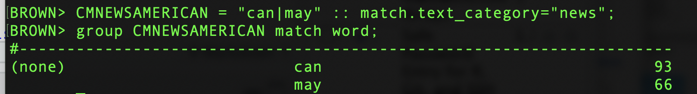 

Parece que sí; el verbo 'may' es menos frecuente, tanto en la muestra inglesa como en la muestra americana, que el verbo 'can' en los textos periodísticos.

*   **Tarea:** Examina los verbos 'may' y 'can' en el género `fiction`. ¿Se observa la misma asimestría? ¿Cómo se comparan los datos del inglés británico y el inglés americano? Ahora, exmamina la categoría de textos con el valor `learned` o `academic`. ¿Está disminuyendo el verbo 'may' en estos géneros?

## Contruir una hipótesis

En la sección anterior, se presentó la idea de que el verbo 'may' está desapareciendo en inglés, tal vez debido al uso elevado del verbo 'can' para expresar los mismos signficados. En esta sección, examinemos nuestra propia hipótesis sobre los modales de obligación (deónticos), 'should' y 'ought'.

* **Hipótesis:** El verbo 'should' ha reemplazado la forma 'ought', lo cual expresa aproximadamente el mismo significado.

Una hipótesis es una adivinanza educada. Sin embargo, si es verdad, debemos observar menos casos de 'ought' que 'should. 

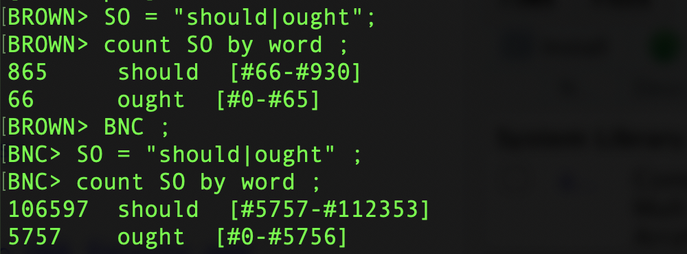

Parece que, sí, esta hipótesis es válida. Las tasas de atestación de 'should' y 'ought' se diferencian por un ordén de magnitud entre los dos corpus.

* Tabla 2: Frecuencias normalizadas en dos corpora del inglés

| expresión | Brown | BNC |
|:---------|:-----|:----|
| should | $\frac{865 x 1M}{brownsize}$ = 744wpm | $\frac{106597 x 1M}{bncsize}$ = 950wpm |
| ought | $\frac{66 x 1M}{brownsize}$ = 56wpm | $\frac{5757 x 1M}{bncsize}$ = 51wpm |

Ahora, comparemos la forma modal de obligación 'must' con su homólogo 'have to'. ¿Qué pensamos sobre la siguiente hipótesis?

* **Hipótesis:** La estructura 'have to' es menos formal que 'must'.

Si esta hipótesis es correcta, esperamos tener más casos de 'have to' que 'must' en un género informal como `spoken_conversations`.

*   `BNC> HT = "have" "to" :: match.text_derived_type="spoken_conversation";`
*   `BNC> M = "must" :: match.text_derived_type="spoken_conversation" ;`
*   `BNC> size HT;`
*   `5141`
*   `BNC> size M;`
*   `2780`

Vemos que nuestra hipótesis es correcta. ¿Qué observamos en un género como la escritura académica?

*   `BNC> M = "must" :: match.text_derived_type="academic";`
*   `BNC> HT = "have" "to" :: match.text_derived_type="academic";`
*   `BNC> size M ;`
*   `13514`
*   `BNC> size HT ;`
*   `3615`
*   `BROWN> M = "must" :: match.text_category="learned";`     
*   `BROWN> HT = "have" "to" :: match.text_category="learned";`
*   `BROWN> size M ;`
*   `202`
*   `BROWN> size HT ;`
*   `24`

En un género formal, se obsera que hay más casos de 'must' comparado con 'have to', un resultado que es consistente con nuestra hipótesis. [Dejamos el proceso de la normalización como una tarea de casa.]

***

### Las listas de palabras

El trabajo de Biber (2012) identifica tres tipos de significados que puden expresear los verbos modales del inglés:

1.    permisión o posibilidad
2.    obligación o necesidad lógica
3.    voluntad o predicción

Cada uno de estos significados se pueden asociar con una lista de palabras. El CQP ofrece un mecanismo ([manual, sección 6.2](http://cwb.sourceforge.net/files/CQP_Tutorial.pdf)) que permite definir una lista y asociar palabras específicas con estas listas. Este proceso hace posible evitar la necesidad de escribir manualmente secuencias largas separadas por barras verticales.

*   `BROWN> define $perm = "can could may might"`
*   `BROWN> define $oblig = "must should ought"`
*   `BROWN> define $volit = "will would shall"`

Estas variables, cuyos nombres comienzan con un `$`, se pueden utilizar en toda situación en la cual se podría haber utilizado una seria individual en una consulta.

*   `BROWN> O = $oblig ;`
*   `BROWN> group O match text_category ;`
*   `BNC> O = $oblig ;`
*   `BNC> group O match text_derived_type ;`

¿Qué observamos en cuanto a la formalidad con estos resultados? Ahora podemos forma la unión de todas las formas modales:

*   `BNC> define $modal = $perm`
*   `BNC> define $modal += $oblig`
*   `BNC> define $modal += $volit`
*   `BNC> show $modal`
*   `$modal = can could may might must should ought will would shall`

La posibilidad de referirse a todas las formas modales a la vez facilita la búsqueda de las formas modales dobles. Estas formas se aceptan en [algunas variedades del inglés](https://ygdp.yale.edu/phenomena/multiple-modals).

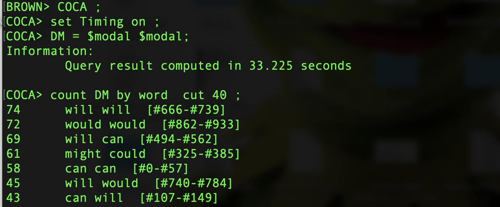

Algunos de estos casos parecen ser errores, los cuales son inevitables en un corpus. Otros casos no son modales de verdad; por ejemplo, la palabra 'will' se entiende también como el sustantivo *voluntad*.

*   `1433741433: at his will be done . And <God 's will will> be done voice-over And i`
*   `429416972: at this second gesture of <good will will> be met with a similar ge`
*   `429589131: this humanitarian aid and <good will will> help bring down some of`
*   `297895587: ple call you . Enough ill <will can> turn anything into an at`
*   `325323612:  official . But political <will can> be found " to do more to`
*   `486055689:  message to them that our <will can> not be broken by terror`

Sin embargo, si observamos de forma más específica los casos de la forma 'might could', se encuentran algunos casos legítimos. En cuanto a la comparación entre el inglés británico y el inglés americano: no existe ningún caso en el BNC y  solo se encuentran dos casos en el SPOKENBNC2014, los cuales no parecen ser casos legítmos. Estas observaciones son consistentes con el uso de 'might could' con un fenómeno especificamente americano. (p. 44 de Hoffman et al.)

***

## Las expresiones regulares con el CQP

Las expresiones regulares representan una notación para especificar diferentes conjuntos de 'strings'. Con una consulta de corpus, se utilizan las expresiones regulares para determinar el conjunto de casos posibles que podemos obtener con la consulta. Las expresiones regulares se puden utilizar en cualquier posición en el CQP y su descripción se presenta en el [Appendix A.1 del manual](http://cwb.sourceforge.net/files/CQP_Tutorial/node52.html). Hay una variedad de diferentes sabores de expresiones regulares; la versión de CQP del servidor utiliza expresiones regulares 'normales de unix (es decir, no son compatibles con la lengua `perl`). Por el momento, estas distinciones no nos distraen.

### El 'wildcard'

Busquemos las diferentes formas del verbo 'drink' en el `BNC-BABY`. Sería posible realizar consultas distintas o, por ejemplo, definir un grupo con el uso de la pipa `|`. Otra opción, es dejar que la vocal no se especifique con el símbolo `.` .   

*  `BNC-BABY> DRINK = "drink|drank|drunk" ;`
*  `BNC-BABY> "dr.nk" ;`

| Palabra | Frecuencia |
|:--------|:-----------|
| drink | 552 |
| drunk | 99 |
| drank | 67 |

No hay que saber de antemano cuáles serán los elementos que se encuentren. Las letras ~d, r, n, y k~ se expresan explícitamente. Entonces, las expresiones regulares incluyen los tipos de palabras completas (es decir, con todas las letras explícitas) que ya hemos buscado con las consultas.

### Clases de carácteres

¿Cuáles son las palabras de cinco letras que empiezan con 'gl' y una vocal? Se puede especificar esto con el uso de las vocales ortográficas entre corchetes `[ ]`.

*   `BNC-BABY> "gl[aeiou].." ;`
*   `BNC-BABY> group Last match word cut 10 ;`

| Palabra | Frecuencia |
|:--------|:-----------|
| glass | 389 |
| glory | 46 |
| gloom | 28 |
| glare | 19 |
| glove | 14 |
| gloss | 12 |
| glide | 11 |

Este ejemplo arriba utiliza el punto dos veces para pedir casos de cinco letras, donde no se especifica el carácter específico de las dos últimas letras. Fíjate que estas consultas responden al tipo de letra (es decir, mayúscula vs. minúscula). La siguiente consulta produce casos de palabras (a) con cinco letras y (b) con una letra inicial mayúscula.

*   `BNC-BABY> "[ABCDEFGHIJKLMNOPQRSTUVWXYZ].... ;`

Estos corchetes no son iguales a los que hemos utilizado antes con las consultas de CQP (e.g., `[word = "lovely"]`). Representan una lista explícita de los carácteres individuales que se pueden encontrar en la posición inicial de la palabra.

### Un rango de carácteres

La consulta que realizamos con las letras mayúsculas se pueden re-escribir de forma más concisa. Dentro de los corchetes, podemos especificar un rango de carácteres con el uso de un guion.

*   `BNC-BABY> "[A-Z]...." ;`

Ahora podemos verificar que esta consulta produce los mismos resultados que la última. El ordén que se utiliza para definir los rangos sigue el [American National Standard for Information Exchange (ANSI)](https://share.ansi.org/Shared%20Documents/News%20and%20Publications/Brochures/What%20Is%20ANSI%202019%20Brochure,%20Single%20Pages.pdf). En el prompt de unix, puedes leer más con el mandato `man ascii`.

### La morfología

**La opcionalidad:**

Hay una variedad operadores que especifican la repetición. El signo de interrogación (`?`) indica que la expresión regular que precede es un elemento opcional; es decir, se puede repetir zero o una vez. Por ejemplo, podemos utilizar esta operador para buscar las formas singulares y plurales de una palabra como 'dog' si indicamos que la *s* es opcional.

*   `BNC-BABY> "dogs?" ;`

| Palabra | Frecuencia |
|:--------|:-----------|
| dog | 321 |
| dogs | 140 |

Este operador se puede colocar en cualquier parte del string. Por ejemplo, podemos observar variaciones ortográficos del inglés británico y el americano.

*   `BNC-BABY> "favou?r" ;`
*   `BNC-BABY> group Last match word by match text_id cut 10 ;`

| Texto | Palabra | Frecuencia |
|:-----|:--------|:-----------|
| ACJ | favour | 16 |
| J57 | favor | 11 |

Si consultamos el texto J57 en [la bibliografía contenida con el Reference Guide for the British National Corpus](http://www.natcorp.ox.ac.uk/docs/URG/bibliog.html), se nota que este texto es un libro de texto sobre Inglaterra cuyo audiencia tal vez sea estudiantes americanos.

**Agrupar:**

Dentro de una expresión regular, los elementos se pueden agrupar con el uso de los paréntesis. De allí, los operadores de repetición (como `?`) se pueden aplicar al grupo entero. Esta posibilidad nos facilita el proceso de observar de la opcionalidad de, por ejemplo, el prefijo *un-* en inglés:

*   `BNC-BABY> "(un)?thinkable" ;`
*   `BNC-BABY> group Last match word ;`

| Palabra | Frecuencia |
|:--------|:-----------|
| unthinkable | 11 |
| thinkable | 1 |

o con el sufijo *-ren* de 'children'.

*   `BNC-BABY> "child(ren)?" ;`
*   `BNC-BABY> group Last match word ;`

| Palabra | Frecuencia |
|:--------|:-----------|
| children | 1541 |
| child | 782 |

**La alternación:**

Como ya hemos visto, la barra vertical (la pipa), puede separar las series alternativas. Por ejemplo, podemos combinar el uso de los operadores de opcionalidad y de repetición para considerar más bases léxicas:

*   `BNC-BABY> "(un)?(think|know|believ|answer|recover)able";`
*   `BNC-BABY> group Last match word ;`

| Palabra | Frecuencia |
|:--------|:-----------|
| unbelievable | 21 |
| unthinkable | 11 |
| recoverable | 8 |
| unanswerable | 7 |
| answerable | 6 |
| unknowable | 5 |
| believable | 1 |
| thinkable | 1 |

Esta diferentes bases, separadas por barras verticales, se tratan como **alternativas disyuntivas**. No se aplican un operador de repetición, lo cual significa que una de las alternativas tienen que corresponder en la consulta. Además, el prefijo (la serie) *-able* tiene que aparece al final de la palabra buscada.

Las alternativas disjuntivas son útiles en el proceso de encontrar formas morfológicas de verbos (regulares). Para leer más sobre "Complex Regular Expression", se debe consultar [el manual (A.1)](http://cwb.sourceforge.net/files/CQP_Tutorial/node52.html).

*   `BNC-BABY> "(call|talk|help)(s|ed|ing)" ;`

| Palabra | Frecuencia |
|:--------|:-----------|
| called | 1279 |
| talking | 740 |
| helped | 315 |
| calls | 223 |
| talked | 192 |
| talks | 178 |
| calling | 144 |
| helping | 122 |
| helps | 80 |

**El uso del 'plus' (y otros):**

El operador plus (`+`) señala que queremos una o más repeticiones de un elemento (o grupo de elementos). Como el signo de interrogación, es un operador sufijo ('postfix') que se aplica a la expresión regular que precede. Si el elemento o la expresión que precede es el operador de 'wildcard, podemos encontrar, por ejemplo, todas las palabras que terminan con *-ly*--es decir, los adverbios en inglés.

*   `BNC-BABY> ".+ly" ;`

Bueno, se nota que no todos los casos encontrados son adverbios (p.e., 'Holly'). Refinemos esta consulta mediante el rasgo que vimos con las listas de palabras (manual, sección 6.2). El operador `!=` señala que **no** debe corresponder (manual, sección 2.5). El signo `&` significa 'and' y requiere que los casos encontrados concuerden con las dos restricciones especificadas--es decir, que terminen con *-ly* y que no sean "stopwords".

*   `BNC-BABY> define $nothanks = "Holly Billy Italy July" ;`
*   `BNC-BABY> [ word = ".+ly" & word != $nothanks ] ;`

El proceso de descubrir las excepciones (p.e. *Sally* y *Willy*) es iterativo. Al encontrar estas palabras, se pueden añadir a la lista de stopwords.

**Una cantidad específica de repeticiones:** 

Las llaves (`{ }`) permiten que especifiquemos un número específico, o un rango número de repeticiones. Por ejemplo, podemos revisar una de nuestras consultas anteriores de la siguiente manera:

*   `BNC-BABY> "gl[aeiou].{2}";`

**Negación de un rango:**

Además, podemos definir de manera negativa con el uso del signo de intercalación (`^`), indicado al inicio de una lista de carácteres. En este caso, estos carácteres no se deben incluir con las correspondencias. Como ejemplo, presento la siguiente consulta que intenta caracterizar todas las palabras monosilábicas del inglés con **un ataque** consonantal, **un núcleo** vocálico, y **una coda**, donde el ataque y la coda son opcionales y consisten de, como máximo, tres letras.

*   `BNC-BABY> MONOSYLL = "[^aeiou]{0,3}[aeiou]+[^aeiou]{0,3}";`

***

### Otra vez con la morfología

Ahora, volvamos a Wuthering Heights. Si pedimos todas las palabras que terminan con `-ity`, ¿cuáles son las categorías gramaticales que esperamos encontrar?

*   `WUTHERING> ".+ity";`

Si consultamos el `info` de WUTHERING con el mando `show cd`. Las palabras de este corpus tienen las etiquetas de clase léxica ('Parts of Speech' / `pos`).  

*   `WUTHERING> group Last match pos ;`

Y, ¿qué decimos sobre las palabras que terminan con *-ous*? ¿Cuál es la léxica de estas palabras? Utilicemos el atributo de `pos` de WUTHERING para probar esta cuestión. Podemos pedir que el CQP nos muestre en el KWIC ('Key-Words-In-Context') estas etiquetas con el siguiente mandato:

*   `WUTHERING> show +pos ;`

Cambiamos este valor con el siguiente mandato `show -pos`. Las etiquetas para las clases léxicas se pueden leer en [el manual (sección A.2.0.1)](http://cwb.sourceforge.net/files/CQP_Tutorial/node53.html).

Ahora busquemos las palabras con el sufijo *-ful*.

*   `WUTHERING> ".+ful" ;`
*   `WUTHERING> group Last match pos ;`

¿Qué encontramos? ¿Cuáles son las clases léxicas de las palabras excepcionales (es decir, palabras que no sean adjetivos) como 'spoonful' y 'mouthful'? Utilicemos una consulta disjuntiva para encontrar todos los miembros de esta categoría minoritaria.

*   `WUTHERING> [ word = ".+ful" & pos=ALGO QUE TÚ ESPECIFICAS];`

¿Y qué pasa con el sufijo `-less`? ¿Cuál son los marcadores discursivos que no sigan la generalización? Hagamos la misma búsqueda con el subconjunto de Wuthering Heights que se encuentra en el BNC.

*   `BNC> ".+less" :: match.text_id = "GWH" ;`
*  `68775950: /PRF a/AT0 wild/AJ0 ,/PUN <hatless/AJ0> girl/NN1 ,/PUN we/PNP sa`
*  `68776660: VVD ,/PUN hot/AJ0 and/CJC <breathless/AJ0> ./PUN ``/PUQ That/DT0 'l`
*  `68778512: you/PNP tonight/AV0 ,/PUN <unless/CJS> perhaps/AV0 I/PNP set/VV`
*  `68780542: N1 ,/PUN wild/AJ0 and/CJC <breathless/AJ0> ./PUN She/PNP threw/VVD `
*  `68788920: ,/PUN and/CJC arrived/VVD <breathless/AJ0> at/PRP Wuthering/VVG Hei`
*  `68791639: y/PRP next/ORD summer/NN1 <unless/CJS> you/PNP help/VVB him/PNP`

Se puede consultar [el conjunto de etiquetas (CLAWS5) aquí](http://ucrel.lancs.ac.uk/claws5tags.html). Esta comparación muestra que el mismo texto se puede interpretar con dos equemas diferentes de anotación léxica. Cada equema viene con su propia perspectiva teórica.

### Tareas (8 de sept.)

**1a Parte:** Con el uso del atributo `pos`, utiliza CQP para encontrar los sustantivos más observados en el corpus de Ancora. Determina si este resultado es esperado o no esperado de acuerdo con el "sampling frame" de Ancora (según el capítulo 1, sección 1.4 de Brezina). 

**2a Parte:** ¿Cuáles son la segunda palabra y la tercera palabra más observadas en el corpus Ancora que (a) tienen una letra mayúscula inicial y (b) continúan con todas letras minúsculas? Crea una expresión regular para encontrar estas palabras que exluya las siglas. Otra vez, compara tus resultados con el sampling frame de Ancora.

**3a Parte:** Utiliza los operadores de alternativas y de repetición para crear una expresión regular que encuentre todas las formas del presente [del verbo *lire* 'to read'](https://www.wordreference.com/conj/FrVerbs.aspx?v=lire) del francés. Utiliza el corpus FRWAC para buscar estas formas del verbo *lire*. 

Verifique los resultados por una consulta de [las clases léxicas observadas](https://www.cis.uni-muenchen.de/~schmid/tools/TreeTagger/data/french-tagset.html). ¡Cuidado! La palabra francesa para 'cama' tiene la misma forma ortográfica que una de las formas verbales del verbo *lire*. Revisa tu consulta para que las formas de ciertas clases léxicas se excluyan.

***
# 4a Semana

## Más sobre las clases léxicas

Como que describimos en la clase anterior, muchos corpus tienen las anotaciones léxicas. El CQP permite que definamos fácilimente una búsqueda con etiquetas particulares. El siguiente ejemplo muestra las palabras con la etiqueta del determinante `DT`.

*   `DICKENS> [ pos = "DT" ] cut 10;`
*   `<A> CHRISTMAS CAROL by Charl`
*   `ens I have endeavoured in <this> Ghostly little book , to`
*   `ly little book , to raise <the> Ghost of an Idea , which`
*   `k , to raise the Ghost of <an> Idea , which shall not p`

Podemos pedir que las etiquetas se vean con el siguiente mandato:

*   `DICKENS> show +pos;`
*   `<A/DT> CHRISTMAS/NP CAROL/NN by`
*   `10: VBP endeavoured/VBN in/IN <this/DT> Ghostly/JJ little/JJ boo`
*   `17: ook/NN ,/, to/TO raise/VB <the/DT> Ghost/NN of/IN an/DT Ide`

Con los corpus tempranos, las etiquetas se asignaron manualmente; luego, estos datos manuales sirvieron como apoyo estadístico para los "POS-Taggers" automáticos que son imperfectos. Fue medio complicado el proceso de determinar las etiqutas. Por ejemplo, en [el trabajo de Beatrice Santorini (1990)](https://repository.upenn.edu/cis_reports/570/) se describen algunas decisiones confusas en la sección "Confusing Parts of Speech" (p. 9.)

## Algunas búsquedas

### ¿Cuáles son los sustantivos comunes más utilizados por Charles Dickens?

*   `DICKENS> Nouns = [ pos = "NN" ];`
*   `DICKENS> group Nouns match word cut 2000;`

| Palabra | Frecuencia |
|:--------|:-----------|
| man | 5923 |
| time | 5100 |
| Mrs | 3797 |
| hand | 3530 |
| head | 3479 |
| gentleman | 3319 |
| sir | 3289 |
| way | 3247 |
| face | 2985 |
| day | 2730 |
| night | 2571 |
| door | 2543 |
| lady | 2511 |
| room | 2367 |
| house | 2223 |
| nothing | 2133 |
| friend | 2022|

### Entre dos palabras

Los corchetes vacíos se pueden utilizar elementos sin propiedades. Con otras expresiones regulares, como el plus, podemos especificar que, por lo menos debe haber un elemento que ocurre entre dos palabras.

*   `DICKENS> "either" []+ "or";`
*   `...`
*   `DICKENS> size Last;`
*   `453`

Ahora podemos imponer más restricciones con esta consulta. Por ejemplo, podemos requerir que los casos aparezcan en posición interna de oración o podemos eliminar los casos de 'either' como un determinante. Acordáos que el signo de exclamación es el operador de negación (manual, sección 2.6).

*   `DICKENS> [ word="either" & !pos="DT"] []+ "or" within s;`
*   `DICKENS> size Last;`
*   `199`

Podemos seguir con aun más restricciones. Por ejemplo, podemos requerir que solo pueda haber cinco o menos casos entre 'either' y 'or'.

*   `DICKENS> [ word="either" & !pos="DT"] []{1,5} "or" withi`n s;`
*   `DICKENS> size Last;`
*   `131`

### Los verbos frasales con "out"

¿Cuáles son los verbos que co-ocurren con la palabra "out"? Este ejemplo incluye el uso de las consultas nombradas. El signo arroba (`@`) determina el blanco. Los usuarios del CQP pueden agrupar los resultados según el blanco de la consulta. En este caso, el mandato `cut` define un límite; es decir, los resultados que se observan menos de 10 veces no se muestran.

*   `DICKENS> PhrasalV = @[ pos="V.*" ] [ word="out" ];`
*   `DICKENS> group PhrasalV target word cut 10;`

**Pregunta** ¿Son todos estos casos "verbo" + "out"? ¿Cómo se sabe?

### Más con secuencias de palabras

Podemos utilizar las expresiones regulares al nivel del de los casos también ([sección 2.7 del manual](http://cwb.sourceforge.net/files/CQP_Tutorial/node13.html)).

*   `DICKENS> [pos = "IN"] [pos = "DT"]? ( [pos = "RB"]? [pos = "JJ.*"]) * [pos = "N.*"]+ ;`

¿Qué significa exactamente esta consulta?

### El caso en el alemán

El mandato `show` revela otro nivel de anotación. Consideremos las Figuras 7 y 8 de [la sección 6.6 del manual](http://cwb.sourceforge.net/files/CQP_Tutorial/node39.html). Verifique que tu terminal esté configurado para la visualización de Latin1, y no UTF8. (Por ejemplo, Mac OS X Terminal: Preferences > Settings > Advanced. Después, encuentra la sección llamada "International" y verifique que el "Character encoding" esté configurado para el conjunto de ISO Latin 1. Con el PuTTY de Windows, hay que seleccionar ISO-8859 en [el Translation panel](http://the.earth.li/~sgtatham/putty/0.65/htmldoc/Chapter4.html#config-translation).  

*   `GERMAN-LAW> show +agr; `
*   `GERMAN-LAW> [ pos= "ART" & agr contains "Akk.*" ] cut 10 ;`

¿Se entiende porqué el atributo `agr` tiene varios elementos? Examinemos cuidadosamente los determinantes del alemán que empiezan con la letra <d>. ¿Cuáles son los determinantes que sean claramente **nominativos**? Cuáles son los determinantes que sean claramente **acusativos**?

*   `GERMAN-LAW> dacc = [ pos= "ART" & word="[dD].*" & agr contains "Akk.*" ];`
*   `GERMAN-LAW> dnom = [ pos= "ART" & word="[dD].*" & agr contains "Nom.*" ];`
*   `GERMAN-LAW> group dacc match word ;`
*   `GERMAN-LAW> onlyacc = difference dacc dnom ;`
*   `GERMAN-LAW> onlynom = difference dnom dacc;`
*   `GERMAN-LAW> group onlynom match word ;`
*   `GERMAN-LAW> group onlyacc match word ;`

El operador `set` se introduce en [la sección 3.5 del manual](http://cwb.sourceforge.net/files/CQP_Tutorial/node21.html).

### Los grupos verbales en el francés

La instalación del CQP está configurado para el uso de la colección Europarl 3 de los dabates parlimentarios de la U.E. entre los años 1996 y 2003. Esta colección incluye 40 millones de palabaras en cada una de seis lenguas: inglés, alemán, francés, italiano y holandés. Las categorías léxicas se asignaron automaticamente con el uso de TreeTagger. El conjunto de etiquetas para cada lengua se describen en [el sitio de TreeTagger](https://www.cis.uni-muenchen.de/~schmid/tools/TreeTagger/). Consideremos [las etiquetas para el francés](https://www.cis.uni-muenchen.de/~schmid/tools/TreeTagger/data/french-tagset.html), en las cuales se distinguen los verbos infinitos de otros.

*   `EUROPARL-FR> show +pos ;`
*   `EUROPARL-FR> InfVCluster = @[ pos = "VER:infi"] [ pos = "VER.infi"]+  ;`
*   `EUROPARL-FR> group InfVCluster target word cut 100; `

| Palabra | Frecuencia |
|:--------|:-----------|
| faire | 12658 |
| pouvoir | 8360 |
| s | 2206 |
| vouloir | 1753 |
| devoir | 1441 |
| voir | 1273 |
| laisser | 1135 |
| l | 845 |
| savoir | 689 |
| m | 463 |
| entendre | 295 |
| aller | 275 |
| d | 256 |
| venir | 224 |
| espérer | 165 |
| prétendre | 137 |
| oser | 129 |
| n | 115 |
| dire | 100 |

Si encontramos el verbo "faire", podemos explorar su significado de estos grupos con el uso de los **aligned corpora**.


El "context descriptor" (cd) indica cuáles son los corpus alineados con el corpus seleccionado.

*   `EUROPARL-FR> show cd;`
*   `===Context Descriptor==================================`
*   `.....`
*   `Aligned Corpora:`
*   `europarl-nl`
*   `europarl-de`
*   `europarl-en`
*   `europarl-es`
*   `europarl-it`
*   `=======================================================`

Con el mandato `show`, podemos cambiar el alineamiento. Este cambio significa que cada caso estará acompañado por la oración correspondiente del mismo alineamiento.

*   `EUROPARL-FR> show -pos ;`
*   `EUROPARL-FR> set context sentence;`
*   `EUROPARL-FR> faireVinf = [ word="faire" ] @[ pos="VER:infi"] ;`
*   `EUROPARL-FR> show +europarl-en ;`
*   `EUROPARL-FR> cat faireVinf cut 100;`

**Ejercicio:** Basado en el texto alineado del inglés, ¿cómo traduciríamos *faire avancer* o *faire passer*? ¿Cómo traduciríamos estas estructuras al español?

### Los grupos con *faire* en francés e italiano

¿Cuál elemento viene después del grupo verbal con *faire* en francés?

*   *le,la* vs. *lui,leu* + *faire* + VER:infi + **blanco**
*   pronombre + 'hacer' + verbo infinito + categoría desconocida

Para investigar esta pregunta, haremos dos consultas, una que contiene los casos donde un pronombre de objeto directo precede el verbo *faire* y otra donde un pronombre de objeto indirecto precede el verbo *faire*. Eliminemos los casos que ocurren en posición final de oración y los casos que terminan con un signo de puntuación.

*   `EUROPARL-FR> define $faire = "fais fait faisons faites font faire";`
*   `EUROPARL-FR> direct = [ word="le|la" ] [ word=$faire ] [ pos="VER:infi"] @[ pos != "SENT|PUN"];`
*   `EUROPARL-FR> indirect = [ word="lui|leur" ] [ word=$faire ] [ pos="VER:infi"] @[ pos != "SENT|PUN"];`
*   `EUROPARL-FR> group direct target word by target pos ;`
*   `EUROPARL-FR> group indirect target word by target pos ;`

Si el grupo con *faire* está precedida por un pronombre de objeto directo, observamos que las palabras más populares son las preposiciones como *à* 'to', *dans* 'inside', o *en* 'in'. Si el group está precedida por un pronombre de objeto indirecto, estas palabras apenas se observan.

De hecho, los cuatro casos que ocurren con *à* son todos adjuntos temporales:

*   `EUROPARL-FR> anomalous = [ word="lui|leur" ] [ word=$faire ] [ pos="VER:infi"] @[ word="à"];`
*   `EUROPARL-FR> set RightContext 2 s ;`
*   `EUROPARL-FR> cat anomalous ;`

Un pronombre de objeto indirecto que precede la construcción *faire* + verbo infinito corresponde con el objeto indirecto del verbo infinitivo. Este elemento es, probablemente, el recipiente, lo cual se habría marcado con una preposición si hubiera ocurrido en posicón posverbal ([lección sobre el francés](https://www.thoughtco.com/french-causative-le-causatif-1368818)).

Además, podemos realizar esta consulta para el italiano:

*   `EUROPARL-IT> define $fare = "faccio fai fa facciamo fate fanno fare far";`
*   `EUROPARL-IT> direct = [ word="lo|li" ] [ word=$fare ] [ pos="VER:infi" ] @[ pos != "SENT|PON"];`
*  ` EUROPARL-IT> indirect = [ word="gli" ] [ word=$fare ] [ pos="VER:infi" ] @[ pos != "SENT|PON"];`

Otra vez, si un pronombre de objeto directo precede el grupo verbal, los complementos preposicionales son acaptables. Si un pronombre de objeto indirecto precede el grupo, casi no se observan los complementos preposicionales.

*   `EUROPARL-IT> group direct target word by target pos;` 
*   `EUROPARL-IT> group indirect target word by target pos;`

El único caso anómolo, "gli fanno perdere di vista", se traduce así: "lose sight of". Esto sugiere que la preposición "di" sirve como parte de un complejo verbal "perdere di vista." 

**Ejercicio:** Investigemos el español del mismo modo. Empezemos con el verbo *hacer* y la distinción entre *lo,la* vs. *le*. ¿Tiene español el mismo comportamiento que el francés y el italiano con respeto a los complementos preposicionales después de los grupos verbales que son precedidos por pronombres de objeto directo vs. indirecto?

***

# 5a Semana

## Atributos posicionales

Como ya hemos visto, muchos de los corpus tienen las anotaciones para clases léxicas que se pueden utilar con el atributo `pos`. Por ejemplo, el corpus COCA tiene las anotaciones basadas en [el claws C7 tagset](http://ucrel.lancs.ac.uk/claws7tags.html). Aunque todos los sub-tipos de verbso llevan etiquetas distintas, todas las etiquetas de los elementos verbales empiezan con la letra 'v'.

*   `COCA> VERBS = [ pos="v.*" ] ;`
*   `COCA> group VERBS match lemma cut 1000000 ;`

Las combinaciones de diferentes etiquetas de clases léxicas nos facilitan el proceso de encontrar construcciones específicas. Por ejemplo, para encontrar un objeto directo que ocurre durante los dos espacios después de un verbo donde no interviene un complementizador, podemos realizar la siguiente consulta:

*   COCA> VOBJ = [ pos="v.*" ] [ pos != "cs.*"]{0,2} [ pos="nn(1|2)?"] ;

Esta consulta no se permite mediante [el sitio de web del COCA](https://www.english-corpora.org/coca/). ESte tipo de anotación al nivel de la palabra, no se limita a la morfosintáxis. El corpus SPOKENBNC2014 viene con una anotación conceptual-semántica que se llama [USAS](http://ucrel.lancs.ac.uk/usas/). Esta anotación se puede utilizar para encontrar, por ejemplo, las palabras relacionadas con los cigarrillos, es decir, la categoría `F3` según la tabla de USAS.

*   `SPOKENBNC2014> VICE = [ usas="F3" ] ;`
*   `SPOKENBNC2014> group VICE match word  cut 30; `

Exactamente como podemos utilizar `show +pos` y `show -pos` para activar o reprimir la muestra de las etiquestas, también podemos mostrar las anotaciones de USAS en el SPOKENBNC2014 con el mandato `show +usas`.

### El modelo

Para los atributos posicionales, el modelo subyacente es una tabla donde cada fila es una palabra y cada atributo es una columna, como se observa en la siguiente tabla.

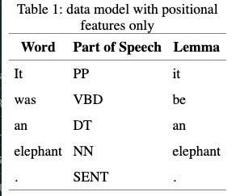

## Los atributos estructurales

Nuestro sistema de corpus diferencia los atributos posicionales de los atributos estructurales. Como ya hemos visto, el segundo se utilizan en muchos casos para indicar los metadatos. Por ejemplo:

1.  Las obras de Shakespeare se identifican por el título: `text_title="Romeo and Juliet"`
2.  Las expresiones del BNC se clasifican con la edad del hablantes: `u_age_group="15-24"`.
3.  Las muestras de textos de BROWn son divididas por el sub-género: `text_category="romance|science_fiction".

Estos atributos estructurales se pueden considerar como elementos invisibles, por ejemplo `<text_category>`, que aparecen al princippio de cada extracto individual representado en BROWN. Dentro de estos corchetes angulures, se observa también otro símbolo de indica la categoría textual--news, editorial, reviews, religion, etc.

*   `<text_category news>The Fulton County Grand Jury s`
*   `<text_category editorial>Assembly session brought `
*   `<text_category reviews>It is not news that Nathan `
*   `<text_category religion>As a result , although we` 
*   `<text_category hobbies>Too often a beginning bodyb`
*   `<text_category lore>In American romance , almost n`
*   `<text_category belles_lettres>Northern liberals ar`
*   `<text_category government>The Office of Business E`
*   `<text_category learned>1 . Introduction It has rec`
*   `<text_category fiction>Thirty-three Scotty did not`
*   `<text_category mystery>There were thirty-eight pat`
*   `<text_category science_fiction>Now that he knew hi`
*   `<text_category adventure>Dan Morgan told himself h`
*   `<text_category romance>They neither liked nor disl`
*   `<text_category humor>It was among these that Hinkl`

Estos elementos que aparacen al principio del extracto (`<text_category>`) van juntos con otro elemento que ocurre al final del extracto (`</text_category>`).


*   `asn't a bit of trouble '' .</text_category>`
*  `pendency and illegitimacy .</text_category>`
*   `esident Kennedy's in 1961 .</text_category>`
*   `ons under 18 years of age .</text_category>`
*   ` for the simplest offense .</text_category>`
*   `on the national committee .</text_category>`
*   `or a coalition Government .</text_category>`
*   ` some of these criticisms .</text_category>`
*   `m a government on its own .</text_category>`
*   `es and presented its case .</text_category>`

Estos elementos no son casos (tokens), pero sí delimitan diferentes regiones del corpus; es decir, tienen un comienzo y un fin. Visto de esta manera, parecen mucho a las etiquetas con corchetas angulares que se utilizan en otros tipos de [markup languages como SGML, HTML y XML](https://en.wikipedia.org/wiki/IBM_Generalized_Markup_Language). El "eXtensible" markup language XML es una de las opciones más populares para la anotación de los corpus de lenguas naturales. [Las secciones 4.1 y 4.2 del capítulo 11 del libro de NLTK (Natural Language Tool Kit)](http://www.nltk.org/book/ch11.html#sec-working-with-xml) explican cómo se utiliza XML para separar las anotaciones lingüísticas de los textos anotados.

Abajo se presenta la forma subyacente del BNC, anotada con XML antes de que se haya preparado para el uso con el CQP. Cada palabra empieza y termina con los símbolos `<w>` y `</w>`. El elemento `w` tiene el atributo `c5` de las etiquetas de CLWAS-C5 y el elemento `hw` para headword.

*   `<w c5="NP0" hw="michael" pos="SUBST">Michael</w>`
*   `<w c5="NP0" hw="palin" pos="SUBST">Palin</w>`
*   `<w c5="VVZ" hw="seem" pos="VERB">seems</w>`
*   `<w c5="AT0" hw="an" pos="ART">an</w>`
*   `<w c5="AJ0" hw="unlikely" pos="ADJ">unlikely</w>`
*   `<w c5="NN1" hw="double" pos="SUBST">double</w>`
*   `<w c5="PRP" hw="for" pos="PREP">for</w>`
*   `<w c5="AT0" hw="the" pos="ART">the</w>`
*   `<w c5="AJ0" hw="archetypal" pos="ADJ">archetypal</w>`
*   `<w c5="NN1-AJ0" hw="stiff" pos="SUBST">stiff</w>`
*   `<w c5="VVD-AJ0" hw="upperlip" pos="VERB">upperlipped</w>`
*   `<w c5="AJ0" hw="phlegmatic" pos="ADJ">phlegmatic</w>`
*   `<w c5="NP0-NN1" hw="englsihman" pos="SUBST">Englsihman</w>`
*   `<w c5="NP0" hw="phileas" pos="SUBST">Phileas</w>`
*   `<w c5="NP0" hw="fogg" pos="SUBST">Fogg</w>`
*   `<c c5="PUN">, </c`>`

Podemos comparar esta anotación con la figura 5 de Gries y Berez 2017. Las figuras 3, 6, y 18 de ese capítulo ilustra otras maneras de utilizar XML con los corpus lingüísticos anotados.

Según la manera en que el corpus fue anotado, estas anotaciones de XML se pueden utilizar de manera más o menos directa en las búsquedas. Por ejemplo, en la forma subyacente del XML del corpus de DICKENS, los sintagmas nominales y los sintagmas preposiciones son anotados, como se muestra en el siguiente ejemplo sacado de [la sección 4.3 del manual](http://cwb.sourceforge.net/files/CQP_Tutorial/node27.html).

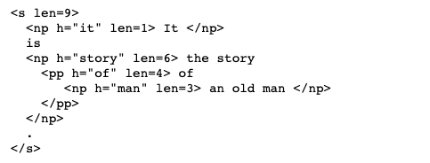
Con esta anotaciones, podemos realizar una consulta con las etiquetas `<np>` y `<\np>`. Por ejemplo, la siguiente búsqueda pide los casos de sintagmas nominales que empiezan con "a", "some", o "many":

*   `DICKENS> INITIALQUANT = <np> [word = "a|some|many" ] ;`

Podemos utilizar otras combinaciones de etiquetas iniciales y finales. La siguiente consulta encuentra todos los sintagmas nominales que contienen la palabra "door":

*   `DICKENS> DOORPP = <pp> []* "door" []* </pp> ;`

El elemento `within` permite que simplifiquemos la consulta:

*   `DICKENS> D = "door" within pp;`

## El modelo subyacente

El modelo completo del CWB (Corpus Work Bench) combina las anotaciones al de los casos y las anotaciones al nivel de las regiones:

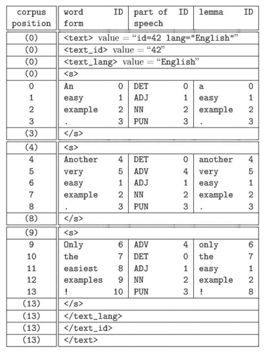
## Los atributos estructurales ('s-attributes')

Las regiones se pueden delimitar con las etiquetas XML. Estas etiquetas también pueden tener diferentes propiedades. Al compilar el corpus, estas propiedades se definen una vez, en vez de definirlas para casa caso.

### La duración

Por ejemplo, en el corpus de DICKENS tanto la duración de las palabras (`lens`) como la cabeza sintáctica (`h`) de los sintagmas nominales son indicados. El atributo de duración se convierte en `np_len` dentro del CQP. Este atributo se puede utilizar con una expresión regular (es decir, `3|4|5|6`) o se puede cambiar a un valor con el rasgo del CQP `int()`. Este rasgo permite que utilice propiedades como "más de" y "menos de":

*   `DICKENS> DOORNP = <np> [ word != "," ]* d:"door" [ word != ","]* </np> :: int(d.np_len) > 7;`

Esta búsqueda intenta encontrar los sintagmas nominales largas en el corpus de DICKENS que mencionan una puerta pero que no contienen una comma. En esta búsqueda, la lentra `d` minúscula funciona como un label, como se explica en [la sección 4.1 del manual](http://cwb.sourceforge.net/files/CQP_Tutorial/node25.html). Es similar al signo `@`, lo cual determina el blanco de la búsqueda.

### El género

Como ya se sabe, en el español las palabras son especificadas por el género gramatical (masculina vs. femenina). El corpus ANCORA viene con etiquetas para las constituyentes sintácticas como los sintagmas nominales (`grup.nom`), sintagmas verbales (`grup.verb`), etc. La forma XML tiene la siguiente estructura:

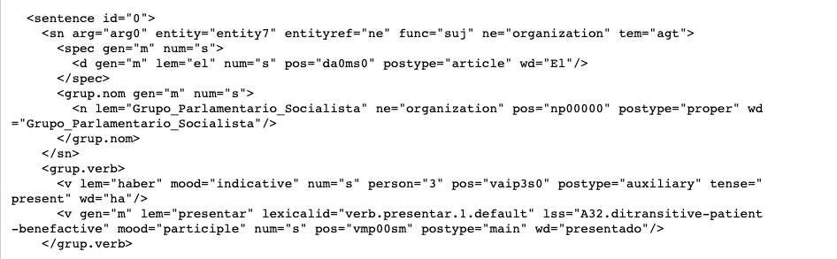

Como los atribuotos de `h` y `len` de DICKENS, los atributos XML `gen` y `num` en el corpus de AnCora se han convertido en atributos estructurales especializados para la constituyente sintáctica donde se manifiestan. Consideremos los sintagmas (`grup`) que son adjetivales (`a`) y que son clasificados por género (`gen`).

*   `ANCORA> P = [ lemma="primero" ];`
*   `ANCORA> group P match grup_a_gen by match word cut 30;` 

### Fecha

El Royal Society Corpus viene anotado con fechas. Con estas fechas, podemos presentar preguntas históricas como "¿Cuándo se utilizaba la palabra *divers*?"

*   `RSC> D = "divers";`
*   `RSC> group D match text_year ;`

Y con algunos mandatos de unix, podemos organizar estos resultados por fecha:

*   `group D match text_year cut 10  > "| tail -n +2  | sed 's/(none)/      /' | sort -nr";`

Para más información sobre el proceso de reenviar los resultados de una búsqueda a un archivo o una barra/pipa, se puede consultar la sección 3.2 del manual.

## Tipos y casos

Esta distinción se refiere a la idea de que **un caso ('token')** es un ejemplo concreto; por otro lado, **los tipos ('types')** representan las categorías que incluyen estos ejemplos.

### La misma palabra

Consideremos la siguiente oración "El ayuda a un montón de gente que no es conocida y se dedica a otra cosa". En esta oración hay 17 palabras, donde dos de ellas son casos de la palabra *a*. En este caso, podemos decir que hay dos casos del mismo tipo. Cuando pedimos que el CQP nos cuente el número de observacioens de una palabra, lo que que nos da es el "token frequency" de este tipo.

*   `CDE> MONTON = "montón";`
*   `CDE> size MONTON;`
*   `57362`

### Lemas

A veces los tipos de palabras son demasiado específicos. Por ejemplo, si hacemos un estudio sobre el uso del verbo *ask*, no nos preocupa el tipo de letra (mayúscula vs. minúscula). Las propiedades relevantes son (i) su estatus como un verbo y (ii) y su raíz morfológica.

En el BNC, estas dos propiedades se combinan en un atributo posicional que se llama `lemma`. La clase léxica, en el sentido normal, se indica en el atributo headword `hw`. El atributo `lemma` incluye un símbolo que [representa una etiqueta simplificada](http://www.natcorp.ox.ac.uk/docs/URG/codes.html#klettpos). Esta etiqueta nos permite observar los resultados por caso y variación morfológica. El siguiente ejemplo utiliza el mandato `count` ([sección 2.9 del manual](http://cwb.sourceforge.net/files/CQP_Tutorial/node15.html)) permite que hagamos una distribución de frecuencias que es algo similar a lo que se produce con el mandato `group`.

*   `BNC> ASK = [ lemma="ask_VERB" ];`
*   `BNC> count ASK by word ;`
*   `30803   asked  [#19152-#49954]`
*   `17469   ask  [#1683-#19151]`
*   `5928    asking  [#49955-#55882]`
*   `1925    asks  [#55883-#57807]`
*   `1086    Ask  [#80-#1165]`
*   `402     Asked  [#1166-#1567]`
*   `105     Asking  [#1568-#1672]`
*   `56      ASK  [#0-#55]`
*   `13      ASKED  [#56-#68]`
*   `9       ASKS  [#71-#79]`
*   `9       Asks  [#1673-#1681]`
*   `2       ASKING  [#69-#70]`
*   `1       asKed  [#1682]`
*   `BNC> size ASK;`
*   `57808`

El mandato `size` nos indica que la frecuencia de caso de este lema es 57808. Estas observaciones se distribuyen por trece tipos distintos, donde cada uno de ellos se muestra en una línea separada con `count`. Por lo tanto, la frecuencia de tipo ('type frequency') de este lema es 13.

**PREGUNTA:** ¿Qué es la frecuencia de tipo del verbo *decir* en ANCORA?

## La riqueza léxica y TTR

La cantidad de tipos en un corpus es necesariamente menos de (o a veces equivale a) la cantidad de casos. Sin embargo, ¿cómo debemos entender esta diferencia? La proporción entre los tipos y los casos--TTR ('type-token-ratio')--cuantifica el grado de diversidad de una selección de lengua. Es decir, cuanto más alta es el TTA, más diversa es el vocabulario. Si dividimos por el número de casos en el corpus, producimos una normalización por la cantidad de ''oportunidades'' disponibles para observar una palabra nueva. Entonces, la TTR es una manera de cuantificar la riqueza léxica.

*   TTR = $\frac{n(tipos)}{n(casos)}$

Como un ejemplo, comparemos la riqueza léxia entre diferentes géneros de textos escritos. Acordáos que el mándato `size` nos produce frecuencias de casos:

*   `BNC> FICTION = [ pos != "PU.*" ] :: match.text_genre = "W:fict.*"  ;`
*   `BNC> size FICTION`
*   `16303411`
*   `BNC> NEWS = [ pos != "PU.*" ] :: match.text_genre = "W:newsp:.*" ;`
*   `BNC> size NEWS`
*   `9412245`
*   `BNC> randomize 51;`
*   `BNC> reduce FICTION to 9412245;`
*   `BNC> size FICTION`
*   `9412245`

Con esta consulta, hemos excluído los casos de puntuación y hemos reducido la sección de FICTION a una selección aleatoria para que concuerde con el tamaño de la sub-sección NEWS ([sección 3.6 del manual](http://cwb.sourceforge.net/files/CQP_Tutorial/node22.html)). Este paso permite que los denominadores de las TTR tengan el mismo valor, 94122245.

Para obtener los numeradores, tenemos que contar los tipos. Una forma fácil de realizar este paso es contar la cantidad de líneas que se producen con los resultados de un mandato de CQP como `count` o `group`. Con el operador `>` podemos "enviar" los resultados a un archivo mediante una "pipa" ('pipe') que contiene una función de unix como `wc`, lo cual nos cuenta las líneas (ya vimos este proceso el martes y se describe en [la sección 3.2 del manual](http://cwb.sourceforge.net/files/CQP_Tutorial/node18.html)). Se escribes `man wc` la próxima vez que te encuentras en el mensaje de unix, se puede apreder más sobre este programa. La etiqueta `%c` tiene el efecto de ignorar las distinciones entre letra mayúscula vs. minúscula ([sección 2.2 del manual](http://cwb.sourceforge.net/files/CQP_Tutorial/node8.html)). 

```{r}
# BNC> count FICTION by word %c > "| wc -l";
# 131476
# BNC> count NEWS by word %c  > "| wc -l";
# 152648
```

Ahora podemos calcular las TTR relevantes:

*   TTR~fiction~ = $\frac{131476}{9412245}$ = 0.013
*   TTR~news~ = $\frac{152648}{9412245}$ = 0.16

Según [Stefanowitsch](https://langsci-press.org/catalog/book/148), la TTR se puede interpretar como la probabilidad de encontrar un tipo nuevo, si seguimos encontrando nuevos tipos al mismo ritmo.

## Los afijos

Ahora podemos extender estas observaciones a la morfología. Stefanowitsch considera esta cuestión en el dominio de la morfología, especifícamente el uso del sufijo *-ly*. Si nuestro corpus consistiera de la siguiente oración de Shakespeare:

*   `CINNA: ...Am I a married man, or a bachelor? Then, to answer every man directly and briefly, wisely and truly: wisely I say, I am a bachelor.`

La frecuencia de casos del sufijo *-ly* sería 5 porque se observa en las palabras *directly*, *briefly*, *wisely*, *truly*, and *wisely*. Su frecuencia de tipo--es decir, el número de ejemplos de palabras específicas que tiene el sufijo *-ly*--es 4. Los dos ejemplos de *wisely* se consideran ejemplos del mismo tipo.

Podemos aplicar esta idea para entender los afijos *-icle* y *mini-*. Por ejemplo, un "denticle" es un diente pequeño, un "pellicle" es una membrana fina, y un "cubicle" es un seudo-oficina. Tal vez tenemos la intuición de que el sufijo *-icle* tiene una distribución más limitada que el prefijo *mini-*. También podemos cuantificar esta pregunta con el uso de la frecuencia de tipo.

### El elemento *-icle* como un sufijo

Empezemos con una búsqueda del sufijo *-icle* en casos singulares y plurales, sin considerar las variantes ortográficas:

```{r}
# BNC> [ word = ".+icles?" %c ] ;
# BNC> size Last ;
# 20854
# BNC> group Last match word > "icle-hits.txt";
```

Después, utilicemos el programa `SCP` para transferir este archivo 'icle-hits.txt' a nuestra máquina local (página 13 del documento "Utilizing the UGA Corpus Server"). Después de limpiar la concordancia, los resultados salen en la Tabla 1:

*   Tabla 1: ejemplos de los tipos de *-icle* (casos de errores ortográficos se han quitado)

| Palabra   | Palabra   | Palabra   | Palabra   | Palabra    |
|:-----------|:-----------|:-----------|:-----------|:-----------|
| article 9515 | cronicles 1 |	fascicle 8 |	pedicle 1 |	testicle 128 |
| astricles 2 | cubicle 233 |	follicle 69 |	pellicle 1 |	tunicles 1 |
| auricles 1 |	curricle 5 |	funicle 3 | pericle 70 |	uncanonicles 1 |
| barnicles 2 |	cuticle 131 |	icicle 56 |	pollicle 1 |	vehicle 7235 |
| canticle 24 |	denticles 1 |	jellicle 3 |	popsicle 3 |	ventricle 40 |
| chicles 3 |	dicle 1 |	mesocuticle 1 |	procuticle 8 |	versicles 2 |
| chronicle 639 |	endocuticle 4 |	ossicles 3 |	radicle 2 |	vesicle 144 |
| clavicle 15 |	epicuticle 9 |	panicles 5 |	runnicles 4 |   |
| conventicle 22 |	exocuticle 5 |	particle 2447 |	subcuticle 1 |   |	 

Observamos 43 tipos y 20850 casos. De hecho, podemos mejorar bastante los resultados con el uso de un "stoplist" en CQP. De esta forma, ignoramos los casos que no buscamos.

### El elemento *mini-* como un prefijo

```{r}
# BNC> define $stopword < "not-instances-of-mini.txt" ;
# BNC> MINI1 = [ word="mini(-)?.+" %c & word != RE($stopword) %c] ;
# BNC> size MINI1
# 1840
# BNC> count MINI1 by word %c > "| wc -l";
# 510
```

En esta consulta, estamos eliminando las palabras que aparecen en nuestra lista de palabras. El operator `RE()` del CPQ interpreta esta lista como una lista de expresiones regulures en vez de ser una simple grupo de palabras. La lista representada en "not-instances-of-mini.txt" se encuentra en la Tabla 2:

| Palabra | Palabra |
|:-----------|:-----------|
| minimi[sz].* |	miniver |
| minim(al? $|$ um $|$ i[sz]e)(ist $|$ ly $|$ ism)?.*	| miniate |
| mininal |	miniutes |
| miniatur.*	| minim.* |
| minist[eéè]?r.*	| mininum |
| min(e| ing).*	| minimu |
| minimum	| minite? |
| minions?	| miniuscula |
| minims? |	miniutes |
| miniscule	| minimse |

### Downsampling

Los denominadores en el último ejempo no son equivalentes. Según Brezina (§ 2.6), los textos más largos presentan la oportunidad de reciclar la misma forma. ¿Es que el sufijo *-cle* combine con las mismas bases o es que las mismas mismas se observen varias veces? Lo que podemos hacer es producir un "downsample"--es decir, un conjunto aleatorio de observaciones de *-icle* que es igual de tamaño al número de observaciones de *mini*.

```{r}
# BNC> randomize 37;
# BNC> ICLE = [ word = ".+icles?" %c ] ;
# BNC> reduce ICLE to 1840 ;
# BNC> group ICLE match word > "icle1840.txt";
```

Ahora podemos limpiar el archivo "icle1840.txt" y determinar que solo hay 17 diferentes tipos. Comparemos las TTR de *-icle* y de *mini-*. 

*   TTR~icle~ = $\frac{17}{1840}$ = 0.009
*   TTR~mini~ = $\frac{510}{1840}$ = 0.277

Se nota que la TTR~icle~ es mucho menos de la TTR~mini~. Es decir, la asimetría entre las frecuencias de *-icle* y *mini-* es consistent con el hecho de que el segundo sea más "importante" en el lexicón del inglés, tal vez por cuestión de que se puede combinar más libremente con otras palabras. Según Stefanowitsch, es importante notar que todavía no hemos hecho ningún argumento estadístico.

### Tarea

Con esta tarea exploremos la distribución de los sufijos *-azo(s)/-aza(s)* y *-ito(s)/-ita(s)* en el corpus de ANCORA. 

**1^a Parte** Realiza unas búsquedas de las palabras terminadas en los sufijos *-azo(s)/-aza(s)* y *-ito(s)/-ita(s)*. ¿Cuántos casos se encuentran?

**2^a Parte** Produce las TTR de estos dos elementos. ¡Cuidado! Hay que eliminar las palabas que no tengan estos elementos como prefijos (p.e. *necesito*). ¿Cómo se compara el uso de *-azo(s)/-aza(s)* con *-ito(s)/-ita(s)* en este corpus?


# 6a Semana

## La ley de Zipf
:
Con las búsquedas que hemos realizado hasta ahora, hemos notado un patrón interesante (¿sospechoso?). Las expresiones bien representadas son muy muy frecuentes. Pero, cuando vemos las otras partes de la lista, se observa que entramos rápidamente en el territorio de los *hapax legomena*^[Los *Hapax Legomena* son palabras que solo aparecen una vez. En la sección 2.3 de Brezina, este término griego se introduce.] Por ejemplo, si volvemos a la consulta que ya hicimos sobre las costrucciones verbales frasales, se observa que, si aun se excluyen los casos de "be out" and "turned out that", las estructuras como "go out", "look out" y "get out" son *mucho* más frecuentes que las demás. ¿Cómo se explica esta distribución? 

```{r}
# DICKENS> PhrasalV = @[ pos="V.*" & lemma != "be" ] [ word="out" ] [ word != "that"];
# DICKENS> group PhrasalV target lemma cut 100 ;
```

### Observamos todas las palabras

Vamos a cambiar de corpus y ver si esta distribución se aplica cuando consideramos todas las palabras (menos la puntuación) a la vez:

```{r}
# BROWN> NONPUNCT = [ pos != "(\.|\(|\)|\*|--|\,|:|``|''|')(-(HL|TL|NC)){0,2}" ] ;
# BROWN> count NONPUNCT by word %c ;
```

Estos resultados nos muestran que las palabras funcionales como "the" y "of" son las más frecuentes en la distribución de frecuencias. Sin embargo, ¡**más de la mitad** de los tipos solo se observan una vez! Este efecto se puede observar por contar las líneas individuales el output de `count` con el mandato de unix que vimos la semana pasada (para más información sobre `egrep`, se debe consultar la sección 2.3 del capítulo de Lu 2014).

```{r}
# BROWN> count NONPUNCT by word %c > "| egrep '^1[[:blank:]]' | wc -l" ;
# 22012
# BROWN> count NONPUNCT by word %c > "|  wc -l" ;
# 49804
```

Esta situación, donde una cantidad pequeña de expresiones son **super** frecuentes y las demás tienen una frecuencia que se acerca a 1, se llama **la Ley de Zipf**.

## La "ley" de Zipf

La ley de Zipf es una "regularidad empírica", motivado por George Kingsley Zipf en su libro del año 1935 con el título, *The Psycho-biology of language*. La "regularidad" se puede describir con el argument que la frecuencia $f$ de una palabra es inversamente proporcional a su rango $r$ en una lista (ordenada) de palabras frecuentes.La ecuación que presenta Brezina en la página 44 representa esta idea. Consideremos esta situación con el corpus de Brown:

| palabra |	frecuencia	| rango |
|:-----|:-----|:-----|
| the	| 69971	| 1 |
| of	| 36412 |	2 |
| and	| 28853	| 3 |
| to	| 26158	| 4 |
| a	| 23195	| 5 | 
| in	| 21337	| 6 |
| that	| 10594	| 7 |
| is	| 10109	| 8 |
| was	| 9815	| 9 |
| he	| 9548	| 10 | 
| i	| 5164	| 20 |
| which	| 3561	| 30 |
| we	| 2652	| 40 |
| out	| 2097	| 50 |
| can	| 1772	| 60 |
| then	| 1380	| 70 |
| man	| 1207	| 80 |
| must	| 1013	| 90 |
| down	| 895	| 100 |
| little	| 831	| 110 |
| work	| 762	| 120 |
| day	| 687	| 130 |
| year	| 658	| 140 |
| three	| 610	| 150 |

Este argumento sobre la proporcionalidad inversa significa que las proporciones de los rangos deben ser proporciones de las frecuencias: es decir, la 50a palabra más común debe tener una frecuencia que es, más o menos, tres veces más que la 150a palabra más común. En esta tabla, 2097 (la frecuencia de la 50a palabra-"out") sí tiene esta propiedad: $3*610=1830$, donde $f_{150}=610$. La forma típica de visualizar esta distribución es con un cuadro logorítmico, donde se calcula el logoritmo de los dos lados:

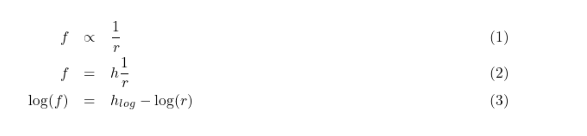

El paso del (1) a (2) nos produce un elemento constante de proporcionalidad, `h`. El paso (3) sigue del paso (2) mediante la ley de los logaritmos. Este elemento constante `h` produce la tendencia decresciente que se observa con la ley de Zipf.

Las distribuciones de Zipf ("Zipfian") son muy comunes en la lengua natural, para todos tipos de expresiones lingüísticas y con escalas de diferentes niveles.

**Ejercicio**: Completemos la tabla en la pregunta 5 de Brezina (página 63).

### La visualización

Cuando se producen distribuciones de frecuencias con el CQP, las podemos compartir con otros programs. Por ejemplo, podemos utilizar [el programa estadística y gráfica R](https://www.r-project.org/). Para poder sacar una distibución de frecuencia con el CQP, podeos utilizar un mandato de unix que pertenece a la familia `awk` (sección 2.3.5 de Lu 2014). En el siguiente ejemplo, `awk` se utiliza para extraer la primera columna (el "attestation count") y la columna 2 (la palabra). La tercera y la última columna que produce el mandato `count` son los que se utilizan para producir la concordancia de KWIC y, por lo tanto, no se tienen que guardar.

```{r}
# BROWN> count NONPUNCT by word %c > "| awk '{print $1,$2}' > brown-nonpunct.cnt" ;
```

El signo `>` es lo que se llama un "output redirection operator" del CPQ. El signo `|` es otro símbolo que se utiliza dentro de las comillas que signifca que los resultados de `count` serán eviandos ('piped') a otro mandato, en este caso `awk`. Finalmente, el signo `>` dentro de las comillas es otro operador de redistribución, pero en este caso queremos tomar los resultados de `awk` y producir un archivo con un nombre específico--`brown-nonpunct.cnt`. Con este archivo, ahora podemos utilizar SCP para transferir el archivo a nuestro laptop:

```{r}
# laptop% scp ugaMyID@corpus.uga.edu:brown-nonpunct.cnt .
```

Lo que hace el mandato de scp es extraer el archivo `brown-nonpunct` del servidor y guardarlo a un espacio local, indicador con el punto. Ahora podemos utilizar el programa R para producir un gráfico:

```{r}
# library(ggplot2)
# brown <- read.table("brown-nonpunct.cnt",header=F,colClasses=c("integer","character"),sep=" "))
# names(brown) <- c("attestations","word")
# quickplot(1:100,brown$attestations[1:100],main="Brown corpus",xlab="rank",ylab="attestations",log="xy",geom=c("point","smooth"),method="lm",se=F)
```

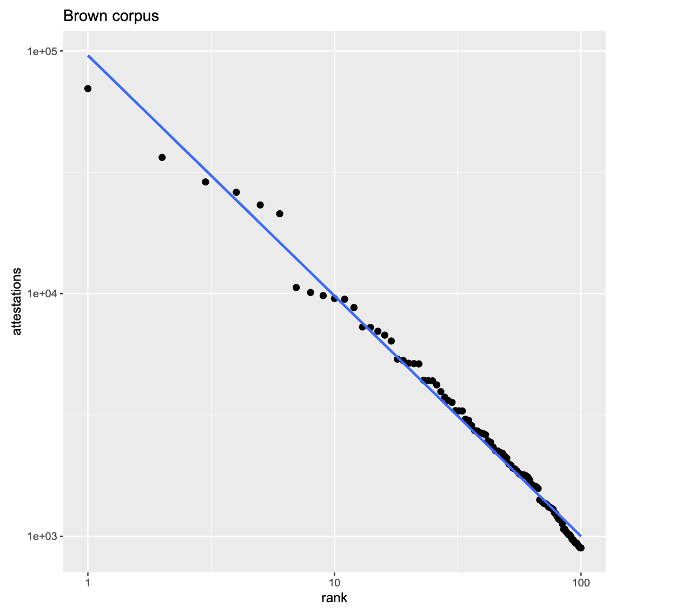

### Algunas observaciones importantes

1.  La ley de Zipf es la norma. Se espera observarla en todos los niveles del análisis lingüístico.
2.  Por consiguiente, nunca hay datos suficientes.
3.  Si un elemento (o una estructura) no aparece en el corpus, **NO* significa que no sea parte de la lengua.

## Tarea
Para el próximo jueves, vamos a calcular la distribución Zipfiana del ANCORA siguiendo los mismos pasos que acabamos de realizar con Brown.

# 7a Semana

**El uso de PolmineR:** El paquate de R preparado pro [Andreas Blätte](https://www.uni-due.de/politik/blaette_forschung.php) facilita el proceso de producir gráficas y realizar el análisis estadístico con los resultados de nuestro análisis de corpus. En esta sección del curso, introducimos el paquete `polmineR`, explicamos su integración con nuestro servidor, y describimos las funcionalidades principales que se desciben en [el polmineR vignette](https://cran.r-project.org/web/packages/polmineR/vignettes/vignette.html).

## Los requisitos

1.    Primero, hay que instalar [el sistema estadístico y grafíco de R](https://cran.r-project.org/doc/manuals/r-release/R-FAQ.html#What-is-R_003f). También, recomiendo que también se instale [el programa de RStudio](https://rstudio.com/).
2.    Abre [el VPN](https://eits.uga.edu/access_and_security/infosec/tools/vpn/). Después, tiene que ajuntar las dos unidades de disco que se exportan del servidor de corpus de UGA. Este proceso está descrito en los siguientes documentos: para [macOS](https://uga.view.usg.edu/d2l/le/content/2064782/viewContent/32252896/View) y [Windows](https://uga.view.usg.edu/d2l/le/content/2064782/viewContent/32252907/View).^[También os encontré un script que automatiza el proceso descrito en el Windows Setup Guide. Hay que (i) descargar el archivo `kucera_ polminer_ prep-DOT-BAT-RENAME-ME` para tu máquina local, (ii) cambiar el nombre a `kucera_polminer_prep.bat` y (iii) hacer un double-click. Notáos que este proceso solo se aplica con los usuarios de Windows.]
3.    Verifica que el paquete `polmineR` se ha estalado. En el R console, escribe o `install.packages("polmineR",repos="https://polmine.github.io/drat")` para macOS o`install.packages("polmineR",repos="https://polmine.github.io/drat",type="win.binary")` para Windows. Solo hay que hacer este proceso una vez.'^[Con el macOS, el paquete se puede instalar con el R básico. Sin embargo, con Windows, el proceso de instalar el paqueste del código básico requiere el uso de Rtools. Por eso, el profesor Blätte proporciona una versión binaria--es decir, una versión que se ha compilado. El argumento adicional `type="win.binary"` requiere esta versión. Eventualmente, los dos paquetes se distribuirán por el archivo CRAN. Por ahora, la versión más reciente está disponible en el depósito personal del profesor Blätte. Se debe consultar la discusión de paquetes al principio de la introducción al `tidyverse` preparado por Jonathan Jones.]
4.    Según esta configuración, tu computadora es la que produce las consultas y calcula los resultados. El servidor de corpus de UGA sirve como el servidor de archivo para los corpus.

## ¡A probarlo!

Para utilizar los corpus dentro del ambiente de R, tenemos que indicar el "registry" apropiado con el proceso de establecar un "environment variable". Hay dos registros seperados: uno para macOS y otro para Windows. Se puede establecer estas variables con R mediante el mandato `Sys.setenv`. El mandato `getenv` permite que verifiquemos que hemos establecido correctamente los registros. Los materiales después de la marca de hash es un comento; es un tipo de documentación, no un mandato. 

```{r}
#> Sys.setenv("CORPUS_REGISTRY" = "/Volumes/cwb_registry/mac_registry") # or "R:/windows_registry" if you are running Windows
#> Sys.getenv("CORPUS_REGISTRY") # check that it was successfully set
```

Cuando esté listo el `CORPUS_REGISTRY` para el disco apropiado, ya estamos listos para abrir el paquete de `polmineR`. [El manual de R explica el proceso de trabajar con los paquetes](https://cran.r-project.org/doc/manuals/r-release/R-intro.html#Packages). 

```{r}
#> library(polmineR)
```

Si funcionó bien, podemos pedir que nos produzca una lista de los corpus disponibles:

```{r}
#> corpus()
```

## Las concordancias

El mandato de `kwic` produce una concordancia de 'keyword-in-context'. El primero argumento es el nombre del corpus, y el segundo es la búsqueda. El programa R reconoce los argumentos de una fución o por su posición o por la sintáxis `name=arg`. Por eso, los dos siguientes mandatos son equivalentes.

```{r}
#> kwic("DICKENS","door-nail")
#> kwic("DICKENS",query="door-nail")
```

Debe aparecer una ventana "pop-up" con con algunos controles para explorar los resultados. Para consultar la documentación de `kwic` o cualquier otra función de R, podemos utilizar el mandato `?kwic` o `help(kwic)` al mensaje de R (`>`).

## Contar casos

El mandato `count` calcula las frecuencias de las palabras. Su resultado es un tipo de "data frame". Se debe consultar la subsección sobre DATA FRAMEs en la introducción al R preparada por Jonathan Jones. Si la búsqueda es una sola palabra, este Data Frame tendrá una sola fila, como se demuestra con los siguientes ejemplos: 

```{r echo=TRUE}
#> count("DICKENS",query="nail")
#> count("DICKENS",query="nails")
#> count("DICKENS",query='"nails?"',cqp=TRUE)
#> count("DICKENS",query=' [word="nails?"] ',cqp=T)
```

Las primeras consultas solo contienen palabras. La tercera contiene una expresión regular (`?`) que nos busca la forma singular "nail" y plural "nails". Podemos pedirle a `polmineR` que reconozca las consultas del tipo `CQP` con el argumento `cqp=T` (donde `T` es un elemento constante que signific TRUE en R). Incluímos la consulta con comillas simples porque la consulta misma se indica con comillas. La cuarta consulta es otra versión equivalente que hace explícita el requisito de que los atributos de las palabras tienen que concordar con la expresión regular `nails?`. Observemos que 73=30+43; la única fila del Data Frame que resulta de la búsqueda que contiene todos las variantes de las formas singulares y plurales.

Además, podemos especificar que queremos varias filas a la vez mediante el uso de la función `c()`. 

```{r echo=TRUE}
#> ail<-count("DICKENS",query=c("nail","nails"))
```

El resultado de este tipo de múltiple consulta se puede asignar a una variable como `nail` con la flechita. Cuando asignmamos el resultado de una función a una variable, no se produce un output. El output se puede exhibir por escribir el nombre de los resultados, en este caso `nail`.

Si seguimos con este exemplo, veremos que el elemento `nail$query=="nails"` es un predicado que, para la segunda fila del data frame, es verdad pero no para el segundo. Esta especificación para las files tiene el nombre de un ["index vector"](https://cran.r-project.org/doc/manuals/r-release/R-intro.html#Index-vectors). Abajo, se nota que el index vector recibe el nombre de `i` mediante el proceso de la asignación. Después, cuando escribimos `i`, el R produce el value de esta variable, lo cual en este caso es un vector de dos valores de veracidad ("truth values").  

```{r echo=TRUE}
#> i  <- nail$query=="nails"
#> i
```

Si utilizamos el index vector dentro de los corchetes después del nombre de un data frame produce el efecto de hacer un subconjunto de los datos que satisfacen este predicado.

```{r echo=TRUE}
#> nail[i]
```

Así solo nos queda una fila que contiene las formas plurales.

## La dispersión

Algunas formas se localizan de manera concentrada en una parte del corpus, mientras que otros se observan mediante todo el corpus. Este fenómeno, descrito por Brezina (sección 2.4) como "The Whelk Problem (homenaje a Adam Kilgarriff), se ha designado como la dispersión.

### Un repaso con el Royal Society Corpus

Hace tiempo estudiamos diferentes formas de la palabra "divers" con el Royal Society Corpus. Los detalles de este corpus, y cualquier otro corpus en el servidor, se pueden recuperar desde el mensaje de R. Solo formamos un "corpus object" con el mandato `corpus`. Entonces, el objecto que resulta sirve como punto de referencia para diferentes tipos de información--p.e. el tamaño, el origen, y los atributos.

```{r echo=TRUE}
#> rsc  <-  corpus("RSC")
#> show_info(rsc)
#> s_attributes(rsc)
```

Con el atributo-s de `text_year`, podemos verificar para ver cuáles eran los años cuando la palabra `divers` se observó más o menos. Utilizemos el mandato `dispersion` y formemos una tabla con la forma y el año. La función `head` de R nos da la posibilidad de ver solo unas filas (o columnas) a de un data frame más extendido (en este caso con 210 filas).

```{r}
#> divers  <- dispersion("RSC",query='divers',s_attribute="text_year")
#> head(divers)
```

Después, podemos producir una gráfica de barra directamente con estos resultados:

```{r}
#> barplot(height = divers$count, names.arg = divers$text_year, las = 2)
```
### Wuthering Heights

¿Cómo funciona `dispersion`? Podemos construir nuestra propia función de `dispersion` y estudiar la mención de personajes en la literatura inglesa.^[Este ejemplo se adopto de la sección 4.4 de Jockers 2020.]

Primero, tenemos que crear un vector de posiciones de corpus en Wuthering Heights. Este poceso puede ser afectado por la repetición del valor disparatado NA ('Not Applicable') lo cual es muy frecuente en este corpus.

Después, utilzamos la función de polmineR `cpos` para revelar las posiciones de corpus que concuerdan con el nombre propio "Heathcliff". Si utilizamos el mandato `?cpos`, podemos consultar la documentación para verificar que el resultado de `cpos` es una matrix de dos columnas donde la primera columna contiene las posiciones initiales de la consulta y la segunda contiene las posiciones finales. Como el elemento "Heathcliff" es solo una palabara, estos números son iguales, así que elegimos arbitráriabmente la primera columna mediante el uso de [la notación comma-1](https://cran.r-project.org/doc/manuals/r-release/R-intro.html#Array-indexing).

Esta columna de posiciones de corpus sirve como un tipo de index vector. Si ponemos este vector dentro de corchetes a la mano izquierda de la flechita de asignación, podemos definir estas posiciones al valor 1 y dejamos que las demás posiciones de corpus donde el nombre "Heathcliff" no se menciona con el valor NA. Este vector ya revisado `w_count` sirve como un argumento apropiado para el mandato gráfico básico de R, `plot`.

```{r}
# everything is NA
#> w_count <- rep(NA,times=size("WUTHERING"))
 # until Healthcliff is mentioned
#> where_he_is_mentioned  <- cpos("WUTHERING","Heathcliff")[,1]
 # set all of those corpus positions to the value 1
#> w_count[where_he_is_mentioned] <- 1
 #Your plot may also appear a lot taller (or thicker) than the one seen here.
#> plot(w_count,main="Gráfica de dispersión de `Healthcliff` en Wuthering Heights",xlab="Duración de la Novela",ylab="Healthcliff",type="h",ylim=c(0,1),yaxt='n')
```
Notemos que Heathcliff aparece mediante toda la novela, aunque el carácter Edgar se muere en la mitad de la historia.


```{r}
# everything is NA
#> w_count2 <- rep(NA,times=size("WUTHERING"))
 # until Edgar is mentioned
#> where_edgar_is_mentioned  <- cpos("WUTHERING","Edgar")[,1]
 # set all of those corpus positions to the value 1
#> w_count2[where_edgar_is_mentioned] <- 1
 #Your plot may also appear a lot taller (or thicker) than the one seen here.
#> plot(w_count2,main="Gráfica de dispersión de `Edgar` en Wuthering Heights",xlab="Duración de la Novela",ylab="Edgar",type="h",ylim=c(0,1),yaxt='n')
```

### Más sobre la dispersión

Ahora consideremos la palabra "breakfast" en el corpus de BNC. ¿Cómo son distintas las dispersiones de esta polabra en este corpus. Primero, se nota que la palabra "breakfast" se observa con 3751 casos.

```{r echo=TRUE}
#> count("BNC",query="breakfast")
```
Después, apliquemos el mandato de `dispersion` para identificar los textos donde aparece esta palabra. Notemos que muchos de los resultados son nulos:

```{r echo=TRUE}
#> bkf_by_text  <- dispersion("BNC","breakfast",s_attribute="text_id")
#> head(bkf_by_text)
```

Formemos un vector de índice que nos da las observaciones (los textos) que contienen la palabra "breakfast". Podemos contar los números de textos, tanto el total como los que contienen la palabra "breakfast", por introducir las funciones de `length` y `unique con la notación `$` para referir al `text_id` de cada data frame (ver la discusión de [named list components en el R Manual](https://cran.r-project.org/doc/manuals/r-release/R-intro.html#Lists)).

```{r}
#> texts_where_bkfast_is_mentioned  <- bkf_by_text[bkf_by_text$count > 0]
#> total_number_texts  <-  length(unique(bkf_by_text$text_id))
#> number_bkfast_texts  <- length(unique(texts_where_bkfast_is_mentioned$text_id))
#> (number_bkfast_texts/total_number_texts)*100
#[1] 25.58656
```

El resultado es el "rango", lo que describe Brezina (sección 2.4) como una medida básica de la dispersión. La interpretación es que la palabra "breakfast" aparece en 25% de los textos del BNC. Con esta misma técnica, podemos determinar el "rango" de de la palabra "corpus". Esta palabra exhibe un rango más bajo y solo aparece en 3% de los textos del BNC. La interpretación es (o puede ser) que el análisis de corpus no es de interés general, mientras que el desayuno sí.

# 8a Semana

## Los intensificadores

La selección de un intensificador (p.e. *very* y *really* en inglés o *muy* y *bien* en español) es una variable bastante interesante. Consideremos la distribución de la palabra "lovely" como intensificador. ¿Es más común esta palabra con los hombres o las mujeres? ¿Qué podemos decir si comparamos esta palabra con la palabra "ace", que también se puede utilizar para intensificar de manera positiva? ¿Habrá una **contingencia** entre el género del/de la escritor(a) y su uso de utilizar una de estas expresiones?

Antes de seguir, verifiquemos que todo está preparado para poder trabajar directamente con R, como se describe en los SMB Setup Guides de macOS y de Windows. También, tenemos que poner la variable ambiental de CORPUS_REGISTRY y inicializar el paquete de `polmineR`. 

Primero, foremos dos data frames para cada expresión, con la clasificación adicional de `text_author_sex`.

```{r}
# lovely <- dispersion("BNC", query = "lovely", s_attribute = "text_author_sex")
# ace <- dispersion("BNC", query = "ace", s_attribute = "text_author_sex")
```

Ahora, podemos representar estas cantidades con una tabla 2x2. En esta tabla, las filas representan la expresión lingüística y las columnas representan los dos géneros en el corpus, "male" y "female".


**Tabla 1:** Tabla de contingencia entre *lovely* y *ace* por género del autor

| palabra |	male	| female | total |
|:-----|:-----|:-----|:-----|
| lovely	| 751	| 1337 | 2088
| ace	| 48 |	19 | 67 |
| Total	| 799	| 1356 | 2155 |

Dentro de R, este proceso es bastante fácil:

```{r}
#> four_counts  <- c(lovely[text_author_sex=="male"]$count,ace[text_author_sex=="male"]$count,lovely[text_author_sex=="female"]$count,ace[text_author_sex=="female"]$count)
#> T <- matrix(four_counts,ncol=2)
  # add names for the table's columns and rows
#> rownames(T) <- c("lovely", "ace")
#> colnames(T) <- c("male", "female")
#> T
#       male female
#lovely  751   1337
#ace      48     19
```

También podemos visualizar estos datos con una gráfica que se llama un "mosaic plot" con el paquete de `vcd`. Esta visualización muestra claramente que existe dos desequilibrios: el número mucho mayor de casos de "lovely" y una diferencia entre los hombres y las mujeres con respeto al uso de estas palabras.


Observamos con la Tabla 1 los número que se escriben en las márgenes. Estos representan los totales para las filas y para las columnas. Podemos pedir que R nos los calcule con la función `marginSum`. Indicamos 1 o 2 para pedir las sumas de las filas o las columnas, respectivamente.

```{r}
#> marginSums(T,1)
#lovely    ace 
#  2088     67 
#> marginSums(T,2)
#  male female 
#   799   1356
```

El elemento marginal en la esquina derecha y abajo representa la cantidad total de las observaciones. Si dividimos cada celda por este número, se producen una seria de proporciones. Podemos producir estas proporciones en R con el mandato `prop.table`.

```{r}
#> prop.table(T)
#             male      female
#lovely 0.34849188 0.620417633
#ace    0.02227378 0.008816705
```


## Otra vez con los elementos modales

Acordáos que hablamos hace mucho de los verbos modales y observamos que no todos los modales se pueden utilizar en todas las situaciones. Simplifiquemos esta comparación para que solo se incluyan los elementos "must" y "need to" en el BNC en los contextos orales y escritos. ¿Cuál esperamos que sea más frecuente en cada tipo de texto o situación lingüístico?

```{r}
# must <- dispersion("BNC", query = "must", s_attribute = "text_text_type")
# needto <- dispersion("BNC", query = "'need' 'to'", s_attribute = "text_text_type")
```

Ahora, si vemos el componente "demographically-sampled" del BNC (sección 3.4 de Hoffman et al.), podemos formar una tabla de contingencia:

**Tabla 2:** Tabla de contingencia entre *must* y *need to*

| palabra |	spoken_demographic	| written_books_periodicals |
|:-----|:-----|:-----|
| must	| 2780	| 56581 |
| need to | 829 |	16040 |

¿Son similares las proporciones de los dos elementos modales? (Utilizemos `prop.table`.)

## La prueba del chi-cuadrado

### La selección entre un artículo definido e indefinido

Como se observa en la Figura 1, las cifras del uso del artículo definido "the" y el artículo indefinido "a/n" en el inglés británico son distintas. Debemos preguntarnos, ¿por qué? Si la grámatica del inglés británico es consistente, debe de haber algunas restricciones sobre las palabras funcionales simples como "the" y "a", ¿no? ¿Por qué no se presentan estas restrcciones de manera distinta en los diferentes registros de la lengua? Estas son las preguntas que motivan el uso del los corpus para el análisis lingüistico. Ahora, vamos a ver cómo podemos hacer una inferencia estadística, la prueba del chi-cuadrado, para concluir que hay una contengencia de verdad entre la selección entre el tipo de artículo (es decir, definido vs. indefinido) y otro factor.

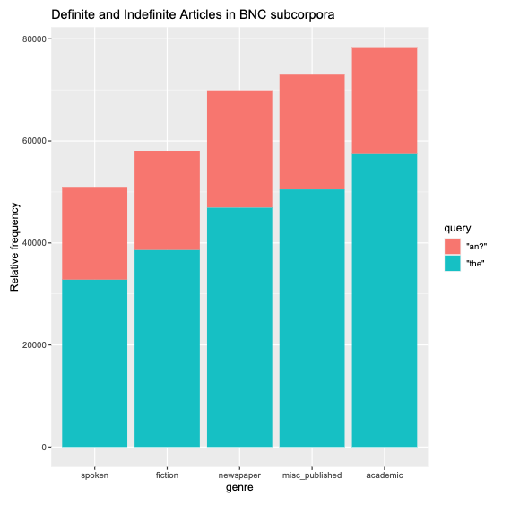

### Otro factor

En su explicación de la prueba del chi-cuadrado, Brezina extrajo una selección de 100 observaciones de "the", "a" o "an" del BNC y codificó manualmente varios factores. Una variable fue el "Definiteness" y otra fue el "Contextual Determination". En la página 106 del libro, Brezina describe así:

-  **contextually-determined**: cases where the article marks a person, object or abstract entity previously mentioned or implied
-  **contextually-nondetermined**: includes reference to a person, object or entity mentioned for the first time and otherwise not specified

Debido a que estos criterios tienen que ver con nociones semánticas, la anotación semántica no es una opción. Se tiene que hacer manualmente, así que representa un juicio lingüístico. Utilizaremos los datos de Brezina y trataremos las datos variables como factores (repasad la discusión de los factores en la Introducción Básica a R).

```{r}
articlechoice  <- read.csv(file="the_a(n).csv",header=T)
# articlechoice es ahora un data frame con columnas y filas que tienen los títulos indicados en el archivo (CSV)
articlechoice$Article_type  <- as.factor(articlechoice$Article_type)
articlechoice$Context_type  <- as.factor(articlechoice$Context_type)
```

Si examinamos el objeto `articlechoice`, debe ser similar a la hoja de cáculo presentada en la figura 4.2 de Brezina (2018, página 105).

### Crear una tabla de contingencia

Esta función de R crear una tabla de contingencia de estos dos factores.^[Sin esta expresión, sería necesario hacer referencia a `articlechoice$Context_type` en vez de solo `Context_type`.]

```{r}
def_by_cntx  <-  with(articlechoice,table(Context_type,Article_type))
def_by_cntx
```

El resultado debe ser como se ve en la Tabla 3:

**Tabla 3:** Tabla de contingencia: *Article_type* por *Context_type*

| Context_type |	a_indefinite	| b_definite |
|:-----|:-----|:-----|
| a_nondetermined	| 25	| 1 |
| b_determined | 2 |	72 |

Las letras "a" y "b" se han puesto como prefijos para los niveles de los factores. Esta selección es tradicional en la sociolingüística y sirve para guarantizar el orden de los niveles para el beneficio del software (como R) que asume el orden alfabético.

#### Los números marginales de las columnas

Consideremos las sumas de las columnas en la tabla de contingencia:

```{r echo=TRUE}
definiteness  <- marginSums(def_by_cntx,2)
definiteness
definiteness[["a_indefinite"]] / sum(definiteness)
```

Estos valores, 27 y 73, son exactamente los totales sombreados al pie de la Tabla 4.2 (página 109) de Brezina (2018). La probabilidad de seleccionar un artículo indefinido (en vez de un artículo definido) es 27/(27+73) = 0.27%. La probabilidad de seleccionar un artículo definido es el complemento de este resultado: 1-027=0.73. Estos cálculos son relativamente fáciles, ya que hay 100 observaciones. Sin embargo, el uso de los números margales es distintivo: revisar solo los números marginales produce una imagen del corpus mediante una de las dos variables de interés--es decir, se consideran las dos posibilidades de la otra variable. Dicho de otra forma, 27% es la probabilidad de seleccionar un artículo indefinido en vez de un artículo definido A PESAR DEL contexto.

#### Los números marginales de las filas

Ahora consideremos las sumas de las filas:

```{r echo=TRUE}
cntx  <-  marginSums(def_by_cntx,1)
cntx
cntx[["b_determined"]] / sum(cntx)
```

El valor 0.74 = 74/(26+74) es la probabilidad de que el contexto es "determined", a pesar de que la palabra sea *the* o *a(n)*. Si ignoramos "definiteness", sabemos la probabilidad de los dos valores posibles de `Context_type`, 0.74 ("determined") y 0.26 ("nondetermined").

#### Las hipótesis

Ahora formulemos dos hipótesis:

-  **H~0~:** El tipo de artículo y el tipo de contexto son independientes.
-  **H~1~:** El tipo de artículo y el tipo de contexto no son independientes.

La primera de estas hipótesis es la hipótesis nula. El término "nulo" en este contexto significa algo como hipóteis "por defecto". Por primera vista, no parece que haya una razón para asumir que dos valores lingüísticos distintos que se han caracterizado de maneras distintas sean relacionados. Si observamos evidencia al contrario, abandonamos la hipótesis nula y aceptamos la hipótesis alternativa.

La diferencia entre dos hipótesis tiene que ver con la palabra "independiente". Esta palabra se entiende en el sentido de [la independencia probabilística](https://mathworld.wolfram.com/IndependentEvents.html). Si son independientes nos variables, su distribución disjunta es el producto de sus probabilidades. Si es verdad la H0, la muestra Tabla debe ser como la siguiente:


**Tabla 4:** Las frecuencia que se esperan si las variables de fila y de columna son independientes

| Context_type |	a_indefinite	| b_definite |
|:-----|:-----|:-----|
| a_nondetermined	| P(indefinite)× P(nondetermined)× samplesize	| P(definite)× P(nondetermined)× samplesize |
| b_determined | (indefinite)× P(determined)× samplesize |	P(definite)× P(determined)× samplesize |

Baja la suposición que es verdad la H0, cada celda de la tabla de contingencia debe tener un número tde observacioens que es el producto de las probabilidades que estimamos arriba. `samplesize` es el total--es decir, 100 observaciones. Multiplicar todas estas probabilidades produce los valores numéricos que se presentan en la siguiente tabla. Comparemos estos resultados con la Tabla 4.5 de Brezina (página 114).

**Tabla 5:** Las sumas esperadas

| Context_type |	a_indefinite	| b_definite |
|:-----|:-----|:-----|
| a_nondetermined	| 7.02	| 18.98 |
| b_determined | 19.98 |	54.02 |

La Tabla 5 es lo que esperamos baja la suposición de la hipótesis nula. Pero, lo que resulta son las observaciones que se presentaron en la Tabla 3. El estatus distinto de los valores esperados **E** versus los valores observados **O** presentado en una tabla de contingencia 2x2 se resume en la descripción de Baroni y Evert (ver las diapositivas).

#### La descrepancia entre las sumas esperadas y las observadas

Decimos que hay un desequilibio con una tabla de contingencia cuando existe una descripancia grande entre los valores esperados y los observados (indicados en la Tabla 3). Sin embargos, debemos preguntarnos, ¿cómo sabemos si esta descrepancia es demasiado grande? La cantidad expresada por $\frac{(O-E)^2}{E}$ evalúa esta descrepancia. Sumamos esta estadística de prueba, a través de todas las celdas, y producimos un cálculo que tiene una distribución $\chi^2$. La distribución $\chi^2$ representa una distribución de las sumas de las cuadradas de las variables normales estándares *k*. Estas distribuciones se presentan en la siguiente gráfica con números que representan los grados de libertad ('degrees of freedom'.)

```{r echo=FALSE, message=FALSE, warning=FALSE}
library(dplyr)
library(ggplot2)
library(tidyr)
data.frame(chisq = 0:7000 / 100) %>% 
  mutate(df_05 = dchisq(x = chisq, df = 5),
         df_15 = dchisq(x = chisq, df = 15),
         df_30 = dchisq(x = chisq, df = 30)) %>%
  gather(key = "df", value = "density", -chisq) %>%
  ggplot() +
  geom_line(aes(x = chisq, y = density, color = df)) +
  labs(title = "Chi-Square con varios Degrees of Freedom",
       x = "Chi-cuadrado",
       y = "Densidad")
```

En este escenario de probar nuestras hipótesis, nosotros calculamos una probabilidad para la variable `Article type` y también para `Context type`. Entonces, en vez de tener $2 \times 2 = 4$ grados de libertad, solo tenemos $(2-1)\times(2-1)=1$ grados de libertad.

#### Probar las hipótesis

Las curvas en la figura previa nos muestran la probabilidad de ciertos valores de la estadística chi-cuadrado. Ahora, podemos pregunta: ¿qué es la probabilidad de una estadística chi-cuadrado **particular** que hemos calculado de una tabla de contingencia que ya formamos (basada en datas de un corpus)? Este proceso es lo que hace la prueba chi-cuadrado. Calcula esta estadística de prueba y determina la probabilidad de observar una tabla de contingencia que el mismo o un valor más extremo de la estadística de prueba. En R, esta función se llama `chisq.test`.^[El argumento adicional `correct=F` apaga lo que se llama el "Yate's correction" en este ejemplo. Para más información, consulta la nota 8 en la página 113 de Brezina (2018).]

```{r echo=TRUE}
chisq.test(def_by_cntx,correct=F)
```
Observemos la última línea de los resultados de la función `chisq.test`. X-squared = 85.249 representa la suma de las descrepancias, descrita en las secciones anteriores y por Brezina (página 113). Se puede calcular manualmente con la información que nos produce R:

```{r echo=TRUE}
result  <- chisq.test(def_by_cntx)
E  <- result$expected
O <- result$observed
sum((O - E)^2 / E)
```

El 'p-value' es la probabilidad de tomar una muestra de este valor de `X-squared value` o un valor mayor de la distribución $\chi^2$ con la pregunta: ¿cuánta es el área que se encuentra bajo la curva de la distribución del chi-cuadrado que va más allá del número 85.249?

```{r echo=TRUE}
pchisq(85.249,df=1,lower.tail=F)
```

La respuesta es que casi ninguna (área bajo la curva). Existe una probabilidad casi inexistente de que se observaría aleatoriamente una estadística de prueba tan extrema si fuera verdad la hipótesis nula. El resultado de esta prueba es que la evidencia sacada del BNC es suficiente para rechazar la hipótesis nula. En nuestro escenario, nos queda la hipótesis alternativa, es decir, que la selección del tipo de artículo es un hecho afectado por el tipo de contexto. Como vimos en la Tabla 3, los autores suelen utilizar un artículo definido cuando mencionan algo por primera vez. 


#9a Semana

**Las colocaciones** son las palabras suelen aparecer juntas. Brezina (sección 3.2) utiliza el término "nodo" ('node') para la palabra que nos interesa y introduce la metáfora de un campo magnético para describir la vecindad donde se encuentran las colocaciones. Según [Evert](https://uga.view.usg.edu/d2l/le/content/2055335/viewContent/32427992/View), esta configuración es lo que se llama un "surface co-occurrence". Podemos utilizar la estadística de chi-cuadrado para producir un rango de estas co-ocurrencias dentro de la 'ventana' indicada. Las palabras que ocurren con más frecuencia que se espera deben aparcer en la parte encima de este rango.

## Un ejemplo: *love affair*

Consideremos la palabra "love" como una palabra de interés. ¿Con qué ocurre? Podemos utilizar la función `coocurrenences` en `polmineR` para contestar esta pregunta. Notaos que tenemos que seguir los pasos normales para utilizar esta técnica.

```{}
love_co <- cooccurrences("BNC", query = "love", left = 0, right=5, method="chisquare", verbose=T)
love_df  <- as.data.frame(love_co)
```

Si hacemos este primer mandato, se produce una mensaje que nos informa que se encontraron 20160 casos de la palabra "love" en el BNC.^[You can graphically page through a cooccurences object by coercing it to an htmlwidget like this as(love_co,"htmlwidget")] El segundo mandato (`as.data.frame`) produce un data frame de la lista de co-ocurrencias. 

```{}
stuff here
```


<!--
**Tarea:**
-->


***
# Recursos {.tabset .tabset-fade .tabset-pills}

## Tools {-}
- [Collection of corpus resources available to UGA faculty and students](http://research.franklin.uga.edu/linglab/corpora)
- [The IMS Open Corpus Workbench](http://cwb.sourceforge.net/): The IMS Open Corpus Workbench (CWB) is a collection of open-source tools for managing and querying large text corpora (ranging from 10 million to 2 billion words) with linguistic annotations. Its central component is the flexible and efficient query processor CQP.
- [LANCSBox](http://corpora.lancs.ac.uk/lancsbox/): software package for the analysis of language data and corpora
- [Lancaster Stats Tools online](http://corpora.lancs.ac.uk/stats/index.php): The website provides practical support for the analysis of corpus data using a range of statistical techniques.
- [Linguistic Data Consortium](https://www.ldc.upenn.edu/): A great resource for language corpora; and UGA has an institutional subscription!!
- [Tools for Corpus Linguistics](https://corpus-analysis.com/): A long list of corpus-related resources that's always being updated

## Generales {-}

- [Corpus del Español](http://www.corpusdelespanol.org/): Spanish corpus compiled by BYU
- [El Corpus de Referencia del Español Actual (CREA)](https://www.rae.es/recursos/banco-de-datos/crea)
- [El Atlas Sintáctico del Español (ASinEs)](https://www.rae.es/recursos/enlaces-externos/atlas-sintactico-del-espanol)
- [European Language Resources Association (ELRA)](http://catalog.elra.info/en-us/repository/search/?q=Spanish)
- [ESLORA 2.0: Corpus para el estudio del español oral](http://eslora.usc.es/)

## Históricos {-}

- [El Corpus Diacrónico del Español (CORDE)](https://www.rae.es/recursos/banco-de-datos/corde)
- [Corpus del Nuevo Diccionario Histórico del Español](http://web.frl.es/CNDHE/view/inicioExterno.view;jsessionid=2E34C1C1AF321C2A31535DD5369E994F)
- [Corpus Diacrónico y Diatópico del Español de América](http://www.cordiam.org/): El Corpus Diacrónico y Diatópico del Español de América reúne tres conjuntos documentales; Cordiam-Documentos, Cordiam-Literatura y Cordiam-Prensa.
- [Corpus Hispánico y Americano en la Red: Textos Antiguos](http://www.corpuscharta.es/): CHARTA se concibe como un proyecto global para la edición y análisis lingüístico de textos archivísticos en español de los siglos XII al XIX.
- [El corpus CODEA (Corpus de Documentos Españoles Anteriores a 1800)](http://corpuscodea.es/)
- [Project P.S. Post Scriptum](http://ps.clul.ul.pt/)
- [Biblia Medieval](http://www.bibliamedieval.es/index.php)

## Sociolingüístico {-}

- [Corpus del Español en el Sur de Arizona (CESA)](https://cesa.arizona.edu/)
- [El Corpus del Español del Siglo XXI (CORPES XXI)](https://www.rae.es/recursos/banco-de-datos/corpes-xxi)
- [PRESEEA](http://preseea.linguas.net/): A collection of sociolinguistic data from around the Spanish-speaking world.
- [CANOLFAN: The Miami corpus consists of conversations by Spanish-English bilinguals](http://bangortalk.org.uk/speakers.php?c=miami)
- [Corpus MIAMI](http://bangortalk.org.uk/speakers.php?c=miami&fbclid=IwAR1gYuXaXUhYw-u7_B0zS2kMwdMYyd-pQW_JGTkjrGxdoL11AgpcRsZFYI8)
- [Corpus of Mexican Spanish in Salinas](https://itcdland.csumb.edu/~eabrown/)
- [COSER: Corpus oral y Sonora del Español Rural](http://corpusrural.es/)
- [Spanish in Texas](http://spanishintexas.org/)
- [Bilingual Youth Texts](https://byts.commons.gc.cuny.edu/)
- [COW](https://www.webcorpora.org/): High Quality Web Corpora


## Adquisición {-}

- [CEDEL2: Corpus Escrito del Español L2 (versión 2)](http://cedel2.learnercorpora.com/)
- [Spanish Learner Language Oral Corpora (splloc)](http://www.splloc.soton.ac.uk/)
- [El Corpus de aprendices del español (CAES)](https://hispanismo.cervantes.es/congresos-y-cursos/corpus-aprendices-espanol-caes-concepcion-explotacion-caes)

## Otras lenguas románicas {-}

- [Corpus do Português](http://www.corpusdoportugues.org/): Portuguese corpus compiled by BYU

<!--
- <a href="https://uclouvain.be/en/research-institutes/ilc/cecl/corpora.html">Center for English Corpus Linguistics (Louvain)</a>: A collection of several useful corpus resources
- <a href="http://lingtools.uoregon.edu/coraal/explorer/">CoRAAL</a>: Corpus of Regional African American Language, developed and hosted by the University Oregon
- <a href="https://cqpweb.lancs.ac.uk/">Lancaster Corpus Resources</a>
- <a href="https://cesa.arizona.edu/links-other-sociolinguistic-corpora">University of Arizona Corpus Resources</a>
- [SPeech Across Dialects of English (SPADE)](https://spade.glasgow.ac.uk/): This is a very cool project that seeks to develop tools for doing large-scale analysis of speech data.

-->
