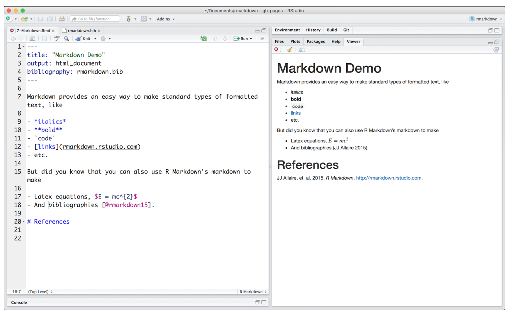

If you’re interested in working with me, please take a look at [my current (and updated!) Advisee Guide](https://chadhoweuga.github.io/chowe/AdviseeGuide). This document is intended to provide some useful guidance in the process of completing your graduate requirements. It’s also a bit out of date so please contact me if you have any questions.

**NOTE:** Before you consider asking me to work with you as a major professor, please keep a few things in mind. First, you need to have taken at least one course with me in order for me to consider serving as your major professor. Second, unless you are working on something related to my current research, I will not be able to serve as your major professor.

----

# Basic Information
- [UGA Grad School Forms](http://grad.uga.edu/index.php/current-students/forms/)
- [UGA Grad School Calendar](http://grad.uga.edu/index.php/current-students/important-dates-deadlines/)
- [Romance Languages Graduate Handbook](http://rom.uga.edu/graduate-handbook)
- [Linguistics Graduate Handbook](https://ling.franklin.uga.edu/sites/default/files/inline-files/Graduate%20Handbook%20Revised%20July%202019.pdf)


----

# Advisees {.tabset}

## Current Advisees

- [Bethany Bateman McDonald](https://www.rom.uga.edu/directory/people/bethany-bateman) (PhD, Romance Languages), Areas of Research: Sociolinguistics, Spanish/Quechua Contact
- [Andrew Bray](http://www.linguistics.uga.edu/directory/people/andrew-bray) (PhD, Linguistics), Areas of Research: Sociolinguistics, language use among hockey players
- [Javier Cabezas Zapata](https://rom.uga.edu/directory/people/javier-cabezas-zapata) (ABD, Romance Languages) Areas of Research: language variation, language change, grammaticalization in Spanish
- [Kit Callaway](https://www.linguistics.uga.edu/directory/people/kit-callaway) (ABD, Linguistics) Areas of Research: language variation, pronouns and gender
- [Madeline Critchfield](http://rom.uga.edu/directory/madeline-critchfield)(PhD, Romance Languages), Areas of Research: Areas of Research: Sociolinguistics, Spanish/Miskitu Contact
- [Katy Dwyer](https://www.linguistics.uga.edu/directory/people/katy-dwyer) (PhD, Linguistics), Areas of Research: Sociolinguistics, English in the Southeastern United States
- [Nathaniel (Nate) Fackler](https://www.linguistics.uga.edu/directory/people/nathaniel-fackler) (PhD. Linguistics), Areas of Research: Sociolinguistics, language acquisition
- [Sarah Hubbel](https://www.rom.uga.edu/directory/people/sarah-bigger) (PhD, Romance Languages), Areas of Research: Sociolinguistics, Spanish/Quechua Contact
- [Rachel Kim](http://www.linguistics.uga.edu/directory/people/dot-eum-kim) (PhD, Linguistics), Areas of Research: Sociolinguistics, perception of US dialects by L2 speakers of English
- [Camila Lívio](https://camlivio.github.io/) (PhD, Romance Languages), Areas of Research: Sociolinguistics, language variation, grammaticalization in Portuguese
- [Shannon Rodríguez](http://www.linguistics.uga.edu/directory/people/shannon-rodriguez) (PhD, Linguistics), Areas of Research: Sociolinguistics, Spanish in the US


----

## Former Advisees
To find a copy of a thesis or dissertation, go to the [UGA repository](http://dbs.galib.uga.edu/cgi-bin/getd.cgi?userid=galileo&amp;serverno=22&amp;instcode=uga1) and search by the author's name.

- [Dallin V. Larsen](http://rom.uga.edu/directory/people/dallin-v-larsen) (PhD, Romance Languages), Dissertation Title: Dissertation Title: *A corpus based approach to the diachrony of the Spanish discourse markers* bien, bueno, *and* claro
- **Joseph "Joey" Stanley** (PhD, Linguistics), Dissertation Title: *Vowel dynamics of the Elsewhere Shift: A sociophonetic analysis of English in Cowlitz County, Washington* (2020, [Assistant Professor at Brigham Young University](http://joeystanley.com/))
- **Mohammad Al Jutaily** (PhD, Linguistics), Dissertation Title: [*The influence of linguistic and non-linguistic factors on the variation of Arabic marked consonants in the speech of Gulf Pidgin Arabic*](https://getd.libs.uga.edu/pdfs/aljutaily_mohammad_f_201808_phd.pdf)  (2018, [Assistant Professor at Qassim University](https://www.qu.edu.sa/))
- **Ryan Dekker** (MA, Linguistics), Thesis Title: [*Income Effects on a Speech Community: Oconee County within Northeastern Georgia*](https://getd.libs.uga.edu/pdfs/dekker_ryan_m_201805_ma.pdf)  (2018, [PhD Student in English at Arizona State Univerisity](https://english.asu.edu/content/ryan-dekker))
- **Philip Limerick** (PhD, Romance Languages), Dissertation Title: [*Subject expression in a Southeastern U.S. Mexican Community*](https://getd.libs.uga.edu/pdfs/limerick_philip_p_201812_phd.pdf) (2018, [Adjunct Professor of Spanish at Eastern Kentucky University](https://foreignlanguages.eku.edu/people/limerick-0))
- **Shannon McDonough** (MA, Romance Languages), Thesis Title: [*La gramaticalización de la estructura* (NO) IMPORTAR + MINIMIZADOR; *La negación y las palabras tabúes en español*](https://getd.libs.uga.edu/pdfs/mcdonough_shannon_r_201808_ma.pdf) (2018, [Spanish Teacher at Cedar Shoals High School](https://www.clarke.k12.ga.us/domain/841), Athens, GA)
- **Jessica Tiegs** (MA, Romance Languages), Thesis Title: [*Language variation and grammaticalization: The case of* estar + que *in Northern Peru*](https://getd.libs.uga.edu/pdfs/tiegs_jessica_c_201805_ma.pdf) (2018, [PhD Student in Spanish and Portuguese at the University of Arizona](https://spanish.arizona.edu/people/jtiegs))
- **Joshua Hummel** (MA, Linguistics), Thesis Title: [*Conflict’s connotation: a study of* protest *and* riot *in contemporary news media*](https://getd.libs.uga.edu/pdfs/hummel_joshua_r_201705_ma.pdf) (2017, PhD Student in Sociolinguistics at North Carolina State University)
- **Christa Rampley** (MA, Linguistics), Thesis Title: Ratchet: [*An etymological origin and social dispersion theory*](https://getd.libs.uga.edu/pdfs/rampley_christa_a_201705_ma.pdf)  (2017)
- **Inma Garnes** (PhD, Romance Languages), Dissertation Title: [*Marcadores conversacionales como origen de intensificadores en el español peninsular: la gramaticalización de* venga](https://getd.libs.uga.edu/pdfs/garnes_inmaculada_201608_phd.pdf) (2016; Profesora Asociada, Universitat de València)
- **Sarah Hubbel** (MA, Romance Languages), Thesis Title: [*Acquiring Quechua mid vowels: L1 English L2 Spanish Third Language Acquisition in a Study Abroad Context*](https://getd.libs.uga.edu/pdfs/hubbel_sarah_e_201605_ma.pdf) (2016)
- **Bethany Bateman** (MA, Romance Languages), Thesis Title: [*Reportative evidentiality in Wounaan meu-Spanish bilinguals: A comparative examination of* dice(n) que](https://getd.libs.uga.edu/pdfs/bateman_bethany_d_201508_ma.pdf) (2015)
- **Lamar Graham** (PhD, Romance Languages), Dissertation Title: [*The history of the future: Morphophonology, syntax, and grammaticalization*](https://getd.libs.uga.edu/pdfs/graham_lamar_a_201505_phd.pdf) (2015; [Assistant Professor at the University of North Carolina Chapel Hill](https://sites.google.com/site/lamaragrahamphd/index)
- **Minh Nguyen** (Linguistics Major, CURO), Honors Thesis Title: *A #whitewashed landscape: internalized racism, linguistic discrimination, and the policing of ethnic identity on Twitter* (2015; [PhD Student in Linguistics at Georgetown University](https://linguistics.georgetown.edu/people/phd-students/current) and [here](https://naomeeminhnguyen.com/))
- **Martín Ocón Gamarra** (PhD, Romance Languages), Dissertation Title: [*Non-contact versus contact induced language change: The case of Andean* pues](https://getd.libs.uga.edu/pdfs/ocon-gamarra_martin_a_201505_phd.pdf) (2015; [Assistant Professor (Teaching) in the Department of Spanish and Portuguese at the University of Southern California](https://dornsife.usc.edu/cf/faculty-and-staff/faculty.cfm?pid=1058679))
- **Philip Limerick** (MA, Romance Languages), Thesis Title: [*Spanish subject expression in Roswell, Georgia: Dialect formation in an emerging bilingual community*](https://getd.libs.uga.edu/pdfs/limerick_philip_p_201405_ma.pdf) (2014)
- **Kristen Fredriksen** (MA, Linguistics), Thesis Title: [*Constraints on perfect auxiliary contraction: Evidence from spoken American English*](https://getd.libs.uga.edu/pdfs/fredriksen_kristen_m_201205_ma.pdf) (2012)
- **Allison Wachter** (MA, Linguistics), Thesis Title: [*Semantic Prosody and Intensifier Variation in Academic Speech*](https://getd.libs.uga.edu/pdfs/wachter_allison_r_201205_ma.pdf) (2012)
- **Kerry Steinberg** (MA, Romance Languages), Thesis Title: [*Language Use, Language Attitudes and Mobility: The Case of the Rural and Urban Areas of Coronel Oviedo, Paraguay*](https://getd.libs.uga.edu/pdfs/steinberg_kerry_201005_ma.pdf) (2011, Spanish Instructor at UGA)
- **Laura Greifner** (MA, Linguistics), Thesis Title: [*Negative Connotations in Adjectives versus Nouns: The Test Case of* Poor](https://getd.libs.uga.edu/pdfs/greifner_laura_s_200912_ma.pdf) (2009)
- **Javier Lluch Latorre** (MA, Romance Languages), Thesis Title: [*La pragmática de la entonación en el discurso político*](https://getd.libs.uga.edu/pdfs/lluch-latorre_javier_200805_ma.pdf) (2008)
- **William 'Buck' Pennington** (MA, Romance Languages), Thesis Title: [*Split antecedents and pronominal expressions in Spanish*](https://getd.libs.uga.edu/pdfs/pennington_william_s_200805_ma.pdf) (2008)
- **Ninosca Pérez Minchola** (MA, Romance Languages), Thesis Title: [*El rol de la cortesía en entrevistas políticas conflictivas en la televisión peruana*](https://getd.libs.uga.edu/pdfs/perez_ninosca_c_200708_ma.pdf) (2007)
- **Anne Rutter Sekanina** (MA, Romance Languages), Thesis Title: [*Address form selection amongst urban Spanish youth: The influence of the Cheli sociolect*](https://getd.libs.uga.edu/pdfs/sekanina_anne_r_200708_ma.pdf) (2007)


----


<!--
Building websites uses the same reproducible workflow you can use for your analyses and collaborations. It is very iterative. You can do it all from RStudio, with a combination of clicking or typing commands as you feel comfortable. 

1. add content (text, code, images, etc) in an RMarkdown file
1. knit the RMarkdown file to view
1. update `_site.yml` (perhaps, if it is a new file)
1. build the website
    - Build tab > Build Website or
    - in the console: `rmarkdown::render_site()`
1. repeat, repeat, repeat
1. commit and push your website to github, it's live!
1. repeat all of the above

Let's see what this looks like. We are not going to have time to learn all of the capabilities of R Markdown today, but the purpose here is to give you familiarlity with the workflow and confidence to explore further on your own.

----

## RStudio landscape

Here is what you'll see when you've opened our `rmarkdown-website-tutorial` project in RStudio.  

The 'Build tab' in the top right corner will show up once RStudio knows you're making a website, don't worry if you don't have it yet.  

If we open `index.Rmd` we will see that it's all text with a bit of formatting. This top part is called the 'front matter'.  


<br>
 
## Markdown Syntax 
 
Now let's look explore the first few webpages/R Markdown files to get familiar with Markdown syntax: 

- `index.Rmd`
- `first_observations.Rmd`
- `basic_workflow.Rmd`

These first few pages have simple formatting (**bold**, *italics*), headers, bullet points, links, and images. These are the majority of things you'll do in Markdown. See a full list of options at [**RStudio's Markdown basics**](http://rmarkdown.rstudio.com/authoring_basics.html) or go to Help > Markdown Quick Reference. Also, check out their [R Markdown cheatsheet](https://www.rstudio.com/resources/cheatsheets/).  

Notice that you can insert images locally (from the /images folder), or from online e.g. Google Drawings!
 
From [rmarkdown.rstudio.com lesson 8](http://rmarkdown.rstudio.com/lesson-8.html): 




<br> 

## Build your website!

Let's make a few changes to this file and knit it to inspect. Try adding some new Markdown formatted text. 

Also, now is a good time to make sure you have the the Build tab; you may need to install `rmarkdown` if you haven't already (below). 

Click `Build Website` in the Build tab (or type `rmarkdown::render_site()` in the Console) and inspect your Website! Commit and push to see it live online. 

<br>

## Other

### Tips for learning Markdown

**In Markdown, spaces can be tricky**.  
To start a new line here, I needed 2 spaces after `tricky.  ` above. 
As you can see, a simple carriage return doesn't cut it. 

To force carriage returns, use the `<br>` html tag...

<br>
<br>

...like this.  

Also, this bulleted list won't render properly:
- because there is no carriage return between the line above
- and where the bullet points start. 

To have the bullet points render nicely: 

- you must have a full blank line 
- following "To have the bullet points render nicely:"

<br>

### Building a website from scratch

If you want to build a website from scratch (i.e. not fork this one), follow RStudio's instructions here: [R Markdown Websites
](https://rmarkdown.rstudio.com/rmarkdown_websites.html). 

**Troubleshooting:**  

We recently had trouble having our nicely built website display online: the website's url only showed the README (nicely formatted though!). We solved it by adding:

```
output_dir: "."
```

to the `_site.yml`. This knits all the .html files in place in the home directory instead of in a `_site` folder, and this solved our problem!

### Install the `rmarkdown` package

You can do this by: 

1. paste this code in the Console and hit enter

    ```
    install.packages('rmarkdown')
    library(rmarkdown) 
    ```
1. from the menu bar select: Tools > Install Packages... "rmarkdown"
1. from the bottom right pane, click on the Packages tab, click on Install, "rmarkdown"

<!---note that the ``` ``` syntax above renders text as a code-looking block--->


